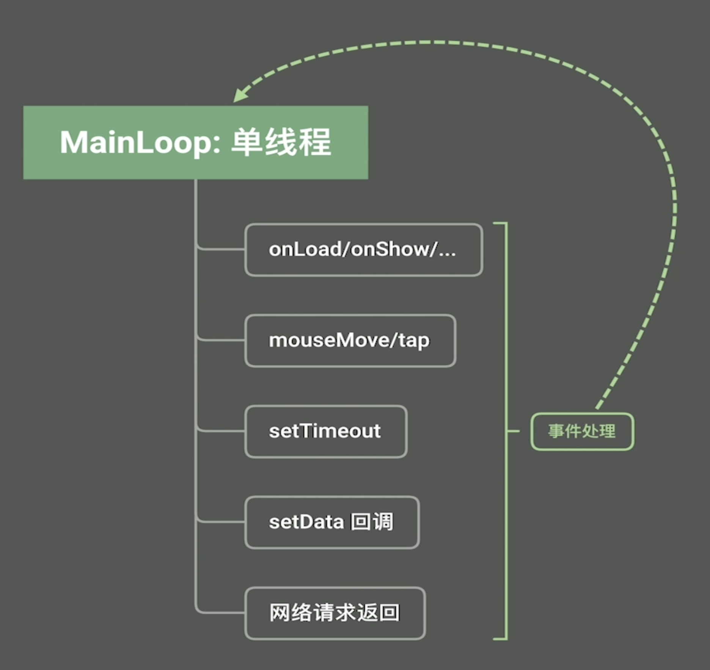

# TypeScript简明教程


## JavaScript是一门糟糕的语言

JavaScript有各种标准，ES5、ES6、ES7，为了解决浏览器适配新版JavaScript问题甚至还有个[Babel](https://babeljs.io)的项目。

## 弱类型的JavaScript

```javascript
let a = 'abc'
console.log(typeof a) // "string" 

a = 123
console.log(typeof a) // "number"
```

而且数字类型都是number类型，不区分整形和浮点型，这也有点小危险了。
```javascript
let a = 123.456
console.log(typeof a) // "number"
```

JavaScript是一个非常灵活的语言：
```javascript
let a = {"name": 'jone', "salary": 3000}
a.bonus = 10000
console.log(a) // {"name": "jone", "salary": 3000, "bonus": 10000}
```
JavaScript程序员会花费大量时间研究一个对象里有哪些类型，是整数呢还是字符串等这样的问题上面。


JavaScript类型有多弱呢？
```javascript
console.log(20 == 20) // true 

console.log(20 == '20') // true
```
粗看还好，但是举个例子，像错误码404，很有可能在安卓里是字符串，在ios里是整形，这是很有可能发生的现象，这样处理起来就会非常头疼。

再举几个JavaScript坑的例子：
```javascript
console.log(10 + 20) // 30 

console.log(10 + '20') // "1020" 

console.log([1,2,3]) // [1, 2, 3] 
console.log([1,2,3] + 4) // "1,2,34" 
```


## 人们为了不写JavaScript人们做了哪些努力？

微软：
- ActiveX控件（C++）
- SilverLight（C#）

Adobe：
- Adobe Flex，基于Adobe Flash（ActionScript）

Google：
- GWT，全程是Google Web Toolkit（Java），把Java编译成JavaScript
- dart，现在变成Flutter了，只写一份代码发不到不同平台会生产相应的网页


上面这些努力，Adobe，FWT，ActiveX本身架构就问题，像SilverLight，dart失败在生态上，已经有很多人使用JavaScript并且生态那么好，很难去换个新赛道。

<br></br>
TypeScript的优势：
- JavaScript的超集，对 JavaScript 有很好的兼容，相当于 JavaScript + 类型定义
- 编译成JavaScript运行
- 无缝衔接JavaScript社区
- 前端框架跟进，包括Angular、Vue、React、小程序


## 基本数据类型

定义变量:

```typescript
let anExampleVariable: string = 'abc'
let anExampleNum: number = 123
let anExampleBool: boolean = true
```
当然也可以让编译器推断类型:
```typescript
let anExampleVariable = 'abc'
console.log(anExampleVariable) // 'abc'
```
定义一个 literal type：
```typescript
let answer: 'yes' | 'no' | 'mabey' = 'mabey' // 类似于枚举类型
```
虽然 answer 值的类型都是字符串，但是 answer 类型并不是字符串：
```typescript
let answer: 'yes' | 'no' | 'mabey' = 'mabey'
let s:string = 'abc'
answer = s // 编译错误：Type 'string' is not assignable to type '"yes" | "no" | "mabey"'.
```
literal type 可以是多种类型：
```typescript
let httpstatus: 200 | 404 | 500 | '200' | '404' | '500' = '200'
```
上面其实是一个类型的并集，即 union of types：
```typescript
let httpstatus: 200 | 404 | 500 | '200' | '404' | '500' = '200'
let statusCode: string|number = httpstatus // union of types
```
TypeScript也可以像JavaScript一样支持动态类型：
```typescript
let a: any = 'abc' // a是任何类型
a = 123
```
undefined类型只能是undefined：
```typescript
let u:undefined = undefined
u = 'abc' // 编译错误
```
undefined 也可以用在 literal type中：
```typescript
let answer: 'yes' | 'no' | 'mabey' | undefined = undefined
```
用${}填充变量：
```typescript
let a = 'abc'
let b = `a is ${a}` // "a is abc"
```

## 枚举类型

定义枚举类型：
```typescript
enum HTTPStatus {
  OK, // 0
  NOT_FOUND, // 1
  INTERNAL_SERER_ERROR, // 2
}

console.log(HTTPStatus.NOT_FOUND) // 1
```
当然也可以赋初值：
```typescript
enum HTTPStatus {
    OK = 200, 
    NOT_FOUND = 404,
    INTERNAL_SERER_ERROR = 500, 
}

console.log(HTTPStatus.NOT_FOUND) // 404
```
获取枚举类型变量名：
```typescript
enum HTTPStatus {
    OK = 200, 
    NOT_FOUND = 404,
    INTERNAL_SERER_ERROR = 500, 
}

console.log(HTTPStatus[HTTPStatus.NOT_FOUND]) // "NOT_FOUND"
```

## 数组
定义数组：
```typescript
let a = [1,2,3,'a'] // equals to：let a: (string | number)[]
let b:number[] = [1,2,3]
let c:Array<number> = [1,2,3] // 泛型
let d = [] // equals to：let d: any
```
判断数组是否为空：
```typescript
let a = []
if (a.length === 0) {
    console.log("a is empty")
} // 不可以用if(a){}判断  
```
数组增加和删除元素：
```typescript
let a:number[] = [] // let可以换位const，因为a始终是数组，元素怎么改变都可以，但是不可以指向其他数组或其他类型
a.push(1) // [1] 从右边添加元素
a.push(2) // [1,2]
a.push(3) // [1,2,3]
a.pop() // [1,2] 从右边删除
a.push(4) // [1,2,4]

a.unshift(5) // [5, 1, 2, 4] 从左边添加元素
a.shift() // [1,2,4] 从左边删除
```
数组子数组：
```typescript
const a = [0,1,2,3,4,5,6,7]
console.log(a.slice(2, 5), a.slice(5, 10), a.slice(2)) // [2, 3, 4], [5, 6, 7], [2, 3, 4, 5, 6, 7] 
a.splice(3, 2) // 从下标3开始删除两个元素
console.log(a) // [0, 1, 2, 5, 6, 7] 

a.splice(3,2,10,11,12) // 从下标3开始删除两个元素并添加元素10，11，12
console.log(a) // [0, 1, 2, 10, 11, 12, 7]
```
数组查找：
```typescript
a.indexOf(2) // 查找第一次出现的位置
a.indexOf(10, 2) // 从第二个位置开始找

a.lastIndexOf(11) // 从右往前找
```
数组排序：
```typescript
const a = [0,1,2,3,10,11,12]
a.sort() // 坑：不是从小到大排序，而且按照字典序，适用于排序字符串
console.log(a) // [0, 1, 10, 11, 12, 2, 3] 
```
元组tuple：
```typescript
const a = [1,2,3]
const [a1, a2] = a
console.log(a1, a2) // 1,  2 
```
数组元素拼接split/join：
```typescript
'a,b,c,1,2,3'.split(',') // ["a", "b", "c", "1", "2", "3"] 

const s = [1,2,3,4].join(' ') // "1 2 3 4" 
```


## 对象类型
对象定义：
```typescript
const emlp = {
    name: {
        first: '三',
        last: '张',
    }, // 对象嵌套
    gender: 'male' as 'male'|'female'|'other'|'unknown',
    salary: 8000,
    bonus: undefined as (number | undefined), // number or undefined
}
```
JSON转换：
```typescript
const s:string = JSON.stringify(emlp) // JSON 转 string

const emlp2 = JSON.parse(s) // string 转 JSON
```

## 函数

函数定义：
```typescript
function add(a: number, b: number): number {
    return a + b
}

add(1, 2) 
```
可选参数：
```typescript
function add(a: number, b: number, c?: number, d: number = 0): number { // c是一个可选参数，d是一个默认值
  return a + b + (c||0) + d // c可能是undefined类型，需要判断，也可以写成 c ? a + b + c +d : a + b + d
}

add(1, 2)
add(1, 2, 3)
```
可变参数列表：
```typescript
function add(...e: number[]): number { // e是可变参数列表
    let sum = 0
    for (let i = 0; i < e.length; i++) {
        sum += e[i]
    }
    return sum
}

console.log(add(1, 2))
const arr = [3,4,5,6,7,8,9]
console.log(add(1, 2,...arr))
```
函数重载，不建议使用，我们可以采用可选值和默认值的方式来获得不同参数列表，或者更推荐用对象类型作为参数（而且Go语言直接不支持函数重载了）：
```typescript
function add(a:number, b:number): number
function add(a:number, ...e: number[]): number

// 实现
function add(a:number, b:number, ...e: number[]): number {
    let sum = a + b
    for (let i = 0; i < e.length; i++) {
        sum += e[i]
    }
    return sum
}

console.log(add(1, 2)) // 3
const arr = [3,4,5,6,7,8,9]
console.log(add(1, 2,...arr)) // 45
```
我们定义一个发送请求的函数可能是这样的：
```typescript
function sendRequest(
    url: string,
    method: 'GET' | 'POST' | 'PUT',
    header: object,
    data: string,
    requireAuth: boolean,
    retry: boolean,
    retryTimeout: number) {

}

sendRequest('https://www.test.com', 'GET', { contentType: 'application/json' }, '{"name": "john"}', true, true, 3000)
```
上面调用方传了很多参数可读性很差，甚至两个true是什么意思都很难理解，在Java里可能会采用在两个true后面添加注释解决这个可读性差的问题（... true /*requireAuth\*/, true /*retry\*/, ...），我们可以用对象类型作为参数解决这个问题：
```typescript
function sendRequest(params: {
    url: string,
    method: 'GET' | 'POST' | 'PUT',
    header: object,
    data?: string,
    requireAuth: boolean,
    retry: boolean,
    retryTimeout?: number,
}) {

}

sendRequest({ // 可读性很好，不用像Java那样添加注释
    url: 'https://www.test.com',
    method: 'GET',
    header: { contentType: 'application/json' },
    data: '{"name": "john"}',
    requireAuth: true,
    retry: true,
    retryTimeout: 3000,
})
```
为对象添加方法：
```typescript
const emlp = {
    name: 'john',
    salary: 8000,
    bonus: undefined as (number | undefined),
    performance: 3.5,
    updateBonus() { // 对象方法
        this.bonus = this.salary * this.performance
    },
}

emlp.updateBonus()
```


## 函数式编程

什么样的编程语言才是函数式编程语言呢？


比如 JavaScript、TypeScript、Python、C#、Go 这些语言都是具有函数式编程风格的语言，而像 haskell 是纯粹的函数式编程语言。

1.函数是一等公民
- 变量类型可以是函数
- 值（literal）可以是函数
- 对象的字段可以是函数
- 函数的参数可以是函数
- 函数的返回值可以是函数

满足上面条件就可以说明函数是一等公民。

利用函数式编程实现数组排序：
```typescript
const a = [1, 2, 3, 10, 11, 12, 20, 21, 30]
function compareNumber(a: number, b: number) {
    // a < b ==> 返回负数
    // a === b ==> 返回0
    // a > b == > 返回正数
    return a - b
}

a.sort(compareNumber)
```
当然可以可以写的更简洁，使用 lambda 表达式，或者在 JavaScript/TypeScript 里称作箭头函数：
注意：箭头函数有个好处是避免了this作用域问题。
```typescript
const a = [1, 2, 3, 10, 11, 12, 20, 21, 30]

let compareNumber = (a: number, b: number) => a-b
a.sort(compareNumber)

// 也可以这样写
a.sort((a: number, b: number) => a-b)
// 箭头函数也可以写大括号
a.sort((a: number, b: number) => {return a-b})
// 当然参数类型也可以省略
a.sort((a, b) => {return a-b})
```
对象的字段也可以是函数：
```typescript
const emlp = {
    name: 'john',
    salary: 8000,
    increaseSalary: function (p: number) {
        this.salary *= p 
    },
}
```

2.高阶函数
```typescript
function loggingComparer(comp: (a: number, b: number) => number) {
    return (a: number, b: number) => {
        console.log('comparing', a, b)
        return comp(a, b)
    }
}

function createComparer(p: {smallerFirst: boolean}) {
    if (p.smallerFirst) {
        return (a:number, b: number) => a-b
    } else {
        return (a: number, b: number) => b-a
    }
}

const a = [1, 2, 3, 10, 11, 12, 20, 21, 30]
let comp = createComparer({smallerFirst: true})
a.sort(loggingComparer(comp))
```

3.无副作用

下面统计比较次数对compCount修改是一个有副作用的操作，需要 reset。副作用可能很难避免，我们应该尽量减少副作用。
```typescript
let compCount = 0
function loggingComparer(comp: (a: number, b: number) => number) {
    return (a: number, b: number) => {
        console.log('comparing', a, b) // 产生日志也是一个副作用
        compCount++
        return comp(a, b)
    }
}

function createComparer(p: {smallerFirst: boolean}) {
    if (p.smallerFirst) {
        return (a:number, b: number) => a-b
    } else {
        return (a: number, b: number) => b-a
    }
}

const a = [1, 10, 11, 2, 20, 7, 12, 8]
const comp = createComparer({smallerFirst: true})

a.sort(loggingComparer(comp))
console.log('compare count', compCount) // 15

compCount = 0 // 清零 reset

a.sort(loggingComparer(comp))
console.log('compare count', compCount) // 7
```

4.闭包

如何解决上面有副作用的问题呢？答案是闭包
```typescript
function loggingComparer(logger: (a: number, b: number) => void, comp: (a: number, b: number) => number) {
    return (a: number, b: number) => {
        logger(a, b)
        return comp(a, b)
    }
}

function createComparer(p: { smallerFirst: boolean }) {
    if (p.smallerFirst) {
        return (a: number, b: number) => a - b
    } else {
        return (a: number, b: number) => b - a
    }
}

function processArray(a: number[]) {
    let compCount = 0
    const comp = createComparer({ smallerFirst: true })
    const logger = (a: number, b: number) => { // logger 是一个闭包（logger + 自由变量打包在一起），闭包的好处是可以把局部变量的生命周期延长
        console.log('comparing', a, b)
        compCount++ // 自由变量
    }
    a.sort(loggingComparer(logger, comp))
    return compCount
}

const a = [1, 10, 11, 2, 20, 7, 12, 8]
const compCount = processArray(a)
console.log(compCount) // 15
```
闭包可以使我们拥有更少的全局变量，尤其是前端比如按钮的状态等，使用闭包延长局部变量的生命周期，可以有效减少全局变量泛滥问题。

5.部分应用函数
isGoodNumber 函数本身有两个参数，而我们只有 GOOD_FACTOR 这一个参数，我们可以新建一个单参数的函数，通过闭包的形式将 GOOD_FACTOR 和单参数函数本身的参数放到 isGoodNumber 中应用，这就是部分应用函数
```typescript
const a = [1, 2, 3, 4, 5, 6, 7, 8, 9]

function isGoodNumber(goodFactor: number, v: number) {
    return v % goodFactor === 0
}

function filterArray(a: number[], f: (v: number) => boolean) {
    return a.filter(f)
}

const GOOD_FACTOR = 2

// 应用 isGoodNumber 需要 GOOD_FACTOR 和 v 两个参数，而我们只有 GOOD_FACTOR 一个参数，先应用 GOOD_FACTOR，然后将剩下的 v 发给 filer，这就是部分应用函数
console.log(filterArray(a, (v) => isGoodNumber(GOOD_FACTOR, v))) // [2, 4, 6, 8] 
```
部分应用函数抽出来更佳直观一些：
```typescript

const a = [1, 2, 3, 4, 5, 6, 7, 8, 9]

function isGoodNumber(goodFactor: number, v: number) {
    return v % goodFactor === 0
}

function filterArray(a: number[], f: (v: number) => boolean) {
    return a.filter(f)
}

const GOOD_FACTOR = 2

// 部分应用函数
function partiallyApply(f: (a: number, b: number) => boolean, a: number) {
    return (b: number) => {
        return f(a, b) // a：自由变量
    }
}

console.log(filterArray(a, partiallyApply(isGoodNumber, GOOD_FACTOR))) // [2, 4, 6, 8] 
```

6.引用透明性

下面这两种写法等价吗？从引用透明性角度来讲是等价的
```typescript
function add(a: number, b: number) {
    return a+b
}

console.log(add(2,3))
console.log(5)
```
但是如果add中写了日志就不等价了，这个add就不具有引用透明性
```typescript
function add(a: number, b: number) {
    console.log(a, b)
    return a+b
}

console.log(add(2,3))
console.log(5)
```

7.惰性计算（lazy evaluation）

下面的例子不是惰性计算，如果是惰性计算的话3+4会原封不动传进add中，即a=2，b=3+4，return 2+(3+4)
```typescript
function add(a: number, b: number) {
    return a+b // 这里啊a，b实际上是2和7，这种就不是惰性计算
}

console.log(add(2,3+4)) // 这里首先要算出3+4=7，然后再add(2,7)
```
引用透明性和惰性计算多应用在并行计算上

## 利用函数式编程解决数组的变换
map变换：
```typescript
const a = [1, 2, 3, 4]

const b: number[] = []
a.forEach(v => {
    b.push(v * v) // 对b做了改变，是有副作用的
})
console.log(b) // [1, 4, 9, 16] 

// 上面代码可以用map实现：
const c = a.map(v => v * v)
console.log(c) // [1, 4, 9, 16] 
```
reduce变换：
```typescript
const a = [1, 2, 3, 4]

let sum = 0
a.forEach(v => sum += v) // 对sum做了改变，是有副作用的
console.log(sum) // 10 

// 上面代码可以用reduce实现：
const sum2 = a.reduce((s, v) => s + v)
console.log(sum2) // 10 
```
当然上面的 reduce 实际上就是如下函数：
```typescript
function reduce(b: number[], r: (s: number, v: number) => number) {
    let previousValue = 0
    b.forEach(currentValue => {
        previousValue = r(previousValue, currentValue)
    })
    return previousValue
}
```
对上面map和reduce合起来就是：
```typescript
console.log([1, 2, 3, 4].map(v => v * v).reduce((s, v) => s + v)) // 30
```
这其实就是单机版的mapReduce，并行版的mapReduce就是把map函数和reduce函数序列化再分发到不同机器上，并行计算再合并起来。为什么map reduce可以并发执行呢？原因就是这两个函数满足无副作用和引用透明性。

所以 forEach 是一个有副作用的函数，但是代码朴素易懂，而 map 和 reduce 是无副作用的函数。


## Promise

前端异步运行机制：

下图是微信小程序的事件处理机制：



上面这些事件可能是很耗时的操作，由于前端UI是一个单线程的模型，所有这些耗时的动作都应该是异步运行的，一般而言一个事件是这样处理的：

 1. 发起请求
 2. 事件处理函数结束（不等待请求结果）
 3. 请求结束
 4. 进入回调函数    

如果请求很多很有可能造成回调函数地狱（Callback Hell）。解决回调函数地狱问题就需要 Promise。

比如我们用回调函数形式写一个加法函数：
```typescript
function add(a: number, b: number, callback: (res: number) => void): void {
    setTimeout(() => {
        callback(a + b)
    }, 2000) // 模拟系统调用或者网络请求比较耗时的操作
}
// Promise 串联
add(2, 3, (res) => {
    console.log('2+3', res)
    add(res, 4, (res2) => {
        console.log('2+3+4', res2)
    })
})
```
将回调函数形式改为 Promise：
```typescript
function add(a: number, b: number): Promise<number> {
    return new Promise((resolve, reject) => {
        setTimeout(() => {
            resolve(a + b) // 调用 resolve 表示成功
        }, 2000) // 模拟系统调用或者网络请求比较耗时的操作
    })

}

// 下面代码好处是按照顺序写的，和人的思维一致
add(2, 3).then((res) => {
    console.log('2+3', res)
    return add(res, 4) // 一定要 return
}).then((res) => {
    console.log('2+3+4', res)
})
```
当然省掉日志打印更为直观：
```typescript
add(2, 3).then((res) => add(res, 4)).then((res) => {
    console.log(' final result', res)
})
```
在出错时使用 reject：
```typescript
function add(a: number, b: number): Promise<number> {
    return new Promise((resolve, reject) => {
        if (b % 17 === 0) {
            reject(`bad number ${b}`) // Uncaught (in promise) bad number 17
        }
        setTimeout(() => {
            resolve(a + b) // 调用 resolve 表示成功
        }, 2000)
    })

}

add(2, 3).then((res) => {
    console.log('2+3', res) // "2+3",  5 
    return add(res, 17)
}).then((res) => {
    console.log('2+3+17', res)
    return add(res, 4)
}).then((res) => {
    console.log('2+3+17+4', res)
}).catch(err => {
    console.log('caught err', err) // "caught err",  "bad number 17" 
})
```
`Promise.all` 同时等待多个 Promise：
```typescript
function add(a: number, b: number): Promise<number> {
    return new Promise((resolve, reject) => {
        if (b % 17 === 0) {
            reject(`bad number ${b}`) // Uncaught (in promise) bad number 17
        }
        setTimeout(() => {
            resolve(a + b) // 调用 resolve 表示成功
        }, 2000)
    })
}

function mul(a: number, b: number): Promise<number> {
    return new Promise((resolve, reject) => {
        setTimeout(() => {
            resolve(a * b)
        }, 2000)
    })
}

// (2+3)*(4+5)
Promise.all([add(2, 3), add(4, 5)]).then(res => { // 等待所有Promise返回
    const [a, b] = res // 使用元组获取返回结果，当然可以将 res 写成 ([a, b])
    return mul(a, b)
}).then(res => {
    console.log('final result', res) // 45
})
```
Promise.race 等待任意一个结果返回：
```typescript
Promise.race([add(2,3), add(4,5)]).then(res => {
    console.log(res)
})
```

## async/await 异步函数

将刚刚的加法运算改为 async/await 形式实现：
```typescript
function add(a: number, b: number): Promise<number> {
    return new Promise((resolve, reject) => {
        if (b % 17 === 0) {
            reject(`bad number ${b}`) // Uncaught (in promise) bad number 17
        }
        setTimeout(() => {
            resolve(a + b) // 调用 resolve 表示成功
        }, 2000)
    })
}

function mul(a: number, b: number): Promise<number> {
    return new Promise((resolve, reject) => {
        setTimeout(() => {
            resolve(a * b)
        }, 2000)
    })
}

// (2+3)*(4+5)
async function calc() {
    const a = await add(2,3) // 异步等待 add 返回，不会卡住线程
    const b = await add(4,5)
    const c = await mul(a, b)
    console.log(c) // 45 
}

calc()
```
如果改为返回值的形式，返回值类型是一个 Promise：
```typescript
// (2+3)*(4+5)
async function calc() { // 返回值类型是 Promise
    const a = await add(2,3) 
    const b = await add(4,5)
    const c = await mul(a, b)
    return c
}

calc().then(res => {
    console.log(res)
})
```
如果需要捕获一场需要用 try catch：
```typescript
// (2+3)*(4+5)
async function calc() {
    try {
        const a = await add(2, 3)
        const b = await add(4, 5)
        return await mul(a, b)
    } catch (err) {
        console.log('caught err', err)
        return undefined // calch 函数需要返回值
    }
}

calc().then(res => {
    console.log(res)
})
```
上面代码执行add是串行的，我们更希望同时执行add函数，用 Promise.all 实现：
```typescript
async function calc() {
    try {
        const [a, b] = await Promise.all([add(2, 3), add(4, 5)]) // 2+3和4+5同时运算
        return await mul(a, b)
    } catch (err) {
        console.log('caught err', err)
        return undefined 
    }
}
```


