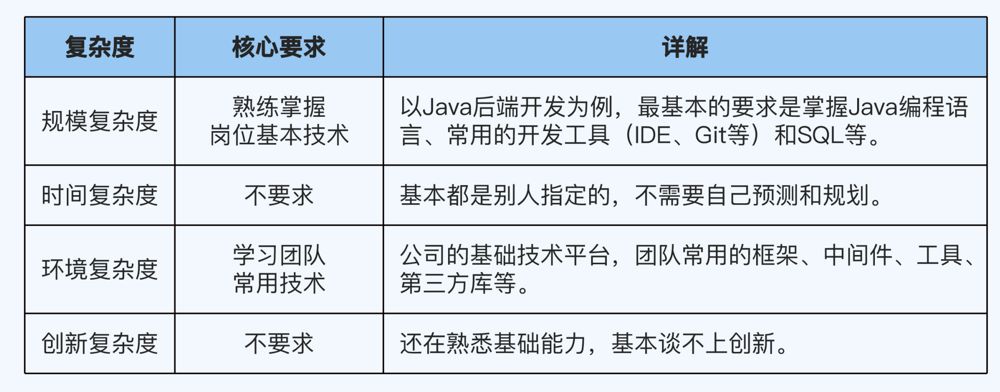

# P5提升攻略：怎么快速从学生转变为“打工人”？

从这一讲开始，我们进入到课程的第二部分，职级详解。

# 职级详解导学

在这个部分，我会基于 COMD 能力模型，从技术、业务、管理三个维度和规模、时间、环境、创新四种复杂度出发，为你详细解读 P5～P9 每一个级别的能力要求。同时，我也会结合过往带团队、指导他人和担任评委的经验，给出每个级别的提升建议。

我想强调的是，这里的职级解读和提升技巧绝对不是只针对阿里的职级，而是通用的。不管你是在 BAT，还是在 TMD，不管你是在互联网大厂，还是在其他公司，都可以参考。你只要把自己当前的职级对标到这门课程定义的级别（P5～P9），然后学习相应的内容就行了。

具体怎么对标呢？你可以参考第 6 讲和《晋升等级：不同的职级体系如何对标》这篇加餐。

另外，我还想提醒一点：你的学习重点肯定是自己当前级别和下一级别的内容（比如 P5 的同学需要重点学习介绍 P5 和 P6 的内容），但并不意味着其它级别的内容你就可以直接跳过。

比如你现在是 P7，虽然已经顺利越过了 P5 和 P6，但你对这两个级别的理解不一定完全准确，也不一定全面。而你很可能要指导这两个级别的同事、面试这两个级别的应聘者，或者作为 Team Leader 带这两个级别的下属。所以，认真学习 P5 和 P6 的内容，对你同样会有很大的帮助。

换一个角度想，如果你现在是 P6，看起来 P8 和 P9 好像离你还很遥远，这两个级别的内容你还要不要学呢？我还是建议你了解一下比较好，因为这样可以让你对自己的长远目标有一个大概的认知，有助于你做职业发展规划和晋升路线规划。

# P5：从学生到“打工人”

我们先来看看 P5 级别。P5 对应的工作年限大概是 0～3 年，本科毕业生的定级一般就是 P5，优秀的毕业生会定到 P5+，目前进 BAT 的应届生绝大部分都是 P5+。

大部分 P5 工作 2 年以后可以晋升 P6（无论是内部晋升还是跳槽定级）。如果你工作 3 年了还没法晋升 P6，可能需要考虑一下是否适合当前岗位了，或者反思一下自己有哪些地方做得不好。

P5 的核心能力是在别人的指导下完成任务，这句话有两个重点：

- 在别人的指导下：通常是 P6 或者 P7 来带 P5。
  
- 任务：项目各个阶段的各项活动。以开发为例，任务包括需求评审、方案设计、编码、修改 Bug 和上线等。

听起来好像要求不高，但这并不意味着你一毕业就自动具备了 P5 的能力。因为在学校读书跟在公司工作还是有很大区别的，主要体现在以下三个方面：

**1.技术差异**

大学学的技术偏重理论，而工作岗位对深度和实践的要求更高。而且就算你是研究生，你的研究方向和公司岗位的要求也很难完全匹配，更不用说前端、Android、iOS、测试、运维、DBA 等各种不同岗位的技能差异了。

**2.业务差异**

大学教育不会针对某个公司的具体业务进行教学，而互联网行业的业务领域多、发展快，近几年比较火的领域有电商、支付、社交、本地生活和出行等。这些业务知识是完成工作的基础，但你在刚毕业的时候，往往没有这方面的积累。

**3.管理差异**

大学学习的管理课程比较理论化，但公司的规章制度和项目流程有很多细化和具体的要求。怎么熟悉和适应工作岗位的管理要求，怎么跟别人协作，怎么推动事情落地，这些也都是完成工作的基础，但刚毕业的大学生往往处理得还不够好。

正是因为校园和职场环境差别这么大，所以 P5 级别的主要目标就是完成“学生”向“打工人”的角色转换。怎么实现这一层蜕变，是 P5 首先要考虑的事情。

接下来，我就分技术、业务和管理三个维度一一展开。

# 技术：重点积累基础技术

首先是技术维度。P5 是你职业生涯的起步阶段，也是打基础的关键时期。虽然你的技术水平还不高，但是这时候的学习效果最好，技术提升也是最快的。

因为跟学校的单向学习不同，你能把刚学到的东西马上实践应用在具体工作中，能够达到“知行合一”的效果；同时，P5 承担的责任不大，等你晋升到更高级别之后，就没有这么多精力和时间用来学习了。

P5 的技术要求，我总结在了这张表格里：

P5 阶段要怎么提升技术呢？最重要的就是基础技术的积累。 

这里的基础技术不是指大学课程中的基础知识，而是指工作岗位中实际用到的技术，不同的岗位要求不同。

比如，Java 业务开发的基础技术包括 Java 编程语言、MySQL 数据库、计算机网络、HTTP 协议和 Linux 操作系统基础知识等，而 iOS 业务开发的基础知识，就包括 Swift/Objective-C 编程语言、iOS 操作系统基础知识、Xcode、SQLite、计算机网络和 HTTP 协议等

虽然它们有一部分相同，但总体来看差异还是比较大的，所以你也要根据自己的岗位有针对性地学习。

# 两个误区：错误理解“基础”与碎片化学习

在 P5 阶段提升技术时，很容易陷入 2 个误区。

第 1 个常见的误区是错误地理解了“基础”的意思。

我在第 3 讲介绍价值原则的时候提到过，很多人为了提升自己的基础能力，跑去学编译原理和 Linux 内核源码分析，或者去背一些算法源码。结果他们到头来发现，投入了大量的时间和精力，却没什么收获。

所以你一定要记住，基础是和工作任务相关的基础，而不是整个计算机行业的基础。关于怎么学习基础技术，我会专门用一期加餐来系统地介绍。

第 2 个常见的误区是只通过搜索来进行碎片化学习。

工作中遇到一个问题或者一个技术点，就上网搜索几篇文章学习一下，很多人都是这么做的。

碎片化学习虽然投入时间少，但是效果难以保证。首先，你不可能在工作中遇到某个技术相关的所有问题；其次，通过这种方式，你只知道一个个零散的技术点，而不知道这些技术点之间的关系。

以 HTTP 缓存为例，如果只是单纯去搜索“HTTP Cache-Control”，你确实可以知道 no-cache 和 no-store 等名词的含义。但是整个 HTTP Cache 协议、浏览器的处理逻辑和服务器的处理机制这些技术点你就学不到了，而它们在分析 HTTP 性能相关的问题或者优化 Web 页面的时候都是必须掌握的。

可能你会觉得碎片化学习是没有办法的事情，因为工作以后就不像在学校那样，有整段的学习时间。

虽然客观条件是这样，但碎片化时间并不意味着只能碎片化学习，正确的做法是“碎片化时间，系统化学习”。也就是说，每天都抽出一小段时间有计划地学习某项技术，哪怕每天 10 分钟都可以，但总体的学习内容是系统化的。

想让学习系统化，最简单的办法就是对照一本经典的书籍循序渐进地学习。

虽然你不能把所有的内容都一次性学懂，但至少在学完一遍后，可以对一项技术的完整体系建立整体印象。这样，你后续再深入学习这项技术的时候，效率也会更高。

除了书籍之外，学习技术类线上课程也是一种很不错的方式。

线上课程的作者都是在某个领域积累了丰富经验的专家，而且讲解的内容跟实际工作关系紧密，再加上这些作者往往会有自己独到的理解，你学习起来会更有趣，也更有效率。

同时，线上课程往往还配有音频，比书籍更适合上下班通勤的时候学习，让你更高效地利用碎片时间。

# 业务：熟悉业务的处理逻辑

第二个维度是业务。P5 对业务的要求主要是熟悉各项业务的处理逻辑。

**广义的业务：提供的功能和服务**

