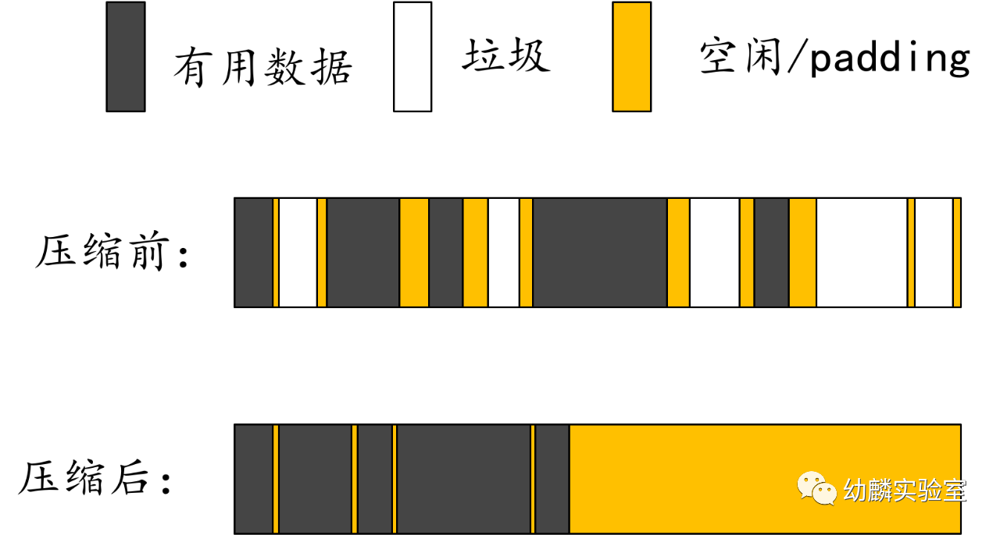
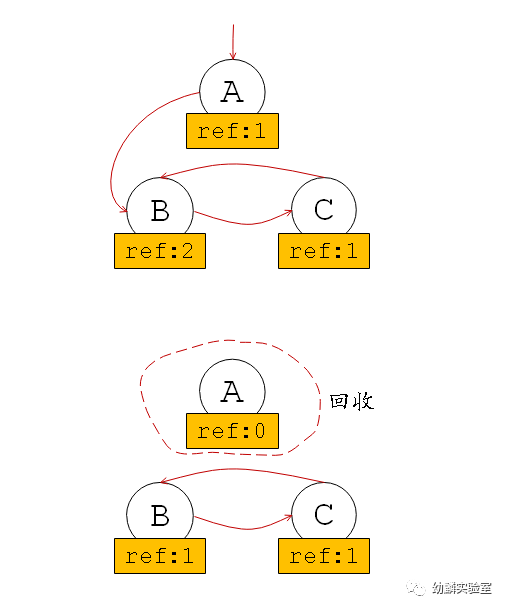
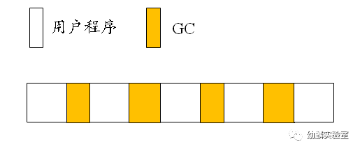

# 垃圾回收机制

<video id="video" width="1000px" height="600px" controls="controls">
    <source id="mp4" src="./assets/videos/粗线条话GC（一）.mp4" type="video/mp4">
</video>

<video id="video" width="1000px" height="600px" controls="controls">
    <source id="mp4" src="./assets/videos/粗线条话GC（二）.mp4" type="video/mp4">
</video>

<font size=5>**手动垃圾回收**</font>


有些编程语言需要程序员在编写程序时，手动释放那些不再需要的、分配在堆上的数据（C，C++）。这被称为“手动垃圾回收”。手动垃圾回收不仅增加编程负担，而且风险还比较高。一旦释放的早了，后续对该数据的访问就会出错。因为被释放的内存可能已经被清空，或重新分配，甚至已经还给操作系统了，这就是所谓的“悬挂指针”问题；而如果忘了释放，它又会一直占用内存，出现“内存泄漏”。

<font size=5>**自动垃圾回收**</font>


从虚拟地址空间来看，可以确定的是，程序中用得到的数据，一定是从栈、数据段（可以理解为全局变量）这些地方追踪得到的数据。也就是说，以这些地方直接追踪到的变量作为根节点，可以追踪到的数据范围大于等于真正的有用数据。


<font size=5>**几种主流垃圾回收算法**</font>

**1.标记——清扫：**

标记的过程需要扫描数据段和栈上的数据，把能够直接追踪到的数据作为root，基于这些root进一步追踪，把能追踪到的数据都进行标记，那剩下的没追踪到的就是垃圾了。

“三色抽象”可以清晰的展现追踪过程中数据标记的变化：

（1）垃圾回收开始会把所有数据都标记为白色；

（2）然后把直接追踪到的root节点都标记为灰色，灰色代表基于当前节点展开的追踪还未完成；

（3）当基于某个节点的追踪任务完成后，便会把该节点标记为黑色，表示它是有用数据，而且无需基于它再次进行追踪了。

（4）当没有灰色节点时，就意味着标记工作可以结束了。此时有用数据都为黑色，垃圾都为白色，在清除阶段回收这些白色的垃圾即可。

标记清除算法实现起来相对简单，但是比较容易造成内存碎片化，而碎片化会影响内存分配与程序执行的效率。这一问题，可以配合相应的内存管理模型来缓解。例如Tcmalloc内存管理模型这样，把内存块分成不同的规格进行统一管理，可以很好的应对碎片化问题。

**2.标记——压缩（整理）：**

标记——压缩算法的标记阶段与标记——清扫算法相同，不同的是，它会在完成标记工作后对堆内存的使用进行压缩。所谓的压缩，就是移动非垃圾数据，使它们尽可能紧凑的放在内存中。



虽然标记——压缩算法有效解决了内存碎片化的问题，但是带来的多次扫描与移动开销也不容小觑。标记——压缩算法比较鲜明的特点便是它会移动数据来减少碎片化，还有一种复制式回收算法，也会移动数据。

**3.复制式回收：**

（1）复制式回收算法会把堆内存划分成两个相等的空间，From和To。程序执行时使用From空间；

（2）垃圾回收执行时会扫描From空间，把能追踪到的数据复制到To空间。

（3）当所有有用的数据都复制到To空间后，把From和To空间的角色交换一下。原来的To空间用作From，原来的From空间则可以全部回收作为新的To空间。


每一轮垃圾回收都是如此，这种复制式回收也不会带来碎片化问题，而且因着使用连续的内存块，可以实现高速的内存分配。但是明显的不足之处就是只有一半的堆内存可以被使用。

为了提高堆内存的使用率，通常会和其它垃圾回收算法搭配使用，只在一部分堆内存中使用复制式回收。例如在分代回收中就经常搭配使用复制式回收。

**4.分代回收：**

分代回收的提出，主要是基于弱分代假说（weak generational hypothesis）：

> “大部分对象都在年轻时死亡”

如果我们把新创建的对象称为“新生代对象”，把经受住特定次数的垃圾回收而依然存活的对象称为“老年代对象”。

基于弱分代假说，新生代对象成为垃圾的概率高于老年代对象，所以可以把数据划分为新生代和老年代，降低老年代执行垃圾回收的频率。

对于标记、复制式等追踪类回收算法而言，不用每次都扫描所有数据，将明显提升垃圾回收执行的效率，而且新生代和老年代还可以分别采用不同的回收策略，进一步提升回收效益并减少开销。

分代回收算法大多通过复制式回收来处理新生代对象，只有经历过一定次数的垃圾回收还能依然存活的新生代对象才会被晋升为老年代对象。

虽然分代回收算法将回收的注意力主要集中在新生代对象上，但是考虑到老年代到新生代的引用，也依然做不到只扫描新生代就把回收工作完成的地步。

到目前为止我们介绍的多为追踪式回收，都需要在执行垃圾回收时扫描数据识别垃圾对象，而引用计数式垃圾回收有所不同。

**5.引用计数：**

引用计数指的是一个数据对象被引用的次数，程序执行过程中会更新对象及其子对象的引用计数。当引用计数更新到0时，就表示这个对象不再有用，可以回收它占用的内存了。

所以，引用计数法不用专门执行扫描任务，因为垃圾识别的任务已经分摊到每一次对数据对象的操作中了。

这样说起来简单，但实现起来却并不容易。虽然引用计数法可以及时回收无用内存，但是高频率的更新引用计数也会造成不小的开销。而且还要专门想办法识别循环引用的情况，因为循环引用会导致引用计数无法更新到0，造成对应的内存无法被回收的情况。



<font size=5>**增量式垃圾回收**</font>


我们总是希望能够尽量缩短STW的时间，所以又出现了“增量式垃圾回收”。增量式垃圾回收是指用户程序与垃圾回收交替执行，将垃圾回收工作分多次完成，也将暂停的时间分摊到多次，进而缩短每次暂停的时间。



但是这也带来了额外的问题，交替执行的过程中，保不齐垃圾回收程序前脚刚把一个变量标记为垃圾，用户程序后脚又用到了它。

若是放任不管，垃圾回收程序就会把有用数据“误判”为垃圾，进而影响程序正常执行。这里我们再用到三色抽象，若出现黑色对象对白色对象的引用，同时没有任何灰色对象可以抵达这个白色对象，它就会被判定为垃圾，但实际上它应该是存活数据。

**若直接不允许存在黑色对象到白色对象的引用，这被称为“强三色不变式”。若把条件放宽一点，允许出现黑色对象到白色对象的引用，但是可以保证通过灰色对象可以抵达该白色对象，也可以避免错误的回收，这被称为“弱三色不变式”。**


实现强弱三色不变式的通常做法是建立读写屏障。

**写屏障:**

写屏障会在写操作中插入指令，目的是把数据对象的修改通知到垃圾回收器。所以写屏障通常都要有一个记录集。强三色不变式提醒我们关注白色指针向黑色对象的写入操作，可以把白色指针着为灰色，也可以把写入的黑色对象退回到灰色，这些都属于插入写屏障。

而弱三色不变式提醒我们关注那些到白色对象的路径的破坏行为，例如要删除灰色对象到白色对象的引用时，可以把白色对象着为灰色，这种写屏障属于删除写屏障。

**读屏障：**

在非移动式垃圾回收器中天然不需要读屏障，但是在复制式回收器或者压缩回收器中，由于会移动数据来避免碎片化，所以垃圾回收器和用户程序交替执行时，读数据便也不那么安全了。

例如复制式回收器已经把数据对象A复制到To空间去了，之后交替执行的用户程序却读取了From空间中的陈旧对象。而垃圾回收器后续复制B到To空间时，B的新副本持有的是A的陈旧对象指针，所以当From空间整体被回收，对原From空间中陈旧对象A的访问便会出错。这种情况下，就需要建立读屏障来确保用户程序不会访问到已经存在副本的陈旧对象。例如，检测到引用对象已经存在新副本，就读取To空间的新副本，或者是将新加载引用的目标对象复制到To空间等等。

<font size=5>**并行垃圾回收**</font>

在实际应用中需要考虑多核的场景。并行垃圾回收，指的是暂停用户程序，多线程并行执行垃圾回收程序的场景。

如果回收器要并行执行，那么原本由一个线程全权负责的任务，现在需要分几份交给多个线程，那么分工不均就会导致有的线程忙死，有的线程闲死。

直接将内存划分不同区域交给各个线程的方式虽简单，却往往不能保障满意的负载均衡。而实现线程间工作转移，可以实现较好的负载均衡，却会增加线程间的同步开销。

例如会移动数据的复制式回收器在并行场景下必须要避免数据对象被不同线程重复复制，否则可能造成数据不一致。像标记——清扫类垃圾回收器，重复处理同一个数据对象不会对回收正确性造成什么影响。

<font size=5>**并发垃圾回收**</font>


并发垃圾回收指的是用户程序与垃圾回收程序并发执行，在多核场景下，就会存在用户程序和垃圾回收程序并行执行的情况，这和并行垃圾回收中，只考虑垃圾回收程序的并行执行是不同的。

拿写屏障来说，多核并发场景下，用户程序和回收器可能同时使用写屏障记录集，所以并发写屏障的设计还要考虑到用户程序之间，以及与垃圾回收程序之间的竞争问题。

如果没有任何STW的时间，那么垃圾回收开始的消息便很难准确及时地通知到所有线程，可能导致某些线程开启写屏障的动作有所延迟而无法保障双方执行的正确性。

所以实际应用中，在某些阶段适当采取STW的方式，在其它阶段支持并发的”主体并发回收“更容易实现，若在此基础上再支持增量式回收，那便属于“主体并发增量式回收”。

Golang中GC的实现采用的是标记——清扫算法，支持并发与增量式回收。使用插入与删除两种写屏障结合的混合写屏障。


<font size=5>**golang三种GC模式**</font>

Golang中垃圾回收支持三种模式：

（1）gcBackgroundMode，默认模式，标记与清扫过程都是并发执行的；

（2）gcForceMode，只在清扫阶段支持并发；

（3）gcForceBlockMode，GC全程需要STW。

<font size=5>**golang GC 流程**</font>

**Mark Setup**

为每个P创建一个mark worker协程，这些后台mark worker创建后很快陷入休眠，等待到标记阶段得到调度。

**第一次STW**

进入_GCMark阶段，在STW的情况下开启写屏障，等所有准备工作（在work中记录bss段、数据段、栈中那些root节点的必要信息，为root节点标记工作做准备）做好后，StartTheWorld，进入并发标记阶段。所有p都会知道写屏障 已经开启。然后，这些后台mark worker得到调度执行时，展开标记工作。

所有worker会先执行未完成的root标记工作，扫描协程栈时，只会暂停对应协程。root标记工作完成后,需要继续追踪的root节点已经被记录到工作队列中，后台mark worker会继续处理工作队列中的节点，它们就是所谓的灰色节点。通过灰色节点可能发现更多灰色节点加入工作队列，处理完的灰色节点成为黑色节点。标记阶段，mutator与GC并发执行，写入指针时会触发写屏障，而且，在GC标记任务完成前，新分配的对象都会被直接着为黑色。

当没有root标记任务与灰色节点时，GC就可以进入**Mark Termination**阶段了。

**第二次STW**

确认标记工作已经完成，然后停止标记工作，停止后台mark worker和assist worker。

然后进入GCOff阶段，关闭写屏障，Start The World，进入清扫阶段，进入_GCOff阶段以后，再新分配的对象就是白色的了。

执行清扫任务的协程，由runtime.main在程序初始化时会创建用于清扫的协程bgsweep，到清扫阶段，这个后台的sweeper会被加入到run queue中，它得到调度执行时会执行清扫任务。因为清扫工作也是增量进行的，所以在每一轮GC开始之前，还要确保完成上一轮GC未完成的清扫工作

<font size=5>**GC Assist机制**</font>

为了避免GC执行过程中，内存分配压力过大，还实现了GC Assist机制，包括“辅助标记”和“辅助清扫”。

如果协程要分配内存，而GC标记工作尚未完成，它就要负担一部分标记工作，要申请的内存越大，对应要负担的标记任务就越多，这是一种借贷偿还机制：

当前G要申请的内存大小对应它所负担的债务多少，债务越多，就需要做越多的标记工作来偿还债务。

不过后台mark worker每完成一定量标记任务就会在全局gcController这里存一笔信用（Credit），有债务需要偿还的G可以从gcController这里steal尽量多的信用来抵消自己所欠的债务。

不管是真正执行标记扫描任务，还是从gcController这里steal信用，如果这一次偿还了当前债务以后还有结余，就可以暂存到当前G这里用于抵消下次内存分配造成的债务。

此外，**在清扫阶段内存分配可能会触发“辅助清扫”。**

例如，直接从mheap分配大对象时，为了维持内存分配量与清扫页面数的线性关系，可能需要执行一定量的清扫工作。

再例如，从本地缓存中直接分配一个span时，若存在尚未清扫的可用span，也需要先清扫这个span再分配使用。

“辅助标记”和“辅助清扫”可以避免出现并发垃圾回收中，因过大的内存分配压力导致GC来不及回收的情况。

<font size=5>**混合写屏障**</font>

Go语言采用混合写屏障，写屏障伪代码如下：

```go
writePointer(slot, ptr):
    shade(*slot)
    if any stack is grey:
        shade(ptr)
    *slot = ptr
```

slot的原指针是old，如果要把ptr写入slot，那么对原指针可达路径的删除会触发删除写屏障，新指针到slot可达路径的增加会触发插入写屏障。

在引入混合写屏障之前只有插入写屏障，但是这需要对所有堆、栈的写操作都开启写屏障，代价太大。

为了改善这个问题，改为忽略协程栈上的写屏障，只在标记结束阶段重新扫描那些被激活的栈帧。但是Go语言通常会有大量活跃的协程，这就导致第二次STW时重新扫描协程栈的时间太长。

如果在当前栈忽略写屏障的前提下，能够保障写入栈上的数据对象不会被hiding，就不用在第二次STW时重新扫描这些栈帧了，而删除写屏障恰好可以保障这一点。

所以，使用混合写屏障既不用在当前栈帧设置写屏障，也不用在第二次STW时重新扫描所有活跃G的堆栈，缩短了第二次STW的时间。


<font size=5>**GC 触发方式**</font>

1.手动触发，runtime.GC()

2.分配内存时，有些情况下需要检查是否需要触发GC，每次GC都会在标记结束后设置下一次触发GC的堆内存分配量，分配大对象，或从mcentral获取空闲内存时，会判断是否到达量这里设置的gc_trigger决定是否需要触发GC。

3.监控线程sysmon的一项任务就是强制执行GC，在runtime包初始化时，会以runtime.forcegchelper为执行入口开启一个协程，但是它被创建后很快会陷入休眠，监控线程检测到距离上一次GC已经超过指定时间时，就会把forcegchelper协程添加到全局runq中，等它调度执行时就会开启新一轮GC了。


# GC触发时机

**阀值触法：**

垃圾回收的触发是由一个gcpercent的变量控制的，当新分配的内存占已在使用中的内存的比例超过gcprecent时就会触发。比如，gcpercent=100，当前使用了4M的内存，那么当内存分配到达8M时就会再次gc。如果回收完毕后，内存的使用量为5M，那么下次回收的时机则是内存分配达到10M的时候。也就是说，并不是内存分配越多，垃圾回收频率越高，这个算法使得垃圾回收的频率比较稳定，适合应用的场景。

gcpercent的值是通过环境变量`GOGC`获取的，如果不设置这个环境变量，默认值是100。如果将它设置成off，则是关闭垃圾回收。


**定期触法：**

默认情况下，最长2分钟触发一次GC，这个间隔在`src/runtime/proc.go:forcegcperiod`变量中被声明：

```go
// forcegcperiod is the maximum time in nanoseconds between garbage
// collections. If we go this long without a garbage collection, one
// is forced to run.
//
// This is a variable for testing purposes. It normally doesn't change.
var forcegcperiod int64 = 2 * 60 * 1e9
```


**手动触法：**

程序代码中也可以使用`runtime.GC()`来手动触发GC。这主要用于GC性能测试和统计。


# 标记清除法缺点？

- STW，stop the world；让程序暂停，程序出现卡顿 **(重要问题)**；
  
- 标记需要扫描整个heap；
  
- 清除数据会产生heap碎片。

参考：[aceld博客文章](https://www.kancloud.cn/aceld/golang/1958308)


# 强三色不变式和弱三色不变式


强三色不变式：强制不允许黑色对象引用白色对象

弱三色不变式：黑色对象可以引用白色对象，但是需要白色对象存在其他灰色对象堆它的引用，或者可达它的链路上游存在灰色对象


# 插入写屏障和删除写屏障

**插入写屏障：**

在A对象引用B对象的时候，B对象被标记为灰色。(将B挂在A下游，B必须被标记为灰色)，满足**强三色不变式**. (不存在黑色对象引用白色对象的情况了， 因为白色会强制变成灰色)

```
添加下游对象(当前下游对象slot, 新下游对象ptr) {   
  //1
  标记灰色(新下游对象ptr)   
  
  //2
  当前下游对象slot = 新下游对象ptr  				  
}
```

由于栈空间的特点是容量小,但是要求相应速度快,因为函数调用弹出频繁使用, 所以“插入屏障”机制,在**栈空间的对象操作中不使用**. 而仅仅使用在堆空间对象的操作中。所以在准备回收白色前，重新扫描一次栈空间，此时加`STW`暂停保护栈防止外界干扰（有新的白色被黑色添加），这次STW大约的时间在10~100ms间。

**参考：**[aceld博客文章](https://www.kancloud.cn/aceld/golang/1958308)


**删除写屏障：**

被删除的对象，如果自身为灰色或者白色，那么被标记为灰色。满足**弱三色不变式**. (保护灰色对象到白色对象的路径不会断)

```
添加下游对象(当前下游对象slot， 新下游对象ptr) {
  //1
  if (当前下游对象slot是灰色 || 当前下游对象slot是白色) {
  		标记灰色(当前下游对象slot)     //slot为被删除对象， 标记为灰色
  }
  
  //2
  当前下游对象slot = 新下游对象ptr
}
```

这种方式的回收精度低，一个对象即使被删除了最后一个指向它的指针也依旧可以活过这一轮，在下一轮GC中被清理掉。


# 混合写屏障

1、GC开始将栈上的对象全部扫描并标记为黑色(之后不再进行第二次重复扫描，无需STW)，

2、GC期间，任何在栈上创建的新对象，均为黑色。

3、被删除的对象标记为灰色。

4、被添加的对象标记为灰色。


栈上不启用屏障，最初全部被标记为黑色，堆上启用屏障


# 辅助GC(Mutator Assist)

为了防止内存分配过快，在GC执行过程中，如果goroutine需要分配内存，那么这个goroutine会参与一部分GC的工作，即帮助GC做一部分工作，这个机制叫作Mutator Assist。

