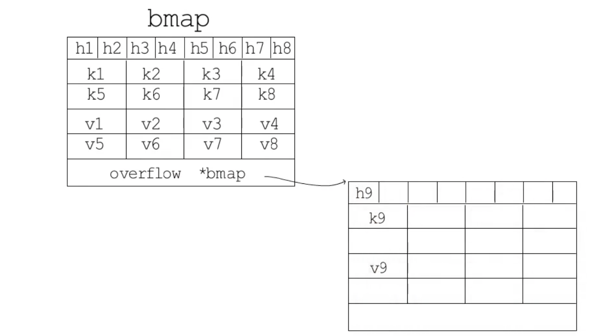
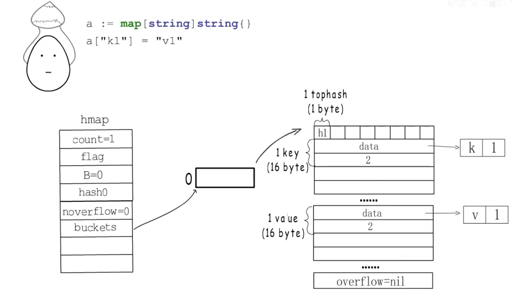

# map相关

<video id="video" width="1000px" height="600px" controls="controls">
    <source id="mp4" src="./assets/videos/Map长啥样儿？.mp4" type="video/mp4">
</video>

# 1.**map+锁和sync.Map怎么选择？**

sync.Map的性能高体现在读操作远多于写操作的时候。 极端情况下，只有读操作时，是普通map的性能的44.3倍。

反过来，如果是全写，没有读，那么sync.Map还不如加普通map+mutex锁呢。只有普通map性能的一半。

建议使用sync.Map时一定要考虑读定比例。当写操作只占总操作的<=1/10的时候，使用sync.Map性能会明显高很多。

# 2.**sync.Map底层原理：**

参考：[知乎专栏文章](https://zhuanlan.zhihu.com/p/344834329)

`sync.map` 适用于读多写少的场景。对于写多的场景，会导致 read map 缓存失效，需要加锁，导致冲突变多；而且由于未命中 read map 次数过多，导致 dirty map 提升为 read map，这是一个 O(N) 的操作，会进一步降低性能。

****

参考：[csdn文章](https://blog.csdn.net/u011957758/article/details/96633984)

sync.Map的原理很简单，使用了空间换时间策略，通过冗余的两个数据结构(read、dirty),实现加锁对性能的影响。

通过引入两个map将读写分离到不同的map，其中read map提供并发读和已存元素原子写，而dirty map则负责读写。

这样read map就可以在不加锁的情况下进行并发读取,当read map中没有读取到值时,再加锁进行后续读取,并累加未命中数。

当未命中数大于等于dirty map长度,将dirty map上升为read map。

从结构体的定义可以发现，虽然引入了两个map，但是底层数据存储的是指针，指向的是同一份值。

****

sync.Map 通过一份只使用原子操作的数据和一份冗余了只读数据的加锁数据实现一定程度上的读写分离，使得大多数读操作和更新操作是原子操作，写入新数据才加锁的方式来提升性能。

参考：[segmentfault文章](https://segmentfault.com/a/1190000018448064)

# 3.**如何优化并发情况下 map+锁性能？**

采用分段锁

参考：[segmentfault文章](https://segmentfault.com/a/1190000018448064)

# 4.**map底层实现？**

说道键值对的存储，我们就会想到哈希表，哈希表通常都会有一堆桶来存储键值对。先通过哈希函数把键处理一下得到一个哈希值，利用这个哈希值从m个桶中选择一个桶，有两种方法比较常用：

第一种是取模法，就是用哈希值与桶的个数m取模得到一个桶编号。

第二种是与运算法，用哈希值与m-1进行与运算。若想确保运算结果落在0到m-1而不会出现空桶，需要限制桶的个数m必须是2的整数次幂（这样m的二进制表示一定只有一位为1，m-1的二进制表示一定是低于这一位的所有位都为1）

如果多个键值对都选择来同一个桶，这就发生了哈希冲突，解决冲突的办法常用的有`开放寻址法`（取下一个空桶）和`链表法`（链一个新桶）。

哈希冲突的发生会影响哈希表的读写效率，选择散列均匀的哈希函数可以减少哈希冲突的发生，适时的对哈希表进行扩容也是一个有效手段。

通常会把存储键值对的数目与桶的个数的比值作为是否需要扩容的判断依据，这个比值被称为`负载因子`。需要扩容时就会分配更多的新桶，需要把旧桶里存储的键值对迁移到新桶中，如果哈希表中存储的键值对较多，一次性迁移所有桶的花费时间比较显著，所以通常会在哈希表扩容时，先分配足够多的新桶，然后用一个字段记录旧桶的位置，再增加一个字段记录旧桶迁移的进度（例如记录下一个要迁移的旧桶编号），在哈希表每次读写操作时，如果检测到当前处于扩容阶段，就完成一部分键值对的迁移任务，直到所有的键值对都迁移完成，旧桶不再使用，像这样把键值对的迁移时间分摊到多次哈希表的操作中的方式叫做`渐进式扩容`。可以避免一次扩容带来的性能瞬时抖动。

Go语言中map类型的底层实现是哈希表，map类型的变量本质上就是一个指针，指向hmap结构体，count记录已经存储的键值对数目，B记录桶的数目是2的多少次幂，因为这里选择的是与运算法，buckets记录桶在哪，oldbuckets用于记录在扩容阶段旧桶在哪，nvacuate用于记录渐进式扩容阶段下一个要迁移的旧桶编号。

一个桶也就是bmap可以存放8个键值对，但是为了让内存排列更加紧凑，8个key放在一起，8个value放在一起。

在8个key的前面则是8个tophash，每个tophash都是对应哈希值的高8位。

最后是一个bmap型的指针，指向一个溢出桶，溢出桶的类型布局与常规桶一样，是为了减少扩容次数引入的，当一个桶存满了，还有可用的溢出桶时，就会在桶后面链一个溢出桶，继续往溢出桶里存。

实际上如果哈希表要分配的桶个数大于2^4就认为使用的溢出桶的几率比较大，就会预分配2^(B-4)个溢出桶备用，这些溢出桶与常规桶在内存中是连续的，只是前2^B个用作常规桶，后面的用作溢出桶。

hmap结构体最后有一个extra字段指向一个mapextra结构体，里面记录的都是溢出桶相关的信息，nextoverflow指向下一个空闲的溢出桶，overflow是一个slice，记录目前已经被使用的溢出桶的地址。

假如编号为2的桶存满了就会在后面链一个溢出桶，nextoverflow指向下一个空闲桶，noverflow记录使用溢出桶的数量，此时只用了1个，oldoverflow用于在扩容阶段存储旧桶旧桶用到的那些溢出桶的地址。

下面看一个例子，变量a实际上是一个hmap的指针，目前存储一个键值对，只拥有一个桶，也没有预分配的溢出桶。

首先是8个tophash，每个占1字节，因为key和value都是string类型，所以64位下的每个key和value都占用16字节，取k1哈希值的高8位存到h1位置，data是"k1"，占用字节数为2，value也是一样，daata是"v1"，占用字节数为2。

如果我们把这个桶存满，接下来再继续存储新的键值对时，这个哈希表会创建新桶还是会扩容呢？这需要看map的扩容规则了：

- Go语言map的默认负载因子是6.5，超过这个数就会触发翻倍扩容，分配新桶的数目是旧桶的两倍

- 如果负载因子没有超标，但是使用的溢出桶较多，会触发等量扩容。即：
    - 常规桶数目小于2^15，使用溢出桶的数目超过常规桶数目。
    - 常规桶数目大于2^15，使用溢出桶的数目超过2^15。

等量扩容就是创建和旧桶数量一样多的新桶，然后把键值对迁移至新桶中，那等量扩容有什么用呢？

其实这个规则是桶的负载因子没有超过上限值，但是使用了较多溢出桶，这种情况对应着很多键值对被删除的情况。这样迁移到新桶后能够使得键值对排列更加紧凑，并且减少溢出桶的使用。

****

关于map源码阅读可以参考：[知乎文章](https://zhuanlan.zhihu.com/p/66676224)

# 5.无锁map如何实现？

参考[coolshell](https://coolshell.cn/articles/9703.html)

