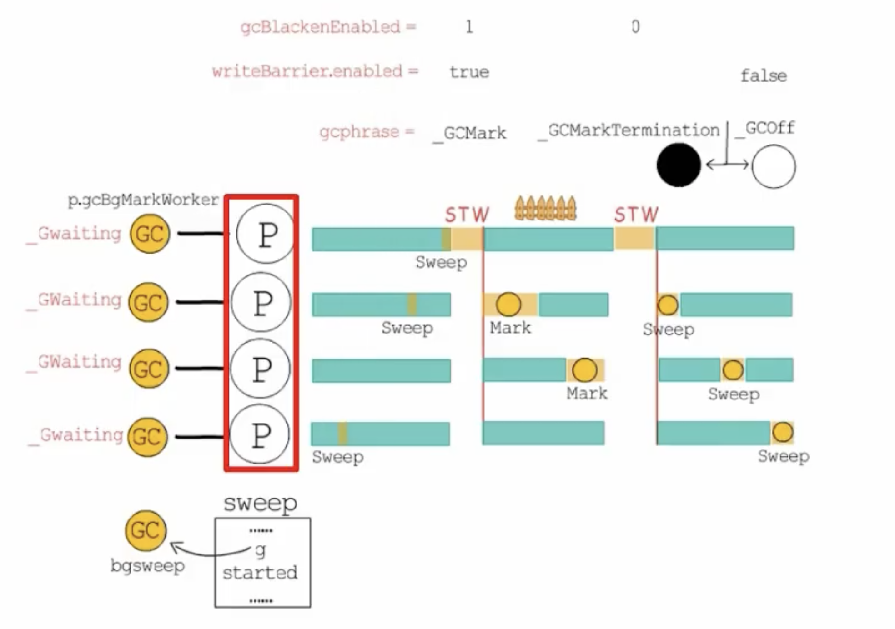
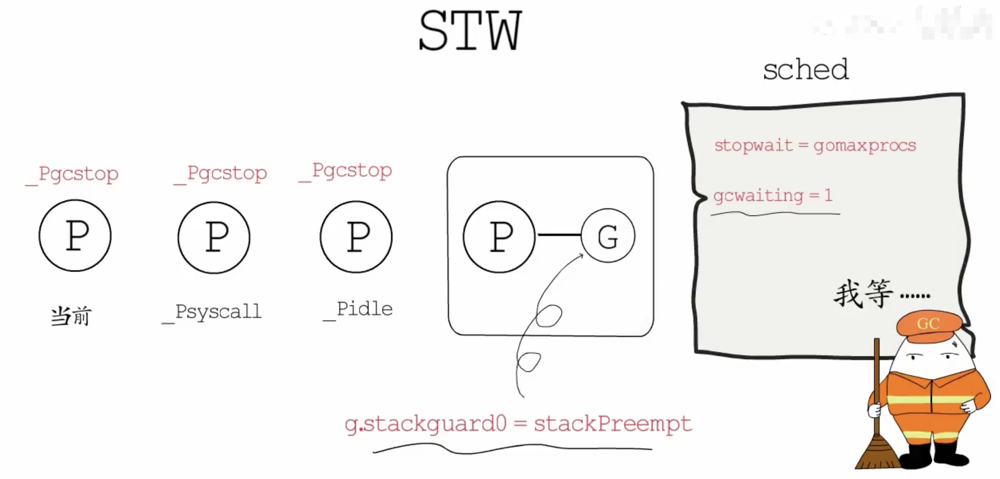
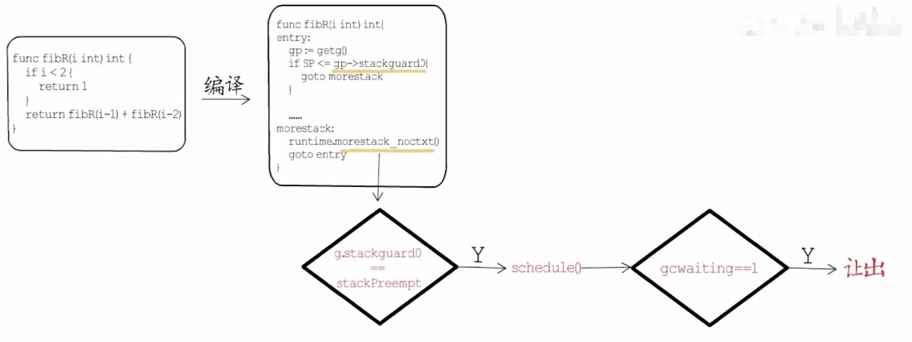
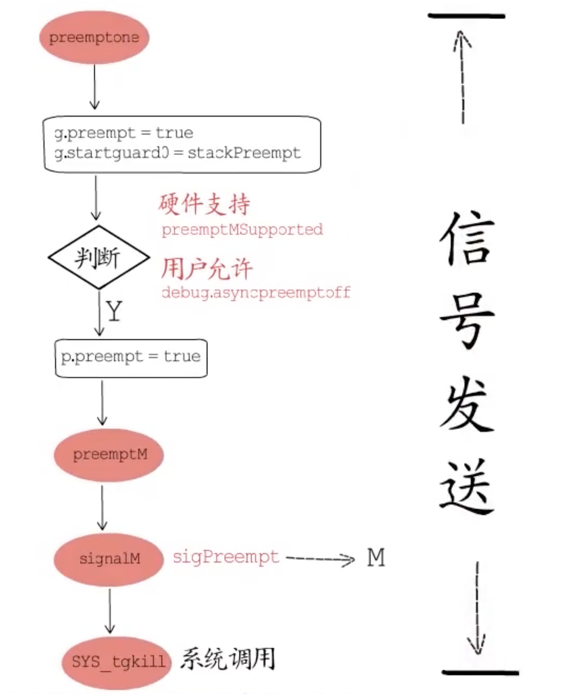

# 协程非抢占式多任务处理讲一下？

<video id="video" width="1000px" height="600px" controls="controls">
    <source id="mp4" src="./assets/videos/抢占式调度(1).mp4" type="video/mp4">
</video>

<video id="video" width="1000px" height="600px" controls="controls">
    <source id="mp4" src="./assets/videos/抢占式调度(2).mp4" type="video/mp4">
</video>

线程在任何时候都会被操作系统切换，所以线程是抢占式多任务处理，线程没有控制权的，哪怕做到一半甚至是语句执行到一半都会被操作系统从中间掐掉然后转到其他线程上去做。协程不一样，协程是非抢占式的，什么时候交出控制权是由协程内部决定的，正是由于非抢占式才使得协程变得轻量级，抢占式需要处理保存上一个线程更多的上下文，对资源消耗多一些，说白了就是线程的切换比协程需要保存的上下文更多。协程是编译器/解释器/虚拟机层面的多任务，不是操作系统层面的多任务，go语言自己的调度器调度协程而不需要操作系统调度器，因此多个协程可以在一个线程上执行。

虽然goroutine是非抢占式的，但是gmp调度器还是可以对协程进行切换。

goroutine可能切换的点：

- I/O，select
  
- channel
  
- 等待锁
  
- 函数调用 （有时）
  
- runtime.GoSched()


来源：ccmouse goroutine


# go 1.13

下面代码在go1.13中会阻塞，实际上它会在stw时阻塞。

```go
package main
 
import "fmt"

func main() {
     go func(n int) {
         for{
             n++
             fmt.Println(n)
         }
     }(0)
     for{}
}
```



gc的stw逻辑是gc需要抢占所有的p，将当前的p、陷入系统调用的p、空闲状态的p设置为_Pgcstop状态，对于还有g在运行的p，则会将其对应的g.stackguard0设置为一个特殊标识runtime.stackPreempt，告诉它GC在等待你让出呢，此外，还会设置一个gcwaiting标识（sched.gcwaiting=1）。



接下来会通过这两个标识符的配合来实现运行中的p的抢占，怎么实现呢？

goroutine在创建之初，栈的大小是固定的，为了防止出现栈溢出的情况，编译器会在有明显栈消耗的函数头部插入一些检验代码，通过g.stackguard0来判断是否需要进行栈增长，但如果g.stackguard0被设置为特殊标识runtime.stackPreempt，便不会执行栈增长，而是去执一次调度（schedule()）。



在调度执行时会检测sched.gcwaiting标识，若发现gc在等待执行，便会让出当前p，将其设置为_Pgstop状态，这就是协作式抢占。所以像for{}这种没有函数调用也就没机会执行栈增长检测代码，所以它并不知道gc在等待它让出。


这是go 1.13中的情况，依赖栈增长检测代码的方式。不算是真正的抢占式调度，不过在1.14中真正实现了抢占式调度

参考：[幼麟实验室](https://zhuanlan.zhihu.com/p/386998235)

# go 1.14 基于信号实现异步抢占

在linux操作系统上这种真正的抢占式调度是基于信号实现的，所以也成为异步抢占，函数preempone用来抢占一个p，主要是设置g.preempt=true，并将g.startguard0设置为特殊标识stackPreempt，而且增加了最后的if语句，判断当前硬件环境是否支持异步抢占并且用户是否允许开启异步抢占，当然默认是允许的，如果if条件通过了，就将p.preempt字段置为true。

```go
func preemptone(_p_ *p) bool {
     mp:= _p_.m.ptr()
     if mp == nil || mp == getg().m {
         return false
     }
     gp:= mp.curg
     if gp == nil || gp == mp.g0 {
         return false
     }
     gp.preempt= true
     gp.stackguard0= stackPreempt
     if preemptMSupported && debug.asyncpreemptoff == 0 {
         _p_.preempt= true
         preemptM(mp)
     }
     returntrue
}
```

实际的抢占操作会交由preemptM函数来完成，它的主要逻辑是通过runtime.SignalM函数向指定M发送sigPreempt信号，SignalM会调用操作系统中信号相关的系统调用，将指定信号发送给目标线程，



线程接收到信号以后，会调用对应的信号handler处理，go语言的信号交由runtime.sigHandler来处理，sigHandler在确定信号为sigPreempt以后，会调用doSigPreempt函数，它会首先确认runtime是否要对指定的g进行异步抢占：

- 首先指定的g与其对应的p的preempt字段都为true
  
- 指定的g还要处于running状态
  
- 然后还要确认在当前位置打断g并执行异步抢占是安全的，首先，指定的g可以挂起并安全的扫描它的栈和寄存器，并且当前被打断的位置并没有打断写屏障。第二，指定的g还有足够的栈空间来注入一个异步抢占函数调用。第三，这里可以安全的和runtime交互，主要就是确定当前并没有持有runtime相关的锁，继而不会在后续尝试获得锁时造成死锁
  
```go
func doSigPreempt(gp *g, ctxt *sigctxt){
     if wantAsyncPreempt(gp) && isAsyncSafePoint(gp, ctxt.sigpc(),ctxt.sigsp(), ctxt.siglr()) {
         ctxt.pushCall(funcPC(asyncPreempt))
     }
 
     atomic.Xadd(&gp.m.preemptGen,1)
     atomic.Store(&gp.m.signalPending,0)
 
     if GOOS == "darwin" {
         atomic.Xadd(&pendingPreemptSignals,-1)
     }
}
```

在确认了要抢占这个g并且在此时抢占是安全的以后，就可以放心的通过pushCall向g的执行上下文注入异步抢占函数（asyncPreempt）了，被注入的异步抢占函数是一个汇编函数，它会先把各个寄存器的值保存在栈上，也就是先保存现场到栈上，然后调用runtime.asyncPreempt2函数，其中preemptStop主要在GC标记时被用来挂起运行中的goroutine，preemptPark函数会把当前g切换至_Gpreempted状态，然后调用schedule函数。到这里异步抢占就完成了。

```go
func asyncPreempt2() {
     gp:= getg()
     gp.asyncSafePoint= true
     if gp.preemptStop {
         mcall(preemptPark)
     }else {
         mcall(gopreempt_m)
     }
     gp.asyncSafePoint= false
}
```

即使for{}没有执行栈增长检测代码，通过注入异步回调函数的方式，依然不会阻塞，实现抢占式调度。

抢占流程由抢占的发起方向被抢占线程发送 SIGURG 信号。

抢占会在下列时机发生：

- STW 期间
  
- 在 P 上执行 safe point 函数期间
  
- sysmon 后台监控期间

- gc pacer 分配新的 dedicated worker 期间

- panic 崩溃期间


参考：

- [幼麟实验室](https://zhuanlan.zhihu.com/p/387003228)

- [csdn文章](https://blog.csdn.net/cch1234/article/details/119113759)
- [csdn qcrao文章](https://blog.csdn.net/qcrao/article/details/116725083)

