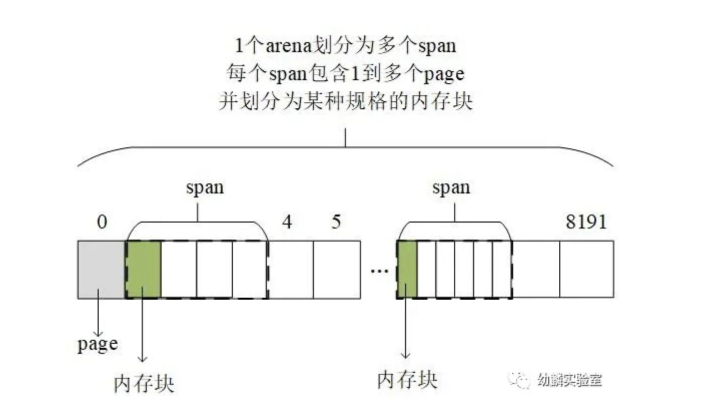

# go语言内存模型

# 堆内存管理

<video id="video" width="1000px" height="600px" controls="controls">
    <source id="mp4" src="./assets/videos/堆内存管理（一）.mp4" type="video/mp4">
</video>

mallocgc函数: 

<video id="video" width="1000px" height="600px" controls="controls">
    <source id="mp4" src="./assets/videos/堆内存分配：mallocgc函数.mp4" type="video/mp4">
</video>

栈内存管理：

<video id="video" width="1000px" height="600px" controls="controls">
    <source id="mp4" src="./assets/videos/栈内存管理.mp4" type="video/mp4">
</video>

因为程序运行起来所需要分配的内存块有大有小，而分散的、大小不一的碎片化内存一方面可能降低内存使用率。另一方面要找到大小合适的内存块的代价会因碎片化而增加。为降低碎片化内存给程序性能造成的不良影响，Go语言的堆分配采用了与tcmalloc内存分配器类似的算法。

简单来讲就是：按照一组预置的大小规格把内存页划分成块，然后把不同规格的内存块放入对应的空闲链表中。

程序申请内存时，分配器会先根据要申请的内存大小找到最匹配的规格，然后从对应空闲链表中分配一个内存块。

Go 1.16 runtime包给出了67种预置的大小规格，最小8字节，最大32KB。Go语言的runtime将堆地址空间划分成了一个一个的arena，每个arena的大小是64MB，每个arena包含8192个page，所以每个page大小为8KB。在划分的整整齐齐的arena里，又会按需划分出不同的span，每个span包含一组连续的page，并且按照特定规格划分成了等大的内存块。

arena, span, page和内存块组成了堆内存，而在堆内存之外，有一票用于管理堆内存的数据结构。

例如，一个arena对应一个heapArena结构，一个span对应一个mspan结构。通过它们可以知道某个内存块是否已分配；已分配的内存用作指针还是标量；是否已被GC标记；是否等待清扫等信息。

为保障多个p之间的并发安全，在向全局mcentral申请mspan时需要加锁，未降低多个p之间的竞争，Go语言的每个p都有一个本地小对象缓存。当前P需要用到特定规格类型的mspan时，先去本地缓存这里找对应的mspan；如果没有或者用完了，就去mcentral这里获取一个放到本地，把已用尽的归还到对应mcentral的full set中。

# mallocgc功能之辅助GC

mallocgc是负责堆分配的关键函数，runtime中的new系列和make系列函数都依赖它。

协程每次执行辅助GC，最少要扫描64KB。先不要替那些申请小块内存的协程感到不公平，因为协程每次执行辅助GC，多出来的部分会作为信用存储到当前G中，就像信用卡的额度一样，后续再执行mallocgc()时，只要信用额度用不完，就不用执行辅助GC了。

此外，还有一种偷懒的办法来逃避辅助GC的责任，那就是：后台的GC mark worker执行扫描任务，会在全局gcController的bgScanCredit这里积累信用。如果能够窃取足够多的信用值来抵消当前协程背负的债务，那也就不用执行辅助GC了。除此之外，后台的GC mark worker执行扫描任务，会在全局gcController的bgScanCredit这里积累信用。如果能够窃取足够多的信用值来抵消当前协程背负的债务，那也就不用执行辅助GC了

# 栈内存管理

