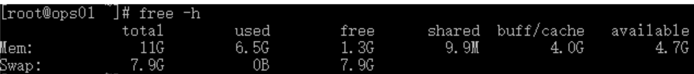
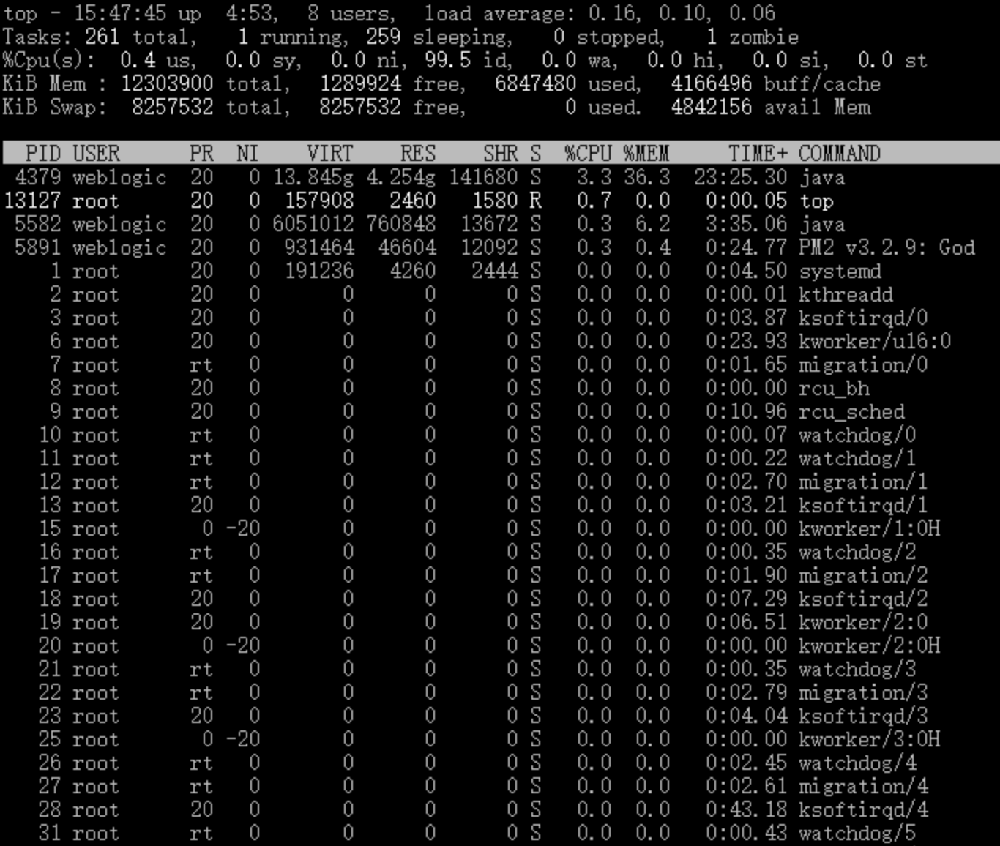
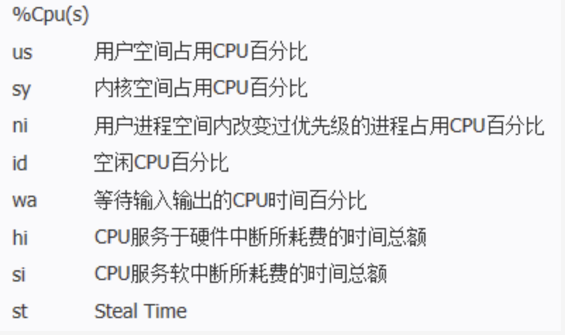
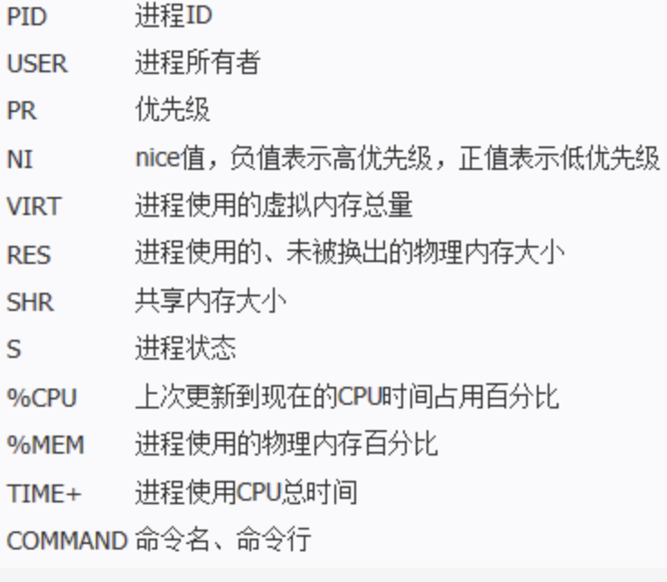

# 查看内存命令

# 1.free命令

free 命令显示系统使用和空闲的内存情况，包括物理内存、交互区内存(swap)和内核缓冲区内存。

可以采用free -m和free -g命令查看，分别表示MB和GB。free -h会自动选择以适合理解的容量单位显示

::: tip 解释
Mem:表示物理内存统计，如果机器剩余内存非常小，一般小于总内存的20%，则判断为系统物理内存不够

Swap: 表示硬盘上交换分区的使用情况，如剩余空间较小，需要留意当前系统内存使用情况及负载，当Swap的used值大于0时，则表示操作系统物理内存不够，已经开始使用硬盘内存了。第1行数据11G表示物理内存总量；6.5G表示总计分配给缓存(包含buffers与cache)使用的数量，但其中可能部分缓存并未实际使用；1.3G表示未被分配的内存；shared表示共享内存；4.0G表示系统分配但未被使用的buffers数量；4.7G表示系统分配但未被使用的available数量
:::

# 2.top命令

top 命令查看系统的实时负载， 包括进程、CPU负载、内存使用等等；

# 3.cat /proc/meminfo

查看RAM使用情况最简单的方法是通过/proc/meminfo。这个动态更新的虚拟文件实际上是许多其他内存相关工具(如：free / ps / top)等的组合显示。/proc/meminfo列出了所有你想了解的内存的使用情况。进程的内存使用信息也可以通过 `/proc/<pid>/statm` 和 `/proc/<pid>/status` 来查看。

# 4.vmstat

vmstat命令显示实时的和平均的统计，覆盖CPU、内存、I/O等内容。例如内存情况，不仅显示物理内存，也统计虚拟内存。

