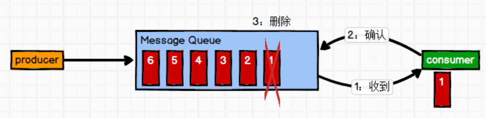
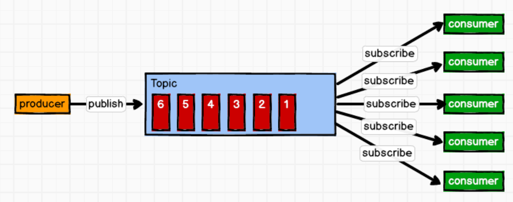

# 消息队列的两种模式

# 点对点模式

一对一，消费者主动拉取数据，消息收到后消息清除。

消息生产者生产消息发送到 Queue 中，然后消息消费者从 Queue 中取出并且消费消息。消息被消费以后，queue 中不再有存储，所以消息消费者不可能消费到已经被消费的消息。 Queue 支持存在多个消费者，但是对一个消息而言，只会有一个消费者可以消费。

# 发布/订阅模式

一对多，消费者消费数据之后不会清除消息

消息生产者(发布)将消息发布到 topic 中，同时有多个消息消费者(订阅)消费该消息。和点对点方式不同，发布到 topic 的消息会被所有订阅者消费。

