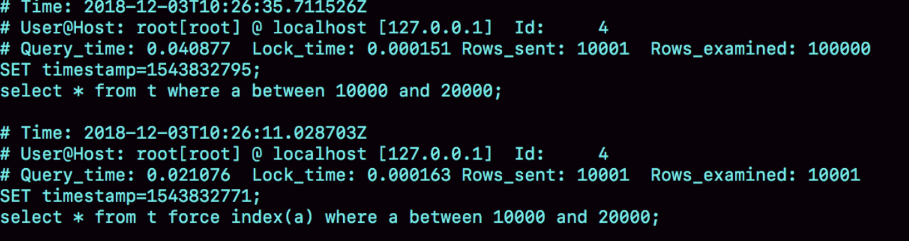

# MySQL为什么会选错索引？

我们先建一个简单的表，表里有 a、b 两个字段，并分别建上索引：

``` mysql
CREATE TABLE `t` (
  `id` int(11) NOT NULL,
  `a` int(11) DEFAULT NULL,
  `b` int(11) DEFAULT NULL,
  PRIMARY KEY (`id`),
  KEY `a` (`a`),
  KEY `b` (`b`)
) ENGINE=InnoDB；
```

然后，我们往表 t 中插入 10 万行记录，取值按整数递增，即：(1,1,1)，(2,2,2)，(3,3,3) 直到 (100000,100000,100000)。

我是用存储过程来插入数据的，这里我贴出来方便你复现：

``` mysql
delimiter ;;
create procedure idata()
begin
  declare i int;
  set i=1;
  while(i<=100000)do
    insert into t values(i, i, i);
    set i=i+1;
  end while;
end;;
delimiter ;
call idata();
```

接下来，我们分析一条 SQL 语句：

```mysql
mysql> select * from t where a between 10000 and 20000;
```

下图显示的就是使用 explain 命令看到的这条语句的执行情况。


这条查询语句的执行也确实符合预期，key 这个字段值是’a’，表示优化器选择了索引 a。

不过别急，这个案例不会这么简单。在我们已经准备好的包含了 10 万行数据的表上，我们再做如下操作。


这里，session A 就是开启了一个事务。随后，session B 把数据都删除后，又调用了 idata 这个存储过程，插入了 10 万行数据。

这时候，session B 的查询语句 select * from t where a between 10000 and 20000 就不会再选择索引 a 了。我们可以通过慢查询日志（slow log）来查看一下具体的执行情况。

为了说明优化器选择的结果是否正确，我增加了一个对照，即：使用 force index(a) 来让优化器强制使用索引 a，下面的三条 SQL 语句，就是这个实验过程。

```mysql
set long_query_time=0;
select * from t where a between 10000 and 20000; /*Q1*/
select * from t force index(a) where a between 10000 and 20000;/*Q2*/
```

下图所示是这三条 SQL 语句执行完成后的慢查询日志。



可以看到，Q1 扫描了 10 万行，显然是走了全表扫描，执行时间是 40 毫秒。Q2 扫描了 10001 行，执行了 21 毫秒。也就是说，我们在没有使用 force index 的时候，MySQL 用错了索引，导致了更长的执行时间。**这个例子对应的是我们平常不断地删除历史数据和新增数据的场景。** 这时，MySQL 竟然会选错索引。


# 优化器的逻辑

选择索引是优化器的工作。而优化器选择索引的目的，是找到一个最优的执行方案，并用最小的代价去执行语句。在数据库里面，扫描行数是影响执行代价的因素之一。扫描的行数越少，意味着访问磁盘数据的次数越少，消耗的 CPU 资源越少。当然，扫描行数并不是唯一的判断标准，优化器还会结合是否使用临时表、是否排序等因素进行综合判断。我们这个简单的查询语句并没有涉及到临时表和排序，所以 MySQL 选错索引肯定是在判断扫描行数的时候出问题了。


rows 这个字段表示的是预计扫描行数。其中，Q1 的结果还是符合预期的，rows 的值是 104620；但是 Q2 的 rows 值是 37116，偏差就大了。而图 1 中我们用 explain 命令看到的 rows 是只有 10001 行，是这个偏差误导了优化器的判断。

到这里，可能你的第一个疑问不是为什么不准，而是优化器为什么放着扫描 37000 行的执行计划不用，却选择了扫描行数是 100000 的执行计划呢？

这是因为，如果使用索引 a，每次从索引 a 上拿到一个值，都要回到主键索引上查出整行数据，这个代价优化器也要算进去的。

而如果选择扫描 10 万行，是直接在主键索引上扫描的，没有额外的代价。

优化器会估算这两个选择的代价，从结果看来，优化器认为直接扫描主键索引更快。当然，从执行时间看来，这个选择并不是最优的。

所以 MySQL 选错索引，这件事儿还得归咎到没能准确地判断出扫描行数。


# 索引选择异常和处理

一种方法是，像我们第一个例子一样，采用 force index 强行选择一个索引。

第二种方法就是，我们可以考虑修改语句，引导 MySQL 使用我们期望的索引。

第三种方法是，在有些场景下，我们可以新建一个更合适的索引，来提供给优化器做选择，或删掉误用的索引。


