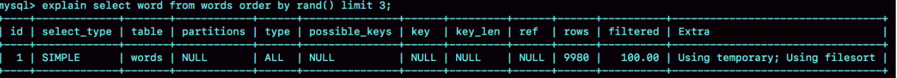

# 如何正确地显示随机消息？

英语学习 App 首页有一个随机显示单词的功能，也就是根据每个用户的级别有一个单词表，然后这个用户每次访问首页的时候，都会随机滚动显示三个单词。我们发现随着单词表变大，选单词这个逻辑变得越来越慢，甚至影响到了首页的打开速度。

现在，如果让你来设计这个 SQL 语句，你会怎么写呢？

为了便于理解，我对这个例子进行了简化：去掉每个级别的用户都有一个对应的单词表这个逻辑，直接就是从一个单词表中随机选出三个单词。这个表的建表语句和初始数据的命令如下：

```mysql
mysql> CREATE TABLE `words` (
  `id` int(11) NOT NULL AUTO_INCREMENT,
  `word` varchar(64) DEFAULT NULL,
  PRIMARY KEY (`id`)
) ENGINE=InnoDB;
 
delimiter ;;
create procedure idata()
begin
  declare i int;
  set i=0;
  while i<10000 do
    insert into words(word) values(concat(char(97+(i div 1000)), char(97+(i % 1000 div 100)), char(97+(i % 100 div 10)), char(97+(i % 10))));
    set i=i+1;
  end while;
end;;
delimiter ;
 
call idata();
```

为了便于量化说明，我在这个表里面插入了 10000 行记录。


# 内存临时表

首先，你会想到用 order by rand() 来实现这个逻辑。

```mysql
mysql> select word from words order by rand() limit 3;
```

这个语句的意思很直白，随机排序取前 3 个。我们先用 explain 命令来看看这个语句的执行情况。



Extra 字段显示 Using temporary，表示的是需要使用临时表；Using filesort，表示的是需要执行排序操作。因此这个 Extra 的意思就是，需要临时表，并且需要在临时表上排序。

对于 InnoDB 表来说，执行全字段排序会减少磁盘访问，因此会被优先选择。但是对于内存表，回表过程只是简单地根据数据行的位置，直接访问内存得到数据，根本不会导致多访问磁盘。优化器没有了这一层顾虑，那么它会优先考虑的，就是用于排序的行越小越好了，所以，MySQL 这时就会选择 rowid 排序。

这条语句的执行流程是这样的：

- 创建一个临时表。这个临时表使用的是 memory 引擎，表里有两个字段，第一个字段是 double 类型，为了后面描述方便，记为字段 R，第二个字段是 varchar(64) 类型，记为字段 W。并且，这个表没有建索引。

- 从 words 表中，按主键顺序取出所有的 word 值。对于每一个 word 值，调用 rand() 函数生成一个大于 0 小于 1 的随机小数，并把这个随机小数和 word 分别存入临时表的 R 和 W 字段中，到此，扫描行数是 10000。

- 现在临时表有 10000 行数据了，接下来你要在这个没有索引的内存临时表上，按照字段 R 排序。

- 初始化 sort_buffer。sort_buffer 中有两个字段，一个是 double 类型，另一个是整型。

- 从内存临时表中一行一行地取出 R 值和位置信息，分别存入 sort_buffer 中的两个字段里。这个过程要对内存临时表做全表扫描，此时扫描行数增加 10000，变成了 20000。

- 在 sort_buffer 中根据 R 的值进行排序。注意，这个过程没有涉及到表操作，所以不会增加扫描行数。

- 排序完成后，取出前三个结果的位置信息，依次到内存临时表中取出 word 值，返回给客户端。这个过程中，访问了表的三行数据，总扫描行数变成了 20003。

这里的“位置信息”是个什么概念？

我们就要回到一个基本概念：MySQL 的表是用什么方法来定位“一行数据”的。

实际上它表示的是：每个引擎用来唯一标识数据行的信息。

- 对于有主键的 InnoDB 表来说，这个 rowid 就是主键 ID；
- 对于没有主键的 InnoDB 表来说，这个 rowid 就是由系统生成的；
- MEMORY 引擎不是索引组织表。在这个例子里面，你可以认为它就是一个数组。因此，这个 rowid 其实就是数组的下标。

到这里，我来稍微小结一下：**order by rand() 使用了内存临时表，内存临时表排序的时候使用了 rowid 排序方法。**

# 磁盘临时表

那么，是不是所有的临时表都是内存表呢？

其实不是的。tmp_table_size 这个配置限制了内存临时表的大小，默认值是 16M。如果临时表大小超过了 tmp_table_size，那么内存临时表就会转成磁盘临时表。

磁盘临时表使用的引擎默认是 InnoDB。

不论是使用哪种类型的临时表，order by rand() 这种写法都会让计算过程非常复杂，需要大量的扫描行数，因此排序过程的资源消耗也会很大。

再回到我们开头的问题，怎么正确地随机排序呢？

# 随机排序方法

我们先把问题简化一下，如果只随机选择 1 个 word 值，可以怎么做呢？思路上是这样的：

- 1.取得这个表的主键 id 的最大值 M 和最小值 N;

- 2.用随机函数生成一个最大值到最小值之间的数 X = (M-N)*rand() + N;

- 3.取不小于 X 的第一个 ID 的行。

我们把这个算法，暂时称作随机算法 1。

```mysql
mysql> select max(id),min(id) into @M,@N from t ;
set @X= floor((@M-@N+1)*rand() + @N);
select * from t where id >= @X limit 1;
```

但实际上，这个算法本身并不严格满足题目的随机要求，因为 ID 中间可能有空洞，因此选择不同行的概率不一样，不是真正的随机。

所以，为了得到严格随机的结果，你可以用下面这个流程:

- 1.取得整个表的行数，并记为 C。

- 2.取得 Y = floor(C * rand())。 floor 函数在这里的作用，就是取整数部分。

- 3.再用 limit Y,1 取得一行。

我们把这个算法，称为随机算法 2。下面这段代码，就是上面流程的执行语句的序列。

```mysql
mysql> select count(*) into @C from t;
set @Y = floor(@C * rand());
set @sql = concat("select * from t limit ", @Y, ",1");
prepare stmt from @sql;
execute stmt;
DEALLOCATE prepare stmt;
```

MySQL 处理 limit Y,1 的做法就是按顺序一个一个地读出来，丢掉前 Y 个，然后把下一个记录作为返回结果，因此这一步需要扫描 Y+1 行。再加上，第一步扫描的 C 行，总共需要扫描 C+Y+1 行，执行代价比随机算法 1 的代价要高。

现在，我们再看看，如果我们按照随机算法 2 的思路，要随机取 3 个 word 值呢？你可以这么做：

- 1.取得整个表的行数，记为 C；

- 2.根据相同的随机方法得到 Y1、Y2、Y3；

- 3.再执行三个 limit Y, 1 语句得到三行数据。


我们把这个算法，称作随机算法 3。下面这段代码，就是上面流程的执行语句的序列。

```mysql
mysql> select count(*) into @C from t;
set @Y1 = floor(@C * rand());
set @Y2 = floor(@C * rand());
set @Y3 = floor(@C * rand());
select * from t limit @Y1，1； // 在应用代码里面取 Y1、Y2、Y3 值，拼出 SQL 后执行
select * from t limit @Y2，1；
select * from t limit @Y3，1；
```


