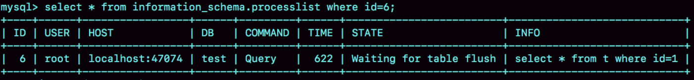
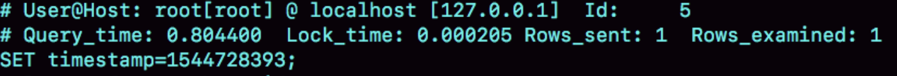

# 只查一行的语句为什么变慢？


为了便于描述，我还是构造一个表，基于这个表来说明今天的问题。这个表有两个字段 id 和 c，并且我在里面插入了 10 万行记录。

```mysql
mysql> CREATE TABLE `t` (
  `id` int(11) NOT NULL,
  `c` int(11) DEFAULT NULL,
  PRIMARY KEY (`id`)
) ENGINE=InnoDB;
 
delimiter ;;
create procedure idata()
begin
  declare i int;
  set i=1;
  while(i<=100000)do
    insert into t values(i,i);
    set i=i+1;
  end while;
end;;
delimiter ;
 
call idata();
```

# 第一类：查询长时间不返回

在表 t 执行下面的 SQL 语句：

```mysql
mysql> select * from t where id=1;
```

查询结果长时间不返回。


一般碰到这种情况的话，大概率是表 t 被锁住了。接下来分析原因的时候，**一般都是首先执行一下 show processlist 命令**，看看当前语句处于什么状态。

# 等 MDL 锁

使用 show processlist 命令查看 Waiting for table metadata lock 的示意图:


出现这个状态表示的是，现在有一个线程正在表 t 上请求或者持有 MDL 写锁，把 select 语句堵住了。

这类问题的处理方式，就是找到谁持有 MDL 写锁，然后把它 kill 掉。

# 等 flush

在表 t 上，执行下面的 SQL 语句：

```mysql
mysql> select * from information_schema.processlist where id=1;
```

查出来这个线程的状态是 Waiting for table flush



出现 Waiting for table flush 状态的可能情况是：有一个 flush tables 命令被别的语句堵住了，然后它又堵住了我们的 select 语句。

还是需要 show processlist 找到阻塞的语句再 kill 掉它。

# 等行锁

现在，经过了表级锁的考验，我们的 select 语句终于来到引擎里了。

```mysql
mysql> select * from t where id=1 lock in share mode; 
```

由于访问 id=1 这个记录时要加读锁，如果这时候已经有一个事务在这行记录上持有一个写锁，我们的 select 语句就会被堵住。

找到它并kill掉。

# 第二类：查询慢

```mysql
mysql> select * from t where id=1；
```

虽然扫描行数是 1，但执行时间却长达 800 毫秒。



如果我把这个 slow log 的截图再往下拉一点，你可以看到下一个语句，select * from t where id=1 lock in share mode，执行时扫描行数也是 1 行，执行时间是 0.2 毫秒。


看上去是不是更奇怪了？按理说 lock in share mode 还要加锁，时间应该更长才对啊。

实际上是因为有事务执行了大量的更新语句，导致我们的查询语句需要执行undo log回滚日志获取结果。

带 lock in share mode 的 SQL 语句，是当前读，因此会直接读到结果，所以速度很快；而 select * from t where id=1 这个语句，是一致性读，因此需要从更新后的值开始，依次执行 undo log，执行了 n 次以后，才将结果返回。

