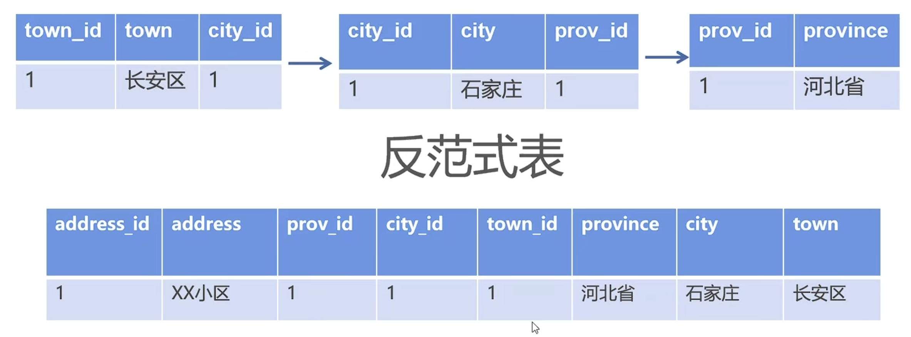
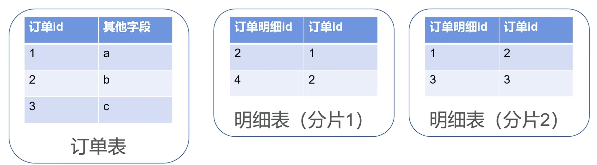
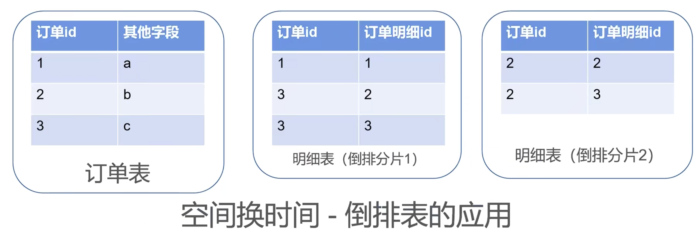

# 为啥禁止三表Join关联？

参考：[阿里开发规范解读，为啥禁止三表Join关联？](https://www.bilibili.com/video/BV1GA411A7gJ/?spm_id_from=333.788)

阿里开发规范：超过3个表禁止join。需要join的字段数据类型必须绝对一致，多表关联查询时保证被关联的字段有索引。即使双表join也要注意表索引，sql性能。

**为什么禁用多表关联？**

首先是产品强制要求，阿里OceanBase只允许两表关联，MaCat只支持两表关联。

其二是mysql自身设计缺陷，超过3表关联时mysql sql优化器做的不好，而且NLJ多级嵌套器性能差，NLJ一般是小表关联大表，在判断小表的过程中需要对数据分布做计算，选择的算法一般是贪心算法和动态规划算法，关联的表一旦多起来会占用大量cpu资源做判断小表的计算工作，所以多表join性能比较差。

**解决方案：**

1.多次select

``` mysql
select * from a where ...
select * from b where aid in(...)
select * from c where bid in(...)
```

这是一个临时解决方案，适用数据量小的情况，而且是inner join。如果数据量大，第一个sql查出的aid如果是几万个，第二个sql查询会很慢。

2.反范式表

反范式表就是对上面3个表拼接成一张表单独存储，如果有join查询的场景直接面向反范式表查，在3表有新增或者修改时需要同步更新反范式表。



反范式表适合单库处理，数据量不大，并发也不大。

3.数据集市

数据集市就是每天从原始数据源中对数据进行抽取，通过ETL（ETL就是数据加工导出导入）对数据进行加工，生成报表，中间表，视图等。在金融行业会采用日中处理，通常在凌晨对数据进行数据加工，未来不对原始数据操作而是对数据集市进行操作。


ETL常见的一个做法就是倒排表：

对于下面订单明细表分表后查询订单id=2的数据需要扫描所有分片。



采用倒排表后查询就很快了。




