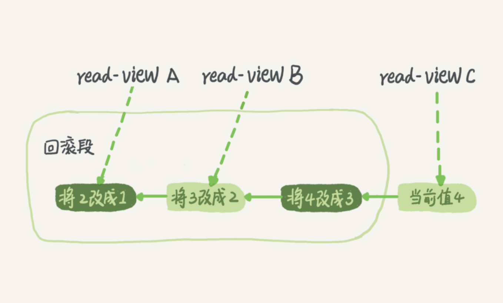

# 事务隔离是怎么实现的？

# 隔离性与隔离级别

当数据库上有多个事务同时执行的时候，就可能出现脏读（dirty read）、不可重复读（non-repeatable read）、幻读（phantom read）的问题，为了解决这些问题，就有了“隔离级别”的概念。

- 读未提交是指，一个事务还没提交时，它做的变更就能被别的事务看到。
  
- 读提交是指，一个事务提交之后，它做的变更才会被其他事务看到。
  
- 可重复读是指，一个事务执行过程中看到的数据，总是跟这个事务在启动时看到的数据是一致的。当然在可重复读隔离级别下，未提交变更对其他事务也是不可见的。
  
- 串行化，顾名思义是对于同一行记录，“写”会加“写锁”，“读”会加“读锁”。当出现读写锁冲突的时候，后访问的事务必须等前一个事务执行完成，才能继续执行。

**读未提交:**

其实就是可以读到其他事务未提交的数据，但没有办法保证你读到的数据最终一定是提交后的数据，如果中间发生回滚，那就会出现脏数据问题，读未提交没办法解决脏数据问题。更别提可重复读和幻读了

**读提交:**

一个事务只能读到其他事务已经提交过的数据.解决了脏读的问题，但是无法做到可重复读，也没办法解决幻读。

**可重复读:**

事务不会读到其他事务对已有数据的修改，即使其他事务已提交，也就是说，事务开始时读到的已有数据是什么，在事务提交前的任意时刻，这些数据的值都是一样的。但是，对于其他事务新插入的数据是可以读到的，这也就引发了幻读问题。

::: tip 不可重复读和幻读有什么区别？

不可重复读是读取了其他事务更改的数据，针对update操作。

幻读是读取了其他事务新增的数据，针对insert和delete操作。

:::

**串行化：**

串行化是4种事务隔离级别中隔离效果最好的，解决了脏读、可重复读、幻读的问题，但是效果最差，它将事务的执行变为顺序执行，与其他三个隔离级别相比，它就相当于单线程，后一个事务的执行必须等待前一个事务结束。
  
**参考：** https://zhuanlan.zhihu.com/p/117476959
  
**在实现上，数据库里面会创建一个视图，访问的时候以视图的逻辑结果为准。在“可重复读”隔离级别下，这个视图是在事务启动时创建的，整个事务存在期间都用这个视图。在“读提交”隔离级别下，这个视图是在每个 SQL 语句开始执行的时候创建的。这里需要注意的是，“读未提交”隔离级别下直接返回记录上的最新值，没有视图概念；而“串行化”隔离级别下直接用加锁的方式来避免并行访问。**

# 事务隔离的实现

我们展开说明“可重复读”。

在 MySQL 中，实际上每条记录在更新的时候都会同时记录一条回滚操作。记录上的最新值，通过回滚操作，都可以得到前一个状态的值。

假设一个值从 1 被按顺序改成了 2、3、4，在回滚日志里面就会有类似下面的记录。

当前值是 4，但是在查询这条记录的时候，不同时刻启动的事务会有不同的 read-view。如图中看到的，在视图 A、B、C 里面，这一个记录的值分别是 1、2、4，同一条记录在系统中可以存在多个版本，就是数据库的多版本并发控制（MVCC）。对于 read-view A，要得到 1，就必须将当前值依次执行图中所有的回滚操作得到。

同时你会发现，即使现在有另外一个事务正在将 4 改成 5，这个事务跟 read-view A、B、C 对应的事务是不会冲突的。

回滚日志总不能一直保留吧，什么时候删除呢？答案是，在不需要的时候才删除。也就是说，系统会判断，当没有事务再需要用到这些回滚日志时，回滚日志会被删除。什么时候才不需要了呢？就是当系统里没有比这个回滚日志更早的 read-view 的时候。

  
**为什么建议你尽量不要使用长事务？**

长事务意味着系统里面会存在很老的事务视图。由于这些事务随时可能访问数据库里面的任何数据，所以这个事务提交之前，数据库里面它可能用到的回滚记录都必须保留，这就会导致大量占用存储空间。

除了对回滚段的影响，长事务还占用锁资源，也可能拖垮整个库。

