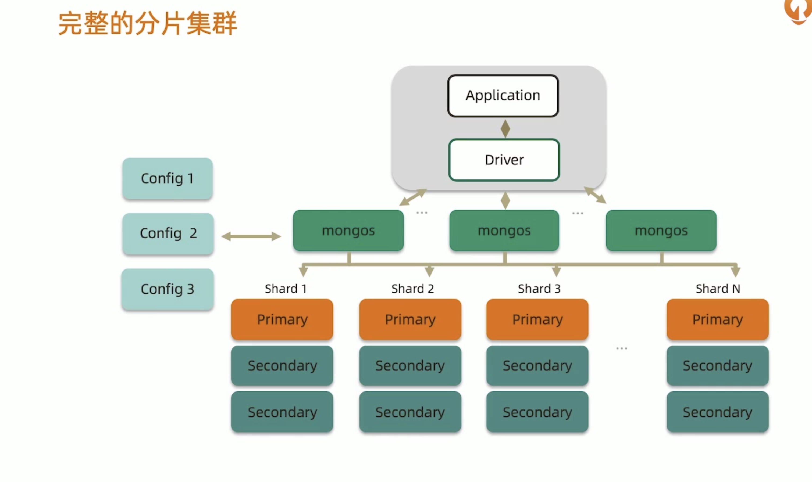
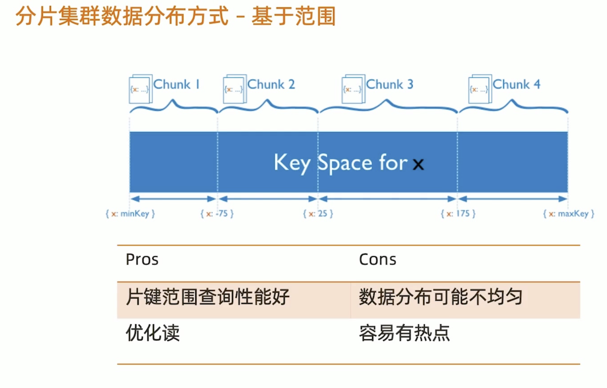

# MongoDB分片和副本集区别？

mongos：路由节点，转发应用端请求，选择合适的数据节点进行读取，合并多个数据节点返回，mongos至少有两个，主要做高可用

Config：配置节点，提供集群元数据存储，分片数据分布的映射，mongos在启动时会将映射表load到内存中，分发请求到目标节点

mongod：数据节点，以复制集为单位，每一个分片都是一个复制集，最大1024个分片，分片之间数据不重复

**数据分布方式**：

- 基于范围
- 基于hash
- 基于zone/tag

基于范围：

基于hash：

基于自定义zone：

