# explain结果字段有哪些？Show Profile？


<font size=5>**SQL执行加载顺序**</font>

手写:

``` mysql
SELECT DISTINCT
    <select_list>
FROM
    <left_table> <join_type>
JOIN 
    <right_table> 
ON
    <join_condition>
WHERE
    <where_condition>
GROUP BY
    <group_by_list>
HAVING
    <having_condition>
ORDER BY
    <order_by_condition>
LIMIT
    <limit_number>
```

机读:

``` mysql
FROM <left_table>
ON <join_condition>
<join_type> JOIN <right_table>
WHERE <where_condition>
GROUP BY <group_by_list>
HAVING <having_condition>
SELECT
DISTINCT <select_list>
ORDER BY <order_by_condition>
LIMIT <limit_number>
```


<font size=5>**1.id**</font>


select查询的序列号，包含一组数字，表示查询中执行select子句或者操作表的顺序，id号分为三种情况：

1、如果id相同，那么执行顺序从上到下

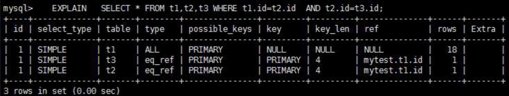


2、如果id不同，如果是子查询，id的序号会递增，id值越大优先级越高，越先被执行


3、id相同和不同的，同时存在：相同的可以认为是一组，从上往下顺序执行，在所有组中，id值越大，优先级越高，越先执行


<font size=5>**2.select_type**</font>


主要用来分辨查询的类型，是普通查询还是联合查询还是子查询。


**SIMPLE**

SIMPLE 代表单表查询。

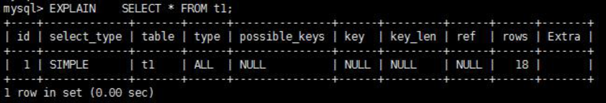

**PRIMARY**

查询中若包含任何复杂的子部分，最外层查询则被标记为 Primary。


**DERIVED**

在 FROM 列表中包含的子查询被标记为 DERIVED(衍生)，MySQL 会递归执行这些子查询，把结果放在临时表里。

**SUBQUERY**

在 SELECT 或 WHERE 列表中包含了子查询。

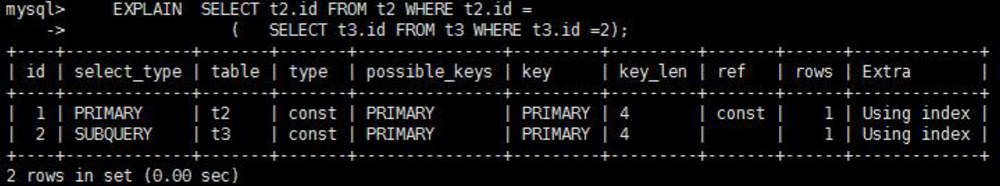

**DEPENDENT SUBQUERY**

在 SELECT 或 WHERE 列表中包含了子查询，子查询基于外层。


都是 where 后面的条件，subquery 是单个值，dependent subquery 是一组值。

**UNCACHEABLE SUBQUREY**


当使用了@@来引用系统变量的时候，不会使用缓存。

**UNION**

若第二个 SELECT 出现在 UNION 之后，则被标记为 UNION；若 UNION 包含在 FROM 子句的子查询中,外层 SELECT 将被标记为：DERIVED。

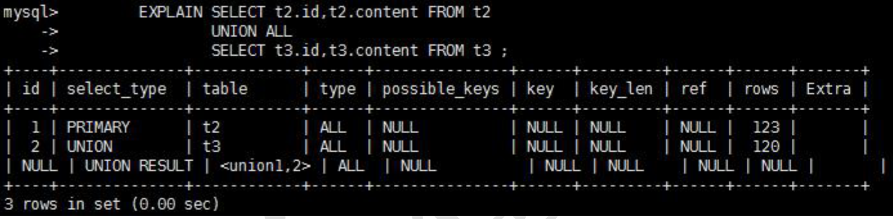

**UNION RESULT**

从 UNION 表获取结果的 SELECT。


<font size=5>**3.table**</font>


对应行正在访问哪一个表，表名或者别名，可能是临时表或者union合并结果集。

1、如果是具体的表名，则表明从实际的物理表中获取数据，当然也可以是表的别名

2、表名是derivedN的形式，表示使用了id为N的查询产生的衍生表

3、当有union result的时候，表名是union n1,n2等的形式，n1,n2表示参与union的id

<font size=5>**4.type**</font>


type显示的是访问类型，访问类型表示我是以何种方式去访问我们的数据，最容易想的是全表扫描，直接暴力的遍历一张表去寻找需要的数据，效率非常低下，访问的类型有很多，效率从最好到最坏依次是：

system > const > eq_ref > ref > fulltext > ref_or_null > index_merge > unique_subquery > index_subquery > range > index > ALL

一般情况下，得保证查询至少达到range级别，最好能达到ref。

**system**

表只有一行记录（等于系统表），这是 const 类型的特列，平时不会出现，这个也可以忽略不计。

**const**

表示通过索引一次就找到了,const 用于比较 primary key 或者 unique 索引。因为只匹配一行数据，所以很快。如将主键置于 where 列表中，MySQL 就能将该查询转换为一个常量。


**eq_ref**

唯一性索引扫描，对于每个索引键，表中只有一条记录与之匹配。常见于主键或唯一索引扫描。

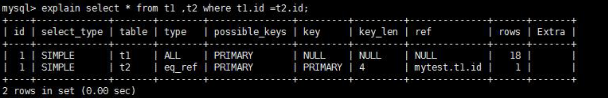


**ref**

非唯一性索引扫描，返回匹配某个单独值的所有行.本质上也是一种索引访问，它返回所有匹配某个单独值的行，然而，它可能会找到多个符合条件的行，所以他应该属于查找和扫描的混合体。

没用索引前：


建立索引后：


**range**

只检索给定范围的行,使用一个索引来选择行。key 列显示使用了哪个索引，一般就是在你的 where 语句中出现了 between、<、>、in 等的查询这种范围扫描索引扫描，比全表扫描要好，因为它只需要开始于索引的某一点，而结束语另一点，不用扫描全部索引。


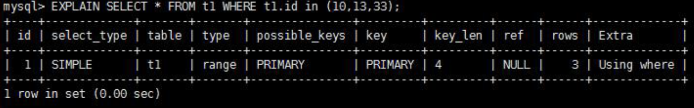


**index**

出现index是sql使用了索引但是没用通过索引进行过滤，一般是使用了覆盖索引或者是利用索引进行了排序分组。

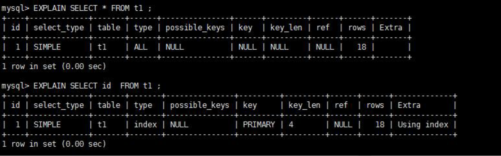

**all**

Full Table Scan，将遍历全表以找到匹配的行。


**index_merge**

在查询过程中需要多个索引组合使用，通常出现在有 or 的关键字的 sql 中。


**ref_or_null**

对于某个字段既需要关联条件，也需要 null 值得情况下。查询优化器会选择用 ref_or_null 连接查询。


**index_subquery**

利用索引来关联子查询，不再全表扫描。

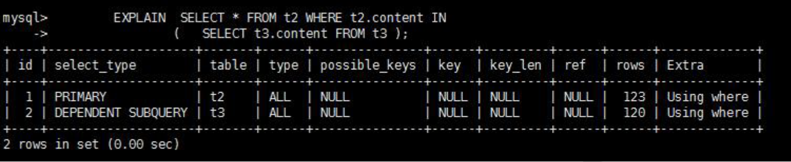

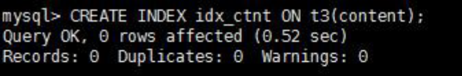


**unique_subquery**

该联接类型类似于 index_subquery。 子查询中的唯一索引。

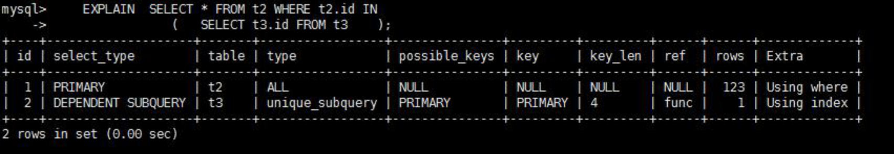


<font size=5>**5.possible_keys**</font>

显示可能应用在这张表中的索引，一个或多个。查询涉及到的字段上若存在索引，则该索引将被列出，但不一定被查询实际使用。


<font size=5>**6.key**</font>


实际使用的索引。如果为NULL，则没有使用索引。


<font size=5>**7.key_len**</font>


表示索引中使用的字节数，可通过该列计算查询中使用的索引的长度。 key_len 字段能够帮你检查是否充分的利用上了索引。ken_len 越长，说明索引使用的越充分。


<font size=5>**8.ref**</font>

显示索引的哪一列被使用了，如果可能的话，是一个常数。哪些列或常量被用于查找索引列上的值

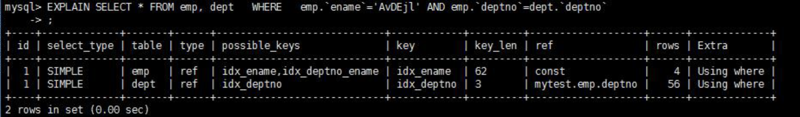

<font size=5>**9.rows**</font>

rows 列显示 MySQL 认为它执行查询时必须检查的行数。越少越好！

<font size=5>**10.Extra**</font>

其他的额外重要的信息。

**Using filesort**

说明 mysql 会对数据使用一个外部的索引排序，而不是按照表内的索引顺序进行读取。MySQL 中无法利用索引完成的排序操作称为“文件排序”。

出现 filesort 的情况：

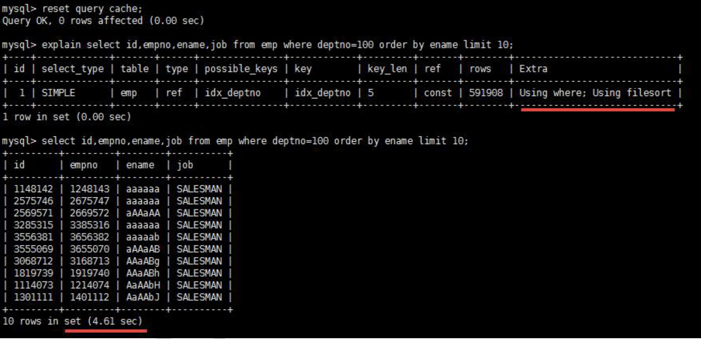

优化后，不再出现 filesort 的情况：


查询中排序的字段，排序字段若通过索引去访问将大大提高排序速度。

**Using temporary**

使了用临时表保存中间结果,MySQL 在对查询结果排序时使用临时表。常见于排序 order by 和分组查询 group by。

优化前：


优化后：


**Using index**

Using index 代表表示相应的 select 操作中使用了覆盖索引(Covering Index)，避免访问了表的数据行，效率不错！如果同时出现 using where，表明索引被用来执行索引键值的查找;如果没有同时出现 using where，表明索引只是用来读取数据而非利用索引执行查找。


**Using where**

表明使用了 where 过滤。

**Using join buffer**

使用了连接缓存。


**impossible where**

where 子句的值总是 false，不能用来获取任何元组。


**select tables optimized away**

在没有 GROUPBY 子句的情况下，基于索引优化 MIN/MAX 操作或者对于 MyISAM 存储引擎优化 COUNT(*)操作，不必等到执行阶段再进行计算，查询执行计划生成的阶段即完成优化。

<font size=5>**索引练习题**</font>

``` mysql
create table test03(
    id int primary key not null auto_increment,
    c1 char(10),
    c2 char(10),
    c3 char(10),
    c4 char(10),
    c5 char(10)
);

insert into test03(c1,c2,c3,c4,c5) values ('a1','a2','a3','a4','a5');
insert into test03(c1,c2,c3,c4,c5) values ('b1','b2','b3','b4','b5');
insert into test03(c1,c2,c3,c4,c5) values ('c1','c2','c3','c4','c5');
insert into test03(c1,c2,c3,c4,c5) values ('d1','d2','d3','d4','d5');
insert into test03(c1,c2,c3,c4,c5) values ('e1','e2','e3','e4','e5');

create index idx_test03_c1234 on test03(c1,c2,c3,c4);
```

1.用到索引c1 c2 c3 c4全字段

``` mysql
EXPLAIN SELECT * FROM `test03` WHERE `c1` = 'a1' AND `c2` = 'a2' AND `c3` = 'a3' AND `c4` = 'a4';
```

2.用到索引c1 c2 c3 c4全字段，MySQL的查询优化器会优化SQL语句的顺序

``` mysql
EXPLAIN SELECT * FROM `test03` WHERE `c1` = 'a1' AND `c2` = 'a2' AND `c4` = 'a4' AND `c3` = 'a3';
```

3.用到索引c1 c2 c3 c4全字段，MySQL的查询优化器会优化SQL语句的顺序

``` mysql
EXPLAIN SELECT * FROM `test03` WHERE `c4` = 'a4' AND `c3` = 'a3' AND `c2` = 'a2' AND `c1` = 'a1';

```

4.用到索引c1 c2 c3字段，c4字段失效，范围之后全失效

``` mysql
mysql> explain select * from test03 where c1='a1' and c2='a2' and c3>'a3' and c4='a4';

+----+-------------+--------+------------+-------+------------------+------------------+---------+------+------+----------+-----------------------+
| id | select_type | table  | partitions | type  | possible_keys    | key              | key_len | ref  | rows | filtered | Extra                 |
+----+-------------+--------+------------+-------+------------------+------------------+---------+------+------+----------+-----------------------+
|  1 | SIMPLE      | test03 | NULL       | range | idx_test03_c1234 | idx_test03_c1234 | 123     | NULL |    1 |    20.00 | Using index condition |
+----+-------------+--------+------------+-------+------------------+------------------+---------+------+------+----------+-----------------------+

1 row in set, 1 warning (0.00 sec)
```

5.用到索引c1 c2 c3 c4全字段，MySQL的查询优化器会优化SQL语句的顺序（可以看key_len，一个索引41长度）

``` mysql
mysql> explain select * from test03 where c1='a1' and c2='a2' and c4>'a4' and c3='a3';
+----+-------------+--------+------------+-------+------------------+------------------+---------+------+------+----------+-----------------------+
| id | select_type | table  | partitions | type  | possible_keys    | key              | key_len | ref  | rows | filtered | Extra                 |
+----+-------------+--------+------------+-------+------------------+------------------+---------+------+------+----------+-----------------------+
|  1 | SIMPLE      | test03 | NULL       | range | idx_test03_c1234 | idx_test03_c1234 | 164     | NULL |    1 |   100.00 | Using index condition |
+----+-------------+--------+------------+-------+------------------+------------------+---------+------+------+----------+-----------------------+
1 row in set, 1 warning (0.00 sec)
```

6.用到了索引c1 c2 c3三个字段, c1和c2两个字段用于查找, c3字段用于排序了但是没有统计到key_len中，c4字段失效

``` mysql
mysql> explain select * from test03 where c1='a1' and c2='a2' and c4='a4' order by c3;
+----+-------------+--------+------------+------+------------------+------------------+---------+-------------+------+----------+-----------------------+
| id | select_type | table  | partitions | type | possible_keys    | key              | key_len | ref         | rows | filtered | Extra                 |
+----+-------------+--------+------------+------+------------------+------------------+---------+-------------+------+----------+-----------------------+
|  1 | SIMPLE      | test03 | NULL       | ref  | idx_test03_c1234 | idx_test03_c1234 | 82      | const,const |    1 |    20.00 | Using index condition |
+----+-------------+--------+------------+------+------------------+------------------+---------+-------------+------+----------+-----------------------+
1 row in set, 1 warning (0.00 sec)

```

7.用到了索引c1 c2 c3三个字段，c1和c2两个字段用于查找, c3字段用于排序了但是没有统计到key_len中
``` mysql
EXPLAIN SELECT * FROM `test03` WHERE `c1` = 'a1' AND `c2` = 'a2' ORDER BY `c3`;
```

8.用到了索引c1 c2两个字段，c4失效，c1和c2两个字段用于查找，c4字段排序产生了Using filesort，说明排序没有用到c4字段

``` mysql
mysql> explain select * from test03 where c1='a1' and c2='a2' order by c4;
+----+-------------+--------+------------+------+------------------+------------------+---------+-------------+------+----------+---------------------------------------+
| id | select_type | table  | partitions | type | possible_keys    | key              | key_len | ref         | rows | filtered | Extra                                 |
+----+-------------+--------+------------+------+------------------+------------------+---------+-------------+------+----------+---------------------------------------+
|  1 | SIMPLE      | test03 | NULL       | ref  | idx_test03_c1234 | idx_test03_c1234 | 82      | const,const |    1 |   100.00 | Using index condition; Using filesort |
+----+-------------+--------+------------+------+------------------+------------------+---------+-------------+------+----------+---------------------------------------+
1 row in set, 1 warning (0.00 sec)
```

9.用到了索引c1 c2 c3三个字段，c1用于查找，c2和c3用于排序

``` mysql
mysql> explain select * from test03 where c1='a1' and c5='a5' order by c2,c3;
+----+-------------+--------+------------+------+------------------+------------------+---------+-------+------+----------+------------------------------------+
| id | select_type | table  | partitions | type | possible_keys    | key              | key_len | ref   | rows | filtered | Extra                              |
+----+-------------+--------+------------+------+------------------+------------------+---------+-------+------+----------+------------------------------------+
|  1 | SIMPLE      | test03 | NULL       | ref  | idx_test03_c1234 | idx_test03_c1234 | 41      | const |    1 |    20.00 | Using index condition; Using where |
+----+-------------+--------+------------+------+------------------+------------------+---------+-------+------+----------+------------------------------------+
1 row in set, 1 warning (0.00 sec)
```

10.用到了c1一个字段，c1用于查找，c3和c2两个字段索引失效，产生了Using filesort

``` mysql
mysql> explain select * from test03 where c1='a1' and c5='a5' order by c3,c2;
+----+-------------+--------+------------+------+------------------+------------------+---------+-------+------+----------+----------------------------------------------------+
| id | select_type | table  | partitions | type | possible_keys    | key              | key_len | ref   | rows | filtered | Extra                                              |
+----+-------------+--------+------------+------+------------------+------------------+---------+-------+------+----------+----------------------------------------------------+
|  1 | SIMPLE      | test03 | NULL       | ref  | idx_test03_c1234 | idx_test03_c1234 | 41      | const |    1 |    20.00 | Using index condition; Using where; Using filesort |
+----+-------------+--------+------------+------+------------------+------------------+---------+-------+------+----------+----------------------------------------------------+
1 row in set, 1 warning (0.00 sec)
```

11.用到了c1 c2 c3三个字段，c1 c2用于查找，c2 c3用于排序

``` mysql
mysql> explain select * from test03 where c1='a1' and c2='a2' order by c2,c3;
+----+-------------+--------+------------+------+------------------+------------------+---------+-------------+------+----------+-----------------------+
| id | select_type | table  | partitions | type | possible_keys    | key              | key_len | ref         | rows | filtered | Extra                 |
+----+-------------+--------+------------+------+------------------+------------------+---------+-------------+------+----------+-----------------------+
|  1 | SIMPLE      | test03 | NULL       | ref  | idx_test03_c1234 | idx_test03_c1234 | 82      | const,const |    1 |   100.00 | Using index condition |
+----+-------------+--------+------------+------+------------------+------------------+---------+-------------+------+----------+-----------------------+
1 row in set, 1 warning (0.00 sec)
```

12.用到了c1 c2 c3三个字段，c1 c2用于查找，c2 c3用于排序

``` mysql
mysql> explain select * from test03 where c1='a1' and c2='a2' and c5='a5' order by c2,c3;
+----+-------------+--------+------------+------+------------------+------------------+---------+-------------+------+----------+------------------------------------+
| id | select_type | table  | partitions | type | possible_keys    | key              | key_len | ref         | rows | filtered | Extra                              |
+----+-------------+--------+------------+------+------------------+------------------+---------+-------------+------+----------+------------------------------------+
|  1 | SIMPLE      | test03 | NULL       | ref  | idx_test03_c1234 | idx_test03_c1234 | 82      | const,const |    1 |    20.00 | Using index condition; Using where |
+----+-------------+--------+------------+------+------------------+------------------+---------+-------------+------+----------+------------------------------------+
1 row in set, 1 warning (0.00 sec)
```


13.用到了c1 c2 c3三个字段，c1 c2用于查找，c2 c3用于排序，没有产生Using filesort，因为之前c2这个字段已经确定了是'a2'了，这是一个常量，再去ORDER BY c3,c2 这时候c2已经不用排序了！所以没有产生Using filesort 和(10)进行对比学习！

``` mysql
mysql> explain select * from test03 where c1='a1' and c2='a2' and c5='a5' order by c3,c2;
+----+-------------+--------+------------+------+------------------+------------------+---------+-------------+------+----------+------------------------------------+
| id | select_type | table  | partitions | type | possible_keys    | key              | key_len | ref         | rows | filtered | Extra                              |
+----+-------------+--------+------------+------+------------------+------------------+---------+-------------+------+----------+------------------------------------+
|  1 | SIMPLE      | test03 | NULL       | ref  | idx_test03_c1234 | idx_test03_c1234 | 82      | const,const |    1 |    20.00 | Using index condition; Using where |
+----+-------------+--------+------------+------+------------------+------------------+---------+-------------+------+----------+------------------------------------+
1 row in set, 1 warning (0.00 sec)
```

GROUP BY 表面上是叫做分组，但是分组之前必定排序。

另外还可以参考下面sql结果：

``` mysql
mysql> explain select * from test03 where c1='a1' and c5='a5' order by c3,c2;
+----+-------------+--------+------------+------+------------------+------------------+---------+-------+------+----------+----------------------------------------------------+
| id | select_type | table  | partitions | type | possible_keys    | key              | key_len | ref   | rows | filtered | Extra                                              |
+----+-------------+--------+------------+------+------------------+------------------+---------+-------+------+----------+----------------------------------------------------+
|  1 | SIMPLE      | test03 | NULL       | ref  | idx_test03_c1234 | idx_test03_c1234 | 41      | const |    1 |    20.00 | Using index condition; Using where; Using filesort |
+----+-------------+--------+------------+------+------------------+------------------+---------+-------+------+----------+----------------------------------------------------+
1 row in set, 1 warning (0.00 sec)
```

14.用到c1 c2 c3三个字段，c1用于查找，c2 c3用于排序，c4失效
``` mysql
mysql> explain select * from test03 where c1='a1' and c4='a4' group by c2,c3;
+----+-------------+--------+------------+------+------------------+------------------+---------+-------+------+----------+-----------------------+
| id | select_type | table  | partitions | type | possible_keys    | key              | key_len | ref   | rows | filtered | Extra                 |
+----+-------------+--------+------------+------+------------------+------------------+---------+-------+------+----------+-----------------------+
|  1 | SIMPLE      | test03 | NULL       | ref  | idx_test03_c1234 | idx_test03_c1234 | 41      | const |    1 |    20.00 | Using index condition |
+----+-------------+--------+------------+------+------------------+------------------+---------+-------+------+----------+-----------------------+
1 row in set, 1 warning (0.00 sec)
```

15.用到c1这一个字段，c4失效，c2和c3排序失效产生了Using filesort

``` mysql
mysql> explain select * from test03 where c1='a1' and c4='a4' group by c3,c2;
+----+-------------+--------+------------+------+------------------+------------------+---------+-------+------+----------+--------------------------------------------------------+
| id | select_type | table  | partitions | type | possible_keys    | key              | key_len | ref   | rows | filtered | Extra                                                  |
+----+-------------+--------+------------+------+------------------+------------------+---------+-------+------+----------+--------------------------------------------------------+
|  1 | SIMPLE      | test03 | NULL       | ref  | idx_test03_c1234 | idx_test03_c1234 | 41      | const |    1 |    20.00 | Using index condition; Using temporary; Using filesort |
+----+-------------+--------+------------+------+------------------+------------------+---------+-------+------+----------+--------------------------------------------------------+
1 row in set, 1 warning (0.00 sec)
```

16.用到c1 c2 c3三个字段

``` mysql
mysql> explain select * from test03 where c1='a1' and c2 like 'kk%' and c3='a3';
+----+-------------+--------+------------+-------+------------------+------------------+---------+------+------+----------+-----------------------+
| id | select_type | table  | partitions | type  | possible_keys    | key              | key_len | ref  | rows | filtered | Extra                 |
+----+-------------+--------+------------+-------+------------------+------------------+---------+------+------+----------+-----------------------+
|  1 | SIMPLE      | test03 | NULL       | range | idx_test03_c1234 | idx_test03_c1234 | 123     | NULL |    1 |    20.00 | Using index condition |
+----+-------------+--------+------------+-------+------------------+------------------+---------+------+------+----------+-----------------------+
1 row in set, 1 warning (0.00 sec)
```

17.只用到用到c1

``` mysql
mysql> explain select * from test03 where c1='a1' and c2 like '%kk' and c3='a3';
+----+-------------+--------+------------+------+------------------+------------------+---------+-------+------+----------+-----------------------+
| id | select_type | table  | partitions | type | possible_keys    | key              | key_len | ref   | rows | filtered | Extra                 |
+----+-------------+--------+------------+------+------------------+------------------+---------+-------+------+----------+-----------------------+
|  1 | SIMPLE      | test03 | NULL       | ref  | idx_test03_c1234 | idx_test03_c1234 | 41      | const |    1 |    20.00 | Using index condition |
+----+-------------+--------+------------+------+------------------+------------------+---------+-------+------+----------+-----------------------+
1 row in set, 1 warning (0.00 sec)
```

18.用到c1 c2 c3三个字段

``` mysql
mysql> explain select * from test03 where c1='a1' and c2 like 'k%kk%' and c3='a3';
+----+-------------+--------+------------+-------+------------------+------------------+---------+------+------+----------+-----------------------+
| id | select_type | table  | partitions | type  | possible_keys    | key              | key_len | ref  | rows | filtered | Extra                 |
+----+-------------+--------+------------+-------+------------------+------------------+---------+------+------+----------+-----------------------+
|  1 | SIMPLE      | test03 | NULL       | range | idx_test03_c1234 | idx_test03_c1234 | 123     | NULL |    1 |    20.00 | Using index condition |
+----+-------------+--------+------------+-------+------------------+------------------+---------+------+------+----------+-----------------------+
1 row in set, 1 warning (0.00 sec)
```

19.小表驱动大表

优化原则：小表驱动大表，即小的数据集驱动大的数据集

IN适合B表比A表数据小的情况

``` mysql
SELECT * FROM `A` WHERE `id` IN (SELECT `id` FROM `B`)
```

EXISTS适合B表比A表数据大的情况

``` mysql
SELECT * FROM `A` WHERE EXISTS (SELECT 1 FROM `B` WHERE `B`.id = `A`.id);
```

**OrderBy优化:**

建表：

``` mysql
create table tblA(
    #id int primary key not null auto_increment,
    age int,
    birth timestamp not null
);

insert into tblA(age, birth) values(22, now());
insert into tblA(age, birth) values(23, now());
insert into tblA(age, birth) values(24, now());

create index idx_A_ageBirth on tblA(age, birth);
```

20.使用索引进行排序了，不会产生Using filesort

``` mysql
mysql> EXPLAIN SELECT * FROM tblA where age > 20 order by age;
+----+-------------+-------+------------+-------+----------------+----------------+---------+------+------+----------+--------------------------+
| id | select_type | table | partitions | type  | possible_keys  | key            | key_len | ref  | rows | filtered | Extra                    |
+----+-------------+-------+------------+-------+----------------+----------------+---------+------+------+----------+--------------------------+
|  1 | SIMPLE      | tblA  | NULL       | index | idx_A_ageBirth | idx_A_ageBirth | 9       | NULL |    3 |   100.00 | Using where; Using index |
+----+-------------+-------+------------+-------+----------------+----------------+---------+------+------+----------+--------------------------+
1 row in set, 1 warning (0.00 sec)
```

21.使用索引进行排序了，不会产生Using filesort

``` mysql
mysql> EXPLAIN SELECT * FROM tblA where age>20 order by age,birth;
+----+-------------+-------+------------+-------+----------------+----------------+---------+------+------+----------+--------------------------+
| id | select_type | table | partitions | type  | possible_keys  | key            | key_len | ref  | rows | filtered | Extra                    |
+----+-------------+-------+------------+-------+----------------+----------------+---------+------+------+----------+--------------------------+
|  1 | SIMPLE      | tblA  | NULL       | index | idx_A_ageBirth | idx_A_ageBirth | 9       | NULL |    3 |   100.00 | Using where; Using index |
+----+-------------+-------+------------+-------+----------------+----------------+---------+------+------+----------+--------------------------+
1 row in set, 1 warning (0.00 sec)
```

22.没有使用索引进行排序，产生了Using filesort

``` mysql
mysql> EXPLAIN SELECT * FROM tblA where age>20 order by birth;
+----+-------------+-------+------------+-------+----------------+----------------+---------+------+------+----------+------------------------------------------+
| id | select_type | table | partitions | type  | possible_keys  | key            | key_len | ref  | rows | filtered | Extra                                    |
+----+-------------+-------+------------+-------+----------------+----------------+---------+------+------+----------+------------------------------------------+
|  1 | SIMPLE      | tblA  | NULL       | index | idx_A_ageBirth | idx_A_ageBirth | 9       | NULL |    3 |   100.00 | Using where; Using index; Using filesort |
+----+-------------+-------+------------+-------+----------------+----------------+---------+------+------+----------+------------------------------------------+
1 row in set, 1 warning (0.00 sec)
```

23.没有使用索引进行排序，产生了Using filesort

``` mysql
mysql> EXPLAIN SELECT * FROM tblA where age>20 order by birth,age;
+----+-------------+-------+------------+-------+----------------+----------------+---------+------+------+----------+------------------------------------------+
| id | select_type | table | partitions | type  | possible_keys  | key            | key_len | ref  | rows | filtered | Extra                                    |
+----+-------------+-------+------------+-------+----------------+----------------+---------+------+------+----------+------------------------------------------+
|  1 | SIMPLE      | tblA  | NULL       | index | idx_A_ageBirth | idx_A_ageBirth | 9       | NULL |    3 |   100.00 | Using where; Using index; Using filesort |
+----+-------------+-------+------------+-------+----------------+----------------+---------+------+------+----------+------------------------------------------+
1 row in set, 1 warning (0.00 sec)
```

24.没有使用索引进行排序，产生了Using filesort

``` mysql
mysql> EXPLAIN SELECT * FROM tblA order by birth;
+----+-------------+-------+------------+-------+---------------+----------------+---------+------+------+----------+-----------------------------+
| id | select_type | table | partitions | type  | possible_keys | key            | key_len | ref  | rows | filtered | Extra                       |
+----+-------------+-------+------------+-------+---------------+----------------+---------+------+------+----------+-----------------------------+
|  1 | SIMPLE      | tblA  | NULL       | index | NULL          | idx_A_ageBirth | 9       | NULL |    3 |   100.00 | Using index; Using filesort |
+----+-------------+-------+------------+-------+---------------+----------------+---------+------+------+----------+-----------------------------+
1 row in set, 1 warning (0.00 sec)
```

25.没有使用索引进行排序，产生了Using filesort 

``` mysql
mysql> EXPLAIN SELECT * FROM tblA WHERE birth > '2016-01-28 00:00:00' order by birth;
+----+-------------+-------+------------+-------+---------------+----------------+---------+------+------+----------+------------------------------------------+
| id | select_type | table | partitions | type  | possible_keys | key            | key_len | ref  | rows | filtered | Extra                                    |
+----+-------------+-------+------------+-------+---------------+----------------+---------+------+------+----------+------------------------------------------+
|  1 | SIMPLE      | tblA  | NULL       | index | NULL          | idx_A_ageBirth | 9       | NULL |    3 |    33.33 | Using where; Using index; Using filesort |
+----+-------------+-------+------------+-------+---------------+----------------+---------+------+------+----------+------------------------------------------+
1 row in set, 1 warning (0.00 sec)
```

26.使用索引进行排序了，不会产生Using filesort
``` mysql
mysql> EXPLAIN SELECT * FROM tblA WHERE birth > '2016-01-28 00:00:00' order by age;
+----+-------------+-------+------------+-------+---------------+----------------+---------+------+------+----------+--------------------------+
| id | select_type | table | partitions | type  | possible_keys | key            | key_len | ref  | rows | filtered | Extra                    |
+----+-------------+-------+------------+-------+---------------+----------------+---------+------+------+----------+--------------------------+
|  1 | SIMPLE      | tblA  | NULL       | index | NULL          | idx_A_ageBirth | 9       | NULL |    3 |    33.33 | Using where; Using index |
+----+-------------+-------+------------+-------+---------------+----------------+---------+------+------+----------+--------------------------+
1 row in set, 1 warning (0.00 sec)
```

27.没有使用索引进行排序，产生了Using filesort
``` mysql
mysql> EXPLAIN SELECT * FROM tblA order by age, birth desc;
+----+-------------+-------+------------+-------+---------------+----------------+---------+------+------+----------+-----------------------------+
| id | select_type | table | partitions | type  | possible_keys | key            | key_len | ref  | rows | filtered | Extra                       |
+----+-------------+-------+------------+-------+---------------+----------------+---------+------+------+----------+-----------------------------+
|  1 | SIMPLE      | tblA  | NULL       | index | NULL          | idx_A_ageBirth | 9       | NULL |    3 |   100.00 | Using index; Using filesort |
+----+-------------+-------+------------+-------+---------------+----------------+---------+------+------+----------+-----------------------------+
1 row in set, 1 warning (0.00 sec)
```
GROUP BY基本上都需要进行排序，索引优化几乎和ORDER BY一致，但是GROUP BY会有临时表的产生。


<font size=5>**Show Profile**</font>

Show Profile 是 MySQL 提供可以用来分析当前会话中语句执行的资源消耗情况。可以用于 SQL 的调优的测量。默认情况下，参数处于关闭状态，并保存最近15次的运行结果。

1.执行SHOW PROFILES 查看 sql 运行时间：

``` mysql
mysql> SHOW PROFILES;
+----------+------------+---------------------------------------------------+
| Query_ID | Duration   | Query                                             |
+----------+------------+---------------------------------------------------+
|        1 | 0.00156100 | SHOW VARIABLES LIKE 'profiling'                   |
|        2 | 0.56296725 | SELECT * FROM `emp` GROUP BY `id`%10 LIMIT 150000 |
|        3 | 0.52105825 | SELECT * FROM `emp` GROUP BY `id`%10 LIMIT 150000 |
|        4 | 0.51279775 | SELECT * FROM `emp` GROUP BY `id`%20 ORDER BY 5   |
+----------+------------+---------------------------------------------------+
4 rows in set, 1 warning (0.00 sec)
```

2.诊断SQL，SHOW PROFILE cpu,block io FOR QUERY Query_ID;

``` mysql
# 这里的3是第四步中的Query_ID。
# 可以在SHOW PROFILE中看到一条SQL中完整的生命周期。
mysql> SHOW PROFILE cpu,block io FOR QUERY 3;
+----------------------+----------+----------+------------+--------------+---------------+
| Status               | Duration | CPU_user | CPU_system | Block_ops_in | Block_ops_out |
+----------------------+----------+----------+------------+--------------+---------------+
| starting             | 0.000097 | 0.000090 |   0.000002 |            0 |             0 |
| checking permissions | 0.000010 | 0.000009 |   0.000000 |            0 |             0 |
| Opening tables       | 0.000039 | 0.000058 |   0.000000 |            0 |             0 |
| init                 | 0.000046 | 0.000046 |   0.000000 |            0 |             0 |
| System lock          | 0.000011 | 0.000000 |   0.000000 |            0 |             0 |
| optimizing           | 0.000005 | 0.000000 |   0.000000 |            0 |             0 |
| statistics           | 0.000023 | 0.000037 |   0.000000 |            0 |             0 |
| preparing            | 0.000014 | 0.000000 |   0.000000 |            0 |             0 |
| Creating tmp table   | 0.000041 | 0.000053 |   0.000000 |            0 |             0 |
| Sorting result       | 0.000005 | 0.000000 |   0.000000 |            0 |             0 |
| executing            | 0.000003 | 0.000000 |   0.000000 |            0 |             0 |
| Sending data         | 0.520620 | 0.516267 |   0.000000 |            0 |             0 |
| Creating sort index  | 0.000060 | 0.000051 |   0.000000 |            0 |             0 |
| end                  | 0.000006 | 0.000000 |   0.000000 |            0 |             0 |
| query end            | 0.000011 | 0.000000 |   0.000000 |            0 |             0 |
| removing tmp table   | 0.000006 | 0.000000 |   0.000000 |            0 |             0 |
| query end            | 0.000004 | 0.000000 |   0.000000 |            0 |             0 |
| closing tables       | 0.000009 | 0.000000 |   0.000000 |            0 |             0 |
| freeing items        | 0.000032 | 0.000064 |   0.000000 |            0 |             0 |
| cleaning up          | 0.000019 | 0.000000 |   0.000000 |            0 |             0 |
+----------------------+----------+----------+------------+--------------+---------------+
20 rows in set, 1 warning (0.00 sec)
```

Show Profile查询参数备注：

- ALL：显示所有的开销信息。
  
- BLOCK IO：显示块IO相关开销（通用）。
  
- CONTEXT SWITCHES：上下文切换相关开销。

- CPU：显示CPU相关开销信息（通用）。

- IPC：显示发送和接收相关开销信息。

- MEMORY：显示内存相关开销信息。 

- PAGE FAULTS：显示页面错误相关开销信息。

- SOURCE：显示和Source_function。

- SWAPS：显示交换次数相关开销的信息。

Show Profile查询列表，日常开发需要注意的结论：

- converting HEAP to MyISAM：查询结果太大，内存都不够用了，往磁盘上搬了。

- Creating tmp table：创建临时表（拷贝数据到临时表，用完再删除），非常耗费数据库性能。

- Copying to tmp table on disk：把内存中的临时表复制到磁盘，危险！！！

- locked：死锁。


**参考：** https://www.bilibili.com/video/BV1KW411u7vy?from=search&seid=12440132780300942017&spm_id_from=333.337.0.0

