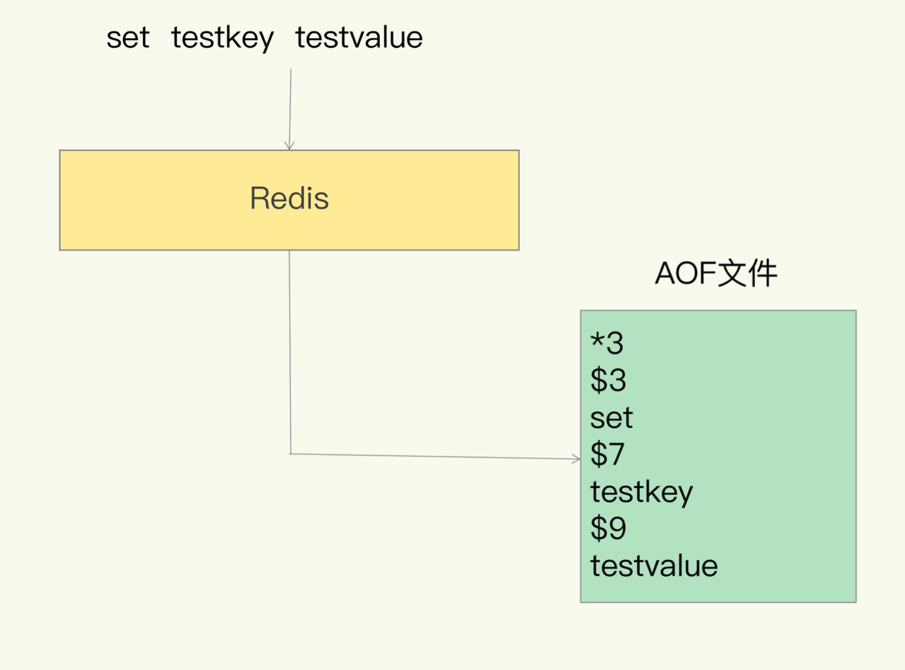
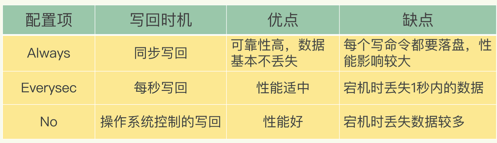

# 持久化AOF和RDB

# AOF日志

说到日志，我们比较熟悉的是数据库的写前日志(Write Ahead Log, WAL)，也就是 说，在实际写数据前，先把修改的数据记到日志文件中，以便故障时进行恢复。不过， AOF 日志正好相反，它是写后日志，“写后”的意思是 Redis 是先执行命令，把数据写入 内存，然后才记录日志

那 AOF 为什么要先执行命令再记日志呢?

传统数据库的日志，例如 redo log(重做日志)，记录的是修改后的数据，而 AOF 里记 录的是 Redis 收到的每一条命令，这些命令是以文本形式保存的。

我们以 Redis 收到“set testkey testvalue”命令后记录的日志为例，看看 AOF 日志的内 容。其中，“*3”表示当前命令有三个部分，每部分都是由“$+数字”开头，后面紧跟着 具体的命令、键或值。这里，“数字”表示这部分中的命令、键或值一共有多少字节。例 如，“$3 set”表示这部分有 3 个字节，也就是“set”命令。

但是，为了避免额外的检查开销，Redis 在向 AOF 里面记录日志的时候，并不会先去对这 些命令进行语法检查。所以，如果先记日志再执行命令的话，日志中就有可能记录了错误 的命令，Redis 在使用日志恢复数据时，就可能会出错。而写后日志这种方式，就是先让系统执行命令，只有命令能执行成功，才会被记录到日志 中，否则，系统就会直接向客户端报错。

除此之外，AOF 还有一个好处:它是在命令执行后才记录日志，所以不会阻塞当前的写操作。

不过，AOF 也有两个潜在的风险。

- 首先，如果刚执行完一个命令，还没有来得及记日志就宕机了，那么这个命令和相应的数 据就有丢失的风险。
- 其次，AOF 虽然避免了对当前命令的阻塞，但可能会给下一个操作带来阻塞风险。这是因 为，AOF 日志也是在主线程中执行的。

这两个风险都是和 AOF 写回磁盘的时机相关的。这也就意味 着，如果我们能够控制一个写命令执行完后 AOF 日志写回磁盘的时机，这两个风险就解除了。

# 三种写回策略

AOF 机制给我们提供了三个选择，也就是 AOF 配置项 appendfsync 的三个可选值。

- Always，同步写回:每个写命令执行完，立马同步地将日志写回磁盘; 
- Everysec，每秒写回:每个写命令执行完，只是先把日志写到 AOF 文件的内存缓冲区，每隔一秒把缓冲区中的内容写入磁盘;
- No，操作系统控制的写回:每个写命令执行完，只是先把日志写到 AOF 文件的内存缓 冲区，由操作系统决定何时将缓冲区内容写回磁盘。

# AOF 重写机制

简单来说，AOF 重写机制就是在重写时，Redis 根据数据库的现状创建一个新的 AOF 文 件，也就是说，读取数据库中的所有键值对，然后对每一个键值对用一条命令记录它的写 入。比如说，当读取了键值对“testkey”: “testvalue”之后，重写机制会记录 set testkey testvalue 这条命令。这样，当需要恢复时，可以重新执行该命令，实 现“testkey”: “testvalue”的写入。

AOF 重写后，日志文件会缩小，而且，和 AOF 日志由主线程写回不同，重写过程是由后台线程 bgrewriteaof 来完成的，这也是为了避免阻塞主线程，导致数据库性能下降。

我把重写的过程总结为“一个拷贝，两处日志”。

“一个拷贝”就是指，每次执行重写时，主线程 fork 出后台的 bgrewriteaof 子进程。此 时，fork 会把主线程的内存拷贝一份给 bgrewriteaof 子进程，这里面就包含了数据库的 最新数据。然后，bgrewriteaof 子进程就可以在不影响主线程的情况下，逐一把拷贝的数 据写成操作，记入重写日志。

因为主线程未阻塞，仍然可以处理新来的操作。此时，如果有写操作，第一处日志就是指 正在使用的 AOF 日志，Redis 会把这个操作写到它的缓冲区。这样一来，即使宕机了，这 个 AOF 日志的操作仍然是齐全的，可以用于恢复。

而第二处日志，就是指新的 AOF 重写日志。这个操作也会被写到重写日志的缓冲区。这 样，重写日志也不会丢失最新的操作。等到拷贝数据的所有操作记录重写完成后，重写日 志记录的这些最新操作也会写入新的 AOF 文件，以保证数据库最新状态的记录。此时，我 们就可以用新的 AOF 文件替代旧文件了。

# RDB 内存快照

和 AOF 相比，RDB 记录的是某一时刻的数据，并不是操作，所以，在做数据恢复时，我 们可以直接把 RDB 文件读入内存，很快地完成恢复。它执行的是全量快照，也就 是说，把内存中的所有数据都记录到磁盘中

我们就可以通过 bgsave 命令来执行全量快照，bgsave 创建一个子进程，专门用于写入 RDB 文件，避免了主线程的阻塞。

如果快照执行期间数据不能被修改，是会有潜在问题的。所以这个时候，Redis 就会借助操作系统提 供的写时复制技术(Copy-On-Write, COW)，在执行快照的同时，正常处理写操作。

简单来说，bgsave 子进程是由主线程 fork 生成的，可以共享主线程的所有内存数据。 bgsave 子进程运行后，开始读取主线程的内存数据，并把它们写入 RDB 文件。

此时，如果主线程对这些数据也都是读操作，那么，主线程和 bgsave 子进程相互不影响。但是，如果主线程要修改一块数据， 那么，这块数据就会被复制一份，生成该数据的副本。然后，bgsave 子进程会把这个副本 数据写入 RDB 文件，而在这个过程中，主线程仍然可以直接修改原来的数据。

如果频繁地执行全量快照，也会带来两方面的开销。

- 一方面，频繁将全量数据写入磁盘，会给磁盘带来很大压力，多个快照竞争有限的磁盘带宽，前一个快照还没有做完，后一个又开始做了，容易造成恶性循环。
- 另一方面，bgsave 子进程需要通过 fork 操作从主线程创建出来。虽然，子进程在创建后 不会再阻塞主线程，但是，fork 这个创建过程本身会阻塞主线程，而且主线程的内存越 大，阻塞时间越长。

我们可以做增量快照，所谓增量快照，就是指，做了一次全量快照后，后续的快照只对修改的数据进行快照记录，这样可以避免每次全量快照的开销。

虽然跟 AOF 相比，快照的恢复速度快，但是，快照的频率不好把握，如果频率太低，两次快照间一旦宕机，就可能有比较多的数据丢失。如果频率太高，又会产生额外开销，那么，还有什么方法既能利用 RDB 的快速恢复，又能以较小的开销做 到尽量少丢数据呢?

**Redis 4.0 中提出了一个混合使用 AOF 日志和内存快照的方法。简单来说，内存快照以一 定的频率执行，在两次快照之间，使用 AOF 日志记录这期间的所有命令操作。**

这样一来，快照不用很频繁地执行，这就避免了频繁 fork 对主线程的影响。而且，AOF 日志也只用记录两次快照间的操作，也就是说，不需要记录所有操作了，因此，就不会出 现文件过大的情况了，也可以避免重写开销。

# AOF 和 RDB 优缺点

RDB：

1.会生成多个数据文件，每个数据文件分别都代表了某一时刻Redis里面的数据，这种方式，有没有觉得很适合做冷备，完整的数据运维设置定时任务，定时同步到远端的服务器，比如阿里的云服务，这样一旦线上挂了，你想恢复多少分钟之前的数据，就去远端拷贝一份之前的数据就好了。

2.RDB对Redis的性能影响非常小，是因为在同步数据的时候他只是fork了一个子进程去做持久化的，而且他在数据恢复的时候速度比AOF来的快。

3.RDB都是快照文件，都是默认五分钟甚至更久的时间才会生成一次，这意味着你这次同步到下次同步这中间五分钟的数据都很可能全部丢失掉。AOF则最多丢一秒的数据，数据完整性上高下立判。

4.还有就是RDB在生成数据快照的时候，如果文件很大，客户端可能会暂停几毫秒甚至几秒，你公司在做秒杀的时候他刚好在这个时候fork了一个子进程去生成一个大快照，那就出大问题了。

AOF:

1.上面提到了，RDB五分钟一次生成快照，但是AOF是一秒一次去通过一个后台的线程fsync操作，那最多丢这一秒的数据。

2.AOF在对日志文件进行操作的时候是以append-only的方式去写的，他只是追加的方式写数据，自然就少了很多磁盘寻址的开销了，写入性能惊人，文件也不容易破损。

3.AOF的日志是通过一个叫非常可读的方式记录的，这样的特性就适合做灾难性数据误删除的紧急恢复了，比如公司的实习生通过flushall清空了所有的数据，只要这个时候后台重写还没发生，你马上拷贝一份AOF日志文件，把最后一条flushall命令删了就完事了。

RDB性能消耗低，丢失数据多，速度也快。AOF性能消耗高，丢失数据少

****

# Redis 持久化

Redis 提供了不同级别的持久化方式:

- RDB持久化方式能够在指定的时间间隔能对你的数据进行快照存储。

- AOF持久化方式记录每次对服务器写的操作，当服务器重启的时候会重新执行这些命令来恢复原始的数据，AOF命令以redis协议追加保存每次写的操作到文件末尾。Redis还能对AOF文件进行后台重写，使得AOF文件的体积不至于过大。

- 如果你只希望你的数据在服务器运行的时候存在，你也可以不使用任何持久化方式。

- 你也可以同时开启两种持久化方式，在这种情况下，当redis重启的时候会优先载入AOF文件来恢复原始的数据，因为在通常情况下AOF文件保存的数据集要比RDB文件保存的数据集要完整。

- 最重要的事情是了解RDB和AOF持久化方式的不同，让我们以RDB持久化方式开始。

# **RDB的优点**

- RDB是一个非常紧凑的文件，它保存了某个时间点得数据集，非常适用于数据集的备份，比如你可以在每个小时报保存一下过去24小时内的数据，同时每天保存过去30天的数据，这样即使出了问题你也可以根据需求恢复到不同版本的数据集。

- RDB是一个紧凑的单一文件，很方便传送到另一个远端数据中心或者亚马逊的S3（可能加密），非常适用于灾难恢复。

- RDB在保存RDB文件时父进程唯一需要做的就是fork出一个子进程，接下来的工作全部由子进程来做，父进程不需要再做其他IO操作，所以RDB持久化方式可以最大化redis的性能。

- 与AOF相比，在恢复大的数据集的时候，RDB方式会更快一些。

# **RDB的缺点**

- 如果你希望在redis意外停止工作（例如电源中断）的情况下丢失的数据最少的话，那么RDB不适合你.虽然你可以配置不同的save时间点(例如每隔5分钟并且对数据集有100个写的操作)，是Redis要完整的保存整个数据集是一个比较繁重的工作，你通常会每隔5分钟或者更久做一次完整的保存，万一在Redis意外宕机，你可能会丢失几分钟的数据。

- RDB 需要经常fork子进程来保存数据集到硬盘上，当数据集比较大的时候，fork的过程是非常耗时的，可能会导致Redis在一些毫秒级内不能响应客户端的请求。如果数据集巨大并且CPU性能不是很好的情况下，这种情况会持续1秒，AOF也需要fork，但是你可以调节重写日志文件的频率来提高数据集的耐久度。

# **AOF 优点**

- 使用AOF 会让你的Redis更加耐久，你可以使用不同的fsync策略：无fsync,每秒fsync,每次写的时候fsync。使用默认的每秒fsync策略，Redis的性能依然很好(fsync是由后台线程进行处理的，主线程会尽力处理客户端请求)，一旦出现故障，你最多丢失1秒的数据。

- AOF文件是一个只进行追加的日志文件，所以不需要写入seek，即使由于某些原因(磁盘空间已满，写的过程中宕机等等)未执行完整的写入命令，你也也可使用redis-check-aof工具修复这些问题。

- Redis 可以在 AOF 文件体积变得过大时，自动地在后台对 AOF 进行重写：重写后的新 AOF 文件包含了恢复当前数据集所需的最小命令集合。整个重写操作是绝对安全的，因为 Redis 在创建新 AOF 文件的过程中，会继续将命令追加到现有的 AOF 文件里面，即使重写过程中发生停机，现有的 AOF 文件也不会丢失。而一旦新 AOF 文件创建完毕，Redis 就会从旧 AOF 文件切换到新 AOF 文件，并开始对新 AOF 文件进行追加操作。

- AOF 文件有序地保存了对数据库执行的所有写入操作，这些写入操作以 Redis 协议的格式保存，因此 AOF 文件的内容非常容易被人读懂，对文件进行分析（parse）也很轻松。导出（export）AOF 文件也非常简单：举个例子，如果你不小心执行了 FLUSHALL 命令，但只要 AOF 文件未被重写，那么只要停止服务器，移除 AOF 文件末尾的 FLUSHALL 命令，并重启 Redis ，就可以将数据集恢复到 FLUSHALL 执行之前的状态。

# **AOF 缺点**

- 对于相同的数据集来说，AOF 文件的体积通常要大于 RDB 文件的体积。

- 根据所使用的 fsync 策略，AOF 的速度可能会慢于 RDB 。在一般情况下，每秒 fsync 的性能依然非常高，而关闭 fsync 可以让 AOF 的速度和 RDB 一样快，即使在高负荷之下也是如此。不过在处理巨大的写入载入时，RDB 可以提供更有保证的最大延迟时间（latency）。

