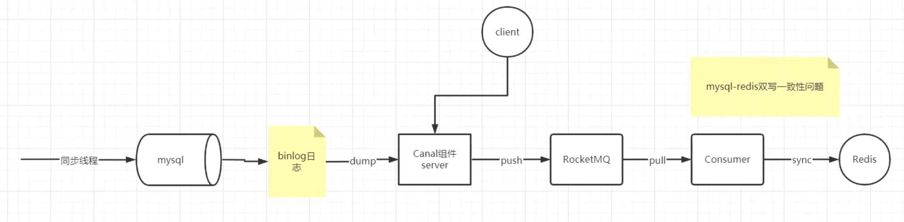

# 缓存和数据库数据一致性问题？

# 1.新增数据

如果是新增数据，数据会直接写到数据库中，不用对缓存做任何操作，此时，缓存中本身 就没有新增数据，而数据库中是最新值，此时，缓存和数据库的数据是一致的。

# 2.删改数据

我们假设应用先删除缓存，再更新数据库，如果缓存删除成功，但是数据库更新失败，那么，应用再访问数据时，缓存中没有数据，就会发生缓存缺失。然后，应用再访问数据库，但是数据库中的值为旧值，应用就访问到旧值了。

如果我们先更新数据库，再删除缓存中的值，在删除缓存时失败了，那么，数据库中的值是新值，而缓存中的是旧值，这肯定是不一致的。这个时候，如果有其他的并发请求来访问数据，按照正常的缓存访问流程，就会先在缓存中查询，但此时，就会读到旧值了。

# 如何解决数据不一致问题?

可以采用重试机制，具体来说，可以把要删除的缓存值或者是要更新的数据库值暂存到消息队列中(例如使用 Kafka 消息队列)。当应用没有能够成功地删除缓存值或者是更新数据库值时，可以从消 息队列中重新读取这些值，然后再次进行删除或更新。如果能够成功地删除或更新，我们就要把这些值从消息队列中去除，以免重复操作，此时，我们也可以保证数据库和缓存的数据一致了。

刚刚说的是在更新数据库和删除缓存值的过程中，其中一个操作失败的情况，实际上，即使这两个操作第一次执行时都没有失败，当有大量并发请求时，应用还是有可能读到不一致的数据。

# 情况一:先更新缓存，再更新数据库

这个方案一般不考虑，原因是更新缓存成功，更新数据库出现异常了，导致缓存数据与数据库数据不一致，而且很难察觉

# 情况二:先更新数据库，再更新缓存

这个方案我们也不考虑，原因和上面一样，数据库更新成功了，缓存更新失败，同样会出现数据不一致问题

而且这种方案还会有并发问题，同时有请求A和请求B进行更新操作，会出现：

1.线程A更新了数据库

2.线程B更新了数据库

3.线程B更新了缓存

4.线程A更新了缓存

这就出现了请求A更新缓存应该比请求B更新缓存早才对，但是因为网络问题B缺比A更新了缓存，这就导致了脏数据。

# 情况三:先删除缓存，再更新数据库。

假设线程 A 删除缓存值后，还没有来得及更新数据库(比如说有网络延迟)，线程 B 就开 始读取数据了，那么这个时候，线程 B 会发现缓存缺失，就只能去数据库读取。这会带来 两个问题:

1.线程 B 读取到了旧值;
2.线程 B 是在缓存缺失的情况下读取的数据库，所以，它还会把旧值写入缓存，这可能会 导致其他线程从缓存中读到旧值。

等到线程 B 从数据库读取完数据、更新了缓存后，线程 A 才开始更新数据库，此时，缓存 中的数据是旧值，而数据库中的是最新值，两者就不一致了。

这该怎么办呢?我来给你提供一种解决方案。

**在线程 A 更新完数据库值以后，我们可以让它先 sleep 一小段时间，再进行一次缓存删除操作。我们也把它叫做“延迟双删”。**

# 情况四:先更新数据库值，再删除缓存值。

这种方式被称为 Cache Aside Pattern，读的时候先读缓存，缓存没有再读数据库，然后取出数据后放入缓存。更新的时候先更新数据库，然后再删除缓存。

这种情况依然会有并发问题，假设请求A做查询操作，请求B做更新操作：

1.缓存刚好失效

2.请求A查询数据库，得到一个旧值

3.请求B将新值写入数据库

4.请求B删除缓存

5.请求A将查到的旧值写入缓存

**然而，发生这种情况的概率很低，原因就是步骤3的写数据操作比步骤2的读数据操作耗时更短才有机会发生，但是，数据库的读操作速度远快于写操作。**

如果真的发生了，该怎么解决呢？

首先，给缓存设置有效过期时间是一种方案

其次，采用异步延时删除策略

****

另外有些其他的方案，比如用canal伪装成 mysql slave 向 MySQL master 发送dump，canal 解析 binary log 然后发送到 消息队列中，消费者负责将消息发送给 Redis。

