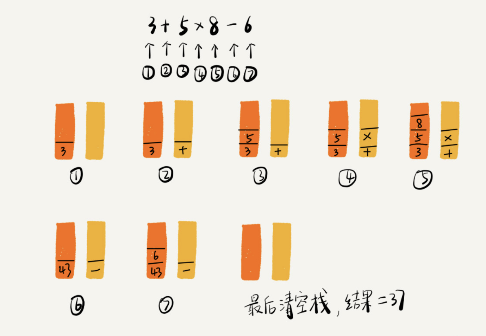

# 栈

后进者先出，先进者后出，这就是典型的“栈”结构。栈是一种“操作受限”的线性表，只允许在一端插入和删除数据。


## 如何实现一个栈？

栈主要包含两个操作，入栈和出栈，也就是在栈顶插入一个数据和从栈顶删除一个数据。实际上，栈既可以用数组来实现，也可以用链表来实现。用数组实现的栈，我们叫作**顺序栈**，用链表实现的栈，我们叫作**链式栈**。

```java
// 基于数组实现的顺序栈
public class ArrayStack {
  private String[] items;  // 数组
  private int count;       // 栈中元素个数
  private int n;           // 栈的大小
 
  // 初始化数组，申请一个大小为 n 的数组空间
  public ArrayStack(int n) {
    this.items = new String[n];
    this.n = n;
    this.count = 0;
  }
 
  // 入栈操作
  public boolean push(String item) {
    // 数组空间不够了，直接返回 false，入栈失败。
    if (count == n) return false;
    // 将 item 放到下标为 count 的位置，并且 count 加一
    items[count] = item;
    ++count;
    return true;
  }
  
  // 出栈操作
  public String pop() {
    // 栈为空，则直接返回 null
    if (count == 0) return null;
    // 返回下标为 count-1 的数组元素，并且栈中元素个数 count 减一
    String tmp = items[count-1];
    --count;
    return tmp;
  }
}
```

不管是顺序栈还是链式栈，我们存储数据只需要一个大小为 n 的数组就够了。在入栈和出栈过程中，只需要一两个临时变量存储空间，所以空间复杂度是 O(1)。

注意，这里存储数据需要一个大小为 n 的数组，并不是说空间复杂度就是 O(n)。因为，这 n 个空间是必须的，无法省掉。所以我们说空间复杂度的时候，是指除了原本的数据存储空间外，算法运行还需要额外的存储空间。

不管是顺序栈还是链式栈，入栈、出栈只涉及栈顶个别数据的操作，所以时间复杂度都是 O(1)。


如果要实现支持动态扩容的顺序栈，当数组空间不够时，我们就重新申请一块更大的内存，将原来数组中数据统统拷贝过去。这样就实现了一个支持动态扩容的数组。


## 栈在函数调用中的应用

我们知道，操作系统给每个线程分配了一块独立的内存空间，这块内存被组织成“栈”这种结构, 用来存储函数调用时的临时变量。每进入一个函数，就会将临时变量作为一个栈帧入栈，当被调用函数执行完成，返回之后，将这个函数对应的栈帧出栈。

```c
int main() {
   int a = 1; 
   int ret = 0;
   int res = 0;
   ret = add(3, 5);
   res = a + ret;
   printf("%d", res);
   reuturn 0;
}
 
int add(int x, int y) {
   int sum = 0;
   sum = x + y;
   return sum;
}
```

从代码中我们可以看出，main() 函数调用了 add() 函数，获取计算结果，并且与临时变量 a 相加，最后打印 res 的值。下图中显示的是，在执行到 add() 函数时，函数调用栈的情况。


## 栈在表达式求值中的应用

我们再来看栈的另一个常见的应用场景，编译器如何利用栈来实现**表达式求值**。

为了方便解释，我将算术表达式简化为只包含加减乘除四则运算，比如：34+13*9+44-12/3。对于这个四则运算，我们人脑可以很快求解出答案，但是对于计算机来说，理解这个表达式本身就是个挺难的事儿。

实际上，编译器就是通过两个栈来实现的。其中一个保存操作数的栈，另一个是保存运算符的栈。我们从左向右遍历表达式，当遇到数字，我们就直接压入操作数栈；当遇到运算符，就与运算符栈的栈顶元素进行比较。

如果比运算符栈顶元素的优先级高，就将当前运算符压入栈；如果比运算符栈顶元素的优先级低或者相同，从运算符栈中取栈顶运算符，从操作数栈的栈顶取 2 个操作数，然后进行计算，再把计算完的结果压入操作数栈，继续比较。

我将 3+5*8-6 这个表达式的计算过程画成了一张图，你可以结合图来理解我刚讲的计算过程。




## 栈在括号匹配中的应用

除了用栈来实现表达式求值，我们还可以借助栈来检查表达式中的括号是否匹配。

我们同样简化一下背景。我们假设表达式中只包含三种括号，圆括号 ()、方括号 [] 和花括号{}，并且它们可以任意嵌套。比如，{[{}]}或 [{()}([])] 等都为合法格式，而{[}()] 或 [({)] 为不合法的格式。那我现在给你一个包含三种括号的表达式字符串，如何检查它是否合法呢？

这里也可以用栈来解决。我们用栈来保存未匹配的左括号，从左到右依次扫描字符串。当扫描到左括号时，则将其压入栈中；当扫描到右括号时，从栈顶取出一个左括号。如果能够匹配，比如“(”跟“)”匹配，“[”跟“]”匹配，“{”跟“}”匹配，则继续扫描剩下的字符串。如果扫描的过程中，遇到不能配对的右括号，或者栈中没有数据，则说明为非法格式。

当所有的括号都扫描完成之后，如果栈为空，则说明字符串为合法格式；否则，说明有未匹配的左括号，为非法格式。


## 栈实现浏览器的前进、后退功能

浏览器的前进、后退功能，我想你肯定很熟悉吧？

当你依次访问完一串页面 a-b-c 之后，点击浏览器的后退按钮，就可以查看之前浏览过的页面 b 和 a。当你后退到页面 a，点击前进按钮，就可以重新查看页面 b 和 c。但是，如果你后退到页面 b 后，点击了新的页面 d，那就无法再通过前进、后退功能查看页面 c 了。

其实，用两个栈就可以非常完美地解决这个问题。

我们使用两个栈，X 和 Y，我们把首次浏览的页面依次压入栈 X，当点击后退按钮时，再依次从栈 X 中出栈，并将出栈的数据依次放入栈 Y。当我们点击前进按钮时，我们依次从栈 Y 中取出数据，放入栈 X 中。当栈 X 中没有数据时，那就说明没有页面可以继续后退浏览了。当栈 Y 中没有数据，那就说明没有页面可以点击前进按钮浏览了。

比如你顺序查看了 a，b，c 三个页面，我们就依次把 a，b，c 压入栈，这个时候，两个栈的数据就是这个样子：


当你通过浏览器的后退按钮，从页面 c 后退到页面 a 之后，我们就依次把 c 和 b 从栈 X 中弹出，并且依次放入到栈 Y。这个时候，两个栈的数据就是这个样子：


这个时候你又想看页面 b，于是你又点击前进按钮回到 b 页面，我们就把 b 再从栈 Y 中出栈，放入栈 X 中。此时两个栈的数据是这个样子：


这个时候，你通过页面 b 又跳转到新的页面 d 了，页面 c 就无法再通过前进、后退按钮重复查看了，所以需要清空栈 Y。此时两个栈的数据这个样子：


