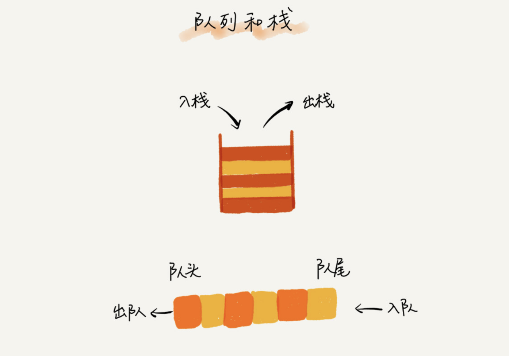
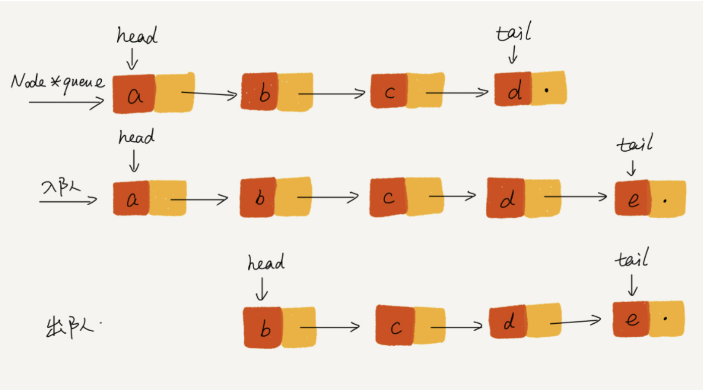
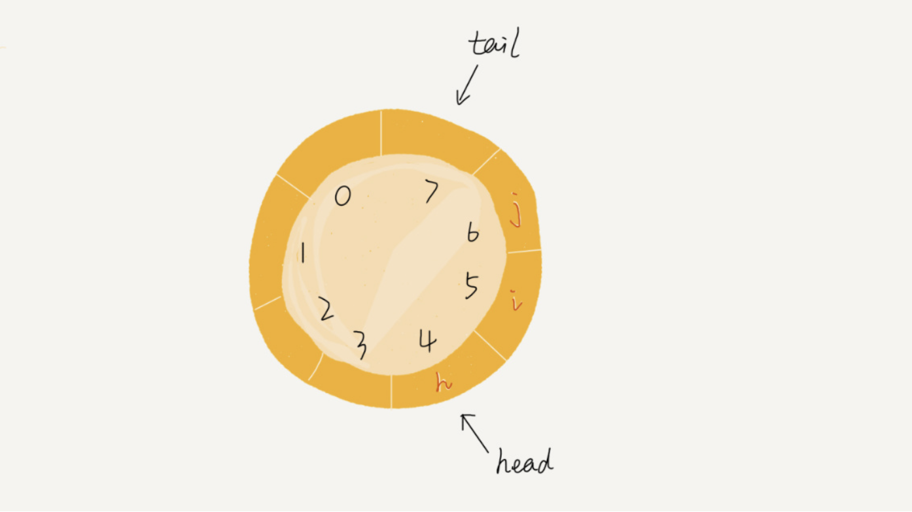
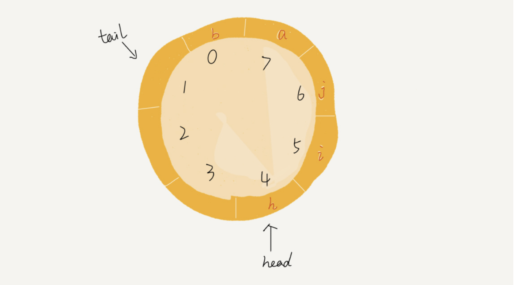
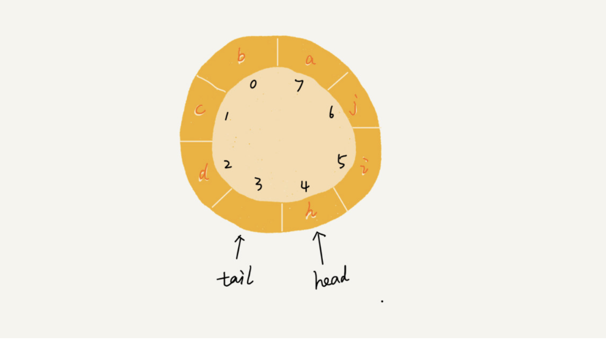

# 队列

先进者先出，这就是典型的队列。我们知道，栈只支持两个基本操作：**入栈 push()\**和\**出栈 pop()**。队列跟栈非常相似，支持的操作也很有限，最基本的操作也是两个：**入队 enqueue()**，放一个数据到队列尾部；**出队 dequeue()**，从队列头部取一个元素。




## 顺序队列和链式队列

如何实现一个队列呢？

跟栈一样，队列可以用数组来实现，也可以用链表来实现。用数组实现的队列叫作**顺序队列**，用链表实现的队列叫作**链式队列**。

先来看下基于数组的实现方法：

```java
// 用数组实现的队列
public class ArrayQueue {
  // 数组：items，数组大小：n
  private String[] items;
  private int n = 0;
  // head 表示队头下标，tail 表示队尾下标
  private int head = 0;
  private int tail = 0;
 
  // 申请一个大小为 capacity 的数组
  public ArrayQueue(int capacity) {
    items = new String[capacity];
    n = capacity;
  }
 
  // 入队
  public boolean enqueue(String item) {
    // 如果 tail == n 表示队列已经满了
    if (tail == n) return false;
    items[tail] = item;
    ++tail;
    return true;
  }
 
  // 出队
  public String dequeue() {
    // 如果 head == tail 表示队列为空
    if (head == tail) return null;
    // 为了让其他语言的同学看的更加明确，把 -- 操作放到单独一行来写了
    String ret = items[head];
    ++head;
    return ret;
  }
}
```

对于栈来说，我们只需要一个**栈顶指针**就可以了。但是队列需要两个指针：一个是 head 指针，指向队头；一个是 tail 指针，指向队尾。

你可以结合下面这幅图来理解。当 a、b、c、d 依次入队之后，队列中的 head 指针指向下标为 0 的位置，tail 指针指向下标为 4 的位置。


当我们调用两次出队操作之后，队列中 head 指针指向下标为 2 的位置，tail 指针仍然指向下标为 4 的位置。


你肯定已经发现了，随着不停地进行入队、出队操作，head 和 tail 都会持续往后移动。当 tail 移动到最右边，即使数组中还有空闲空间，也无法继续往队列中添加数据了。这个问题该如何解决呢？

你是否还记得，在数组那一节，我们也遇到过类似的问题，就是数组的删除操作会导致数组中的数据不连续。你还记得我们当时是怎么解决的吗？对，用**数据搬移**！但是，每次进行出队操作都相当于删除数组下标为 0 的数据，要搬移整个队列中的数据，这样出队操作的时间复杂度就会从原来的 O(1) 变为 O(n)。能不能优化一下呢？

实际上，我们在出队时可以不用搬移数据。如果没有空闲空间了，我们只需要在入队时，再集中触发一次数据的搬移操作。借助这个思想，出队函数 dequeue() 保持不变，我们稍加改造一下入队函数 enqueue() 的实现，就可以轻松解决刚才的问题了。下面是具体的代码：

```java
  // 入队操作，将 item 放入队尾
  public boolean enqueue(String item) {
    // tail == n 表示队列末尾没有空间了
    if (tail == n) {
      // tail ==n && head==0，表示整个队列都占满了
      if (head == 0) return false;
      // 数据搬移
      for (int i = head; i < tail; ++i) {
        items[i-head] = items[i];
      }
      // 搬移完之后重新更新 head 和 tail
      tail -= head;
      head = 0;
    }
    
    items[tail] = item;
    ++tail;
    return true;
  }
```

从代码中我们看到，当队列的 tail 指针移动到数组的最右边后，如果有新的数据入队，我们可以将 head 到 tail 之间的数据，整体搬移到数组中 0 到 tail-head 的位置。


基于链表的实现，我们同样需要两个指针：head 指针和 tail 指针。它们分别指向链表的第一个结点和最后一个结点。如图所示，入队时，tail->next= new_node, tail = tail->next；出队时，head = head->next。




## 循环队列

我们刚才用数组来实现队列的时候，在 tail==n 时，会有数据搬移操作，这样入队操作性能就会受到影响。那有没有办法能够避免数据搬移呢？我们来看看循环队列的解决思路。

循环队列，顾名思义，它长得像一个环。原本数组是有头有尾的，是一条直线。现在我们把首尾相连，扳成了一个环。



我们可以看到，图中这个队列的大小为 8，当前 head=4，tail=7。当有一个新的元素 a 入队时，我们放入下标为 7 的位置。但这个时候，我们并不把 tail 更新为 8，而是将其在环中后移一位，到下标为 0 的位置。当再有一个元素 b 入队时，我们将 b 放入下标为 0 的位置，然后 tail 加 1 更新为 1。所以，在 a，b 依次入队之后，循环队列中的元素就变成了下面的样子：



通过这样的方法，我们成功避免了数据搬移操作。看起来不难理解，但是循环队列的代码实现难度要比前面讲的非循环队列难多了。要想写出没有 bug 的循环队列的实现代码，我个人觉得，最关键的是，**确定好队空和队满的判定条件**。

在用数组实现的非循环队列中，队满的判断条件是 tail == n，队空的判断条件是 head == tail。那针对循环队列，如何判断队空和队满呢？

队列为空的判断条件仍然是 head == tail。但队列满的判断条件就稍微有点复杂了。



就像我图中画的队满的情况，tail=3，head=4，n=8，所以总结一下规律就是：(3+1)%8=4。多画几张队满的图，你就会发现，当队满时，**(tail+1)%n=head**。

队列满时，图中的 tail 指向的位置实际上是没有存储数据的。所以，循环队列会浪费一个数组的存储空间。

代码实现：

```java
public class CircularQueue {
  // 数组：items，数组大小：n
  private String[] items;
  private int n = 0;
  // head 表示队头下标，tail 表示队尾下标
  private int head = 0;
  private int tail = 0;
 
  // 申请一个大小为 capacity 的数组
  public CircularQueue(int capacity) {
    items = new String[capacity];
    n = capacity;
  }
 
  // 入队
  public boolean enqueue(String item) {
    // 队列满了
    if ((tail + 1) % n == head) return false;
    items[tail] = item;
    tail = (tail + 1) % n;
    return true;
  }
 
  // 出队
  public String dequeue() {
    // 如果 head == tail 表示队列为空
    if (head == tail) return null;
    String ret = items[head];
    head = (head + 1) % n;
    return ret;
  }
}
```


## 阻塞队列和并发队列

**阻塞队列**其实就是在队列基础上增加了阻塞操作。简单来说，就是在队列为空的时候，从队头取数据会被阻塞。因为此时还没有数据可取，直到队列中有了数据才能返回；如果队列已经满了，那么插入数据的操作就会被阻塞，直到队列中有空闲位置后再插入数据，然后再返回。

你应该已经发现了，上述的定义就是一个“生产者 - 消费者模型”！是的，我们可以使用阻塞队列，轻松实现一个“生产者 - 消费者模型”！

这种基于阻塞队列实现的“生产者 - 消费者模型”，可以有效地协调生产和消费的速度。当“生产者”生产数据的速度过快，“消费者”来不及消费时，存储数据的队列很快就会满了。这个时候，生产者就阻塞等待，直到“消费者”消费了数据，“生产者”才会被唤醒继续“生产”。

而且不仅如此，基于阻塞队列，我们还可以通过协调“生产者”和“消费者”的个数，来提高数据的处理效率。比如我们可以多配置几个“消费者”，来应对一个“生产者”。

在多线程情况下，会有多个线程同时操作队列，这个时候就会存在线程安全问题，那如何实现一个线程安全的队列呢？

线程安全的队列我们叫作**并发队列**。最简单直接的实现方式是直接在 enqueue()、dequeue() 方法上加锁，但是锁粒度大并发度会比较低，同一时刻仅允许一个存或者取操作。实际上，基于数组的循环队列，利用 CAS 原子操作，可以实现非常高效的并发队列。这也是循环队列比链式队列应用更加广泛的原因。