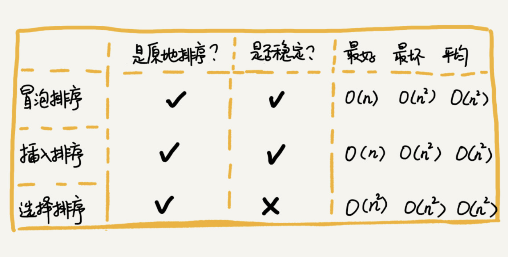

# 为什么插入排序要比冒泡排序更受欢迎

从代码实现上来看，冒泡排序的数据交换要比插入排序的数据移动要复杂，冒泡排序需要 3 个赋值操作，而插入排序只需要 1 个。我们来看这段操作：

```java
冒泡排序中数据的交换操作：
if (a[j] > a[j+1]) { // 交换
   int tmp = a[j];
   a[j] = a[j+1];
   a[j+1] = tmp;
   flag = true;
}
 
插入排序中数据的移动操作：
if (a[j] > value) {
  a[j+1] = a[j];  // 数据移动
} else {
  break;
}
```

我们把执行一个赋值语句的时间粗略地计为单位时间（unit_time），然后分别用冒泡排序和插入排序对同一个逆序度是 K 的数组进行排序。用冒泡排序，需要 K 次交换操作，每次需要 3 个赋值语句，所以交换操作总耗时就是 3*K 单位时间。而插入排序中数据移动操作只需要 K 个单位时间。


虽然冒泡排序和插入排序在时间复杂度上是一样的，都是 O(n^2)，但是如果我们希望把性能优化做到极致，那肯定首选插入排序。插入排序的算法思路也有很大的优化空间，我们只是讲了最基础的一种。如果你对插入排序的优化感兴趣，可以自行学习一下[希尔排序](https://zh.wikipedia.org/wiki/希尔排序)。



