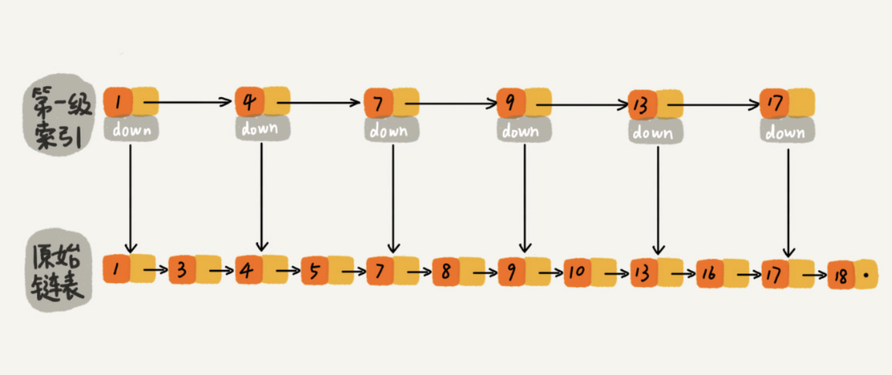

# 高效的动态插入、删除、查找

二分查找底层依赖的是数组随机访问的特性，所以只能用数组来实现。如果数据存储在链表中，就真的没法用二分查找算法了吗？实际上，我们只需要对链表稍加改造，就可以支持类似“二分”的查找算法。我们把改造之后的数据结构叫作**跳表**（Skip list）。

跳表是一种各方面性能都比较优秀的**动态数据结构**，可以支持快速的插入、删除、查找操作，写起来也不复杂，甚至可以替代[红黑树](https://zh.wikipedia.org/wiki/红黑树)（Red-black tree）。

## 如何理解跳表？

对链表建立一级“索引”，每两个结点提取一个结点到上一级，我们把抽出来的那一级叫作**索引**或**索引层**。图中的 down 表示 down 指针，指向下一级结点。

我们在第一级索引的基础之上，每两个结点就抽出一个结点到第二级索引。现在我们来查找 16，只需要遍历 6 个结点了，需要遍历的结点数量又减少了。

**这种链表加多级索引的结构，就是跳表**。

## 用跳表查询到底有多快？

在跳表中查询任意数据的时间复杂度就是 O(logn)。这个查找的时间复杂度跟二分查找是一样的。换句话说，我们其实是基于单链表实现了二分查找。

## 跳表是不是很浪费内存？

比起单纯的单链表，跳表需要存储多级索引，肯定要消耗更多的存储空间。跳表的空间复杂度是 O(n)。

## 高效的动态插入和删除

跳表这个动态数据结构，不仅支持查找操作，还支持动态的插入、删除操作，而且插入、删除操作的时间复杂度也是 O(logn)。

我们知道，在单链表中，一旦定位好要插入的位置，插入结点的时间复杂度是很低的，就是 O(1)。但是，这里为了保证原始链表中数据的有序性，我们需要先找到要插入的位置，这个查找操作就会比较耗时。

对于纯粹的单链表，需要遍历每个结点，来找到插入的位置。但是，对于跳表来说，我们讲过查找某个结点的的时间复杂度是 O(logn)，所以这里查找某个数据应该插入的位置，方法也是类似的，时间复杂度也是 O(logn)。

在删除时如果这个结点在索引中也有出现，我们除了要删除原始链表中的结点，还要删除索引中的。