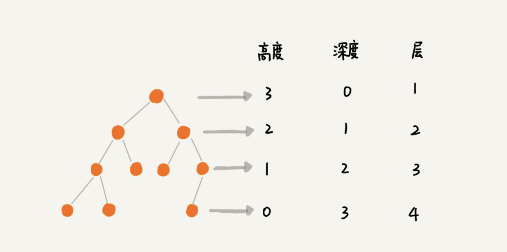

# 树

有三个比较相似的概念：**高度**（Height）、**深度**（Depth）、**层**（Level）。它们的定义是这样的：

这三个概念的定义比较容易混淆，描述起来也比较空洞。我举个例子说明一下，你一看应该就能明白。

记这几个概念，我还有一个小窍门，就是类比“高度”“深度”“层”这几个名词在生活中的含义。

在我们的生活中，“高度”这个概念，其实就是从下往上度量，比如我们要度量第 10 层楼的高度、第 13 层楼的高度，起点都是地面。所以，树这种数据结构的高度也是一样，从最底层开始计数，并且计数的起点是 0。

“深度”这个概念在生活中是从上往下度量的，比如水中鱼的深度，是从水平面开始度量的。所以，树这种数据结构的深度也是类似的，从根结点开始度量，并且计数起点也是 0。

“层数”跟深度的计算类似，不过，计数起点是 1，也就是说根节点的位于第 1 层。