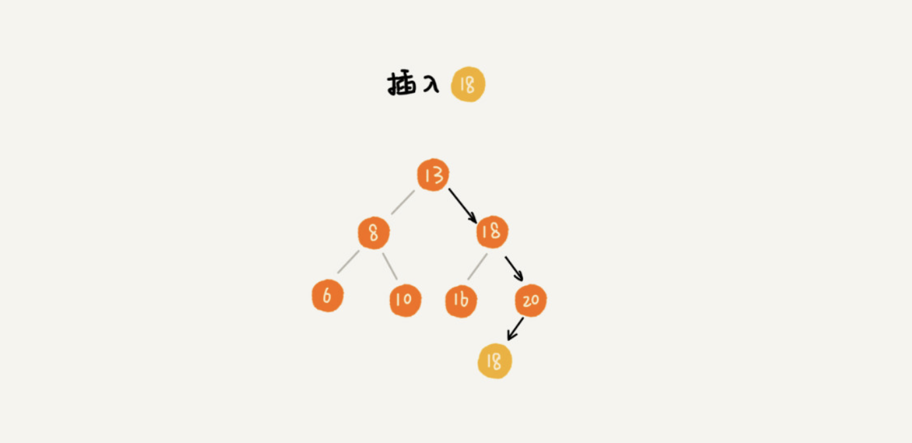

# 支持重复数据的二叉查找树

前面讲二叉查找树的时候，我们默认树中节点存储的都是数字。很多时候，在实际的软件开发中，我们在二叉查找树中存储的，是一个包含很多字段的对象。我们利用对象的某个字段作为键值（key）来构建二叉查找树。我们把对象中的其他字段叫作卫星数据。

前面我们讲的二叉查找树的操作，针对的都是不存在键值相同的情况。那如果存储的两个对象键值相同，这种情况该怎么处理呢？我这里有两种解决方法。

第一种方法比较容易。二叉查找树中每一个节点不仅会存储一个数据，因此我们通过链表和支持动态扩容的数组等数据结构，把值相同的数据都存储在同一个节点上。

第二种方法比较不好理解，不过更加优雅。

每个节点仍然只存储一个数据。在查找插入位置的过程中，如果碰到一个节点的值，与要插入数据的值相同，我们就将这个要插入的数据放到这个节点的右子树，也就是说，把这个新插入的数据当作大于这个节点的值来处理。

当要查找数据的时候，遇到值相同的节点，我们并不停止查找操作，而是继续在右子树中查找，直到遇到叶子节点，才停止。这样就可以把键值等于要查找值的所有节点都找出来。

对于删除操作，我们也需要先查找到每个要删除的节点，然后再按前面讲的删除操作的方法，依次删除。

**二叉查找树的时间复杂度其实都跟树的高度成正比，也就是 O(height)**。完全二叉树的高度小于等于 log2n。即：理想情况下，时间复杂度是 O(logn)。