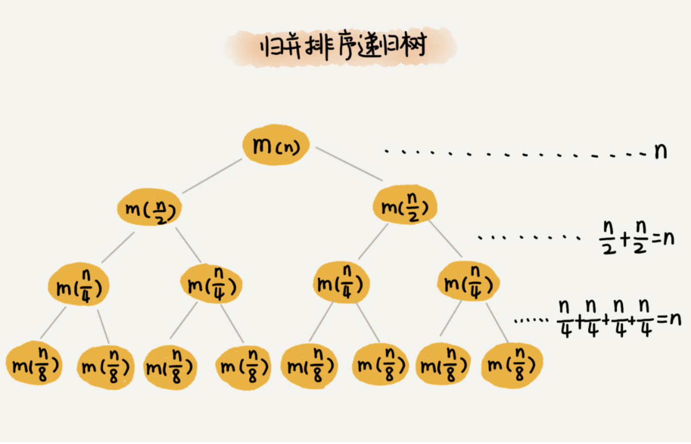
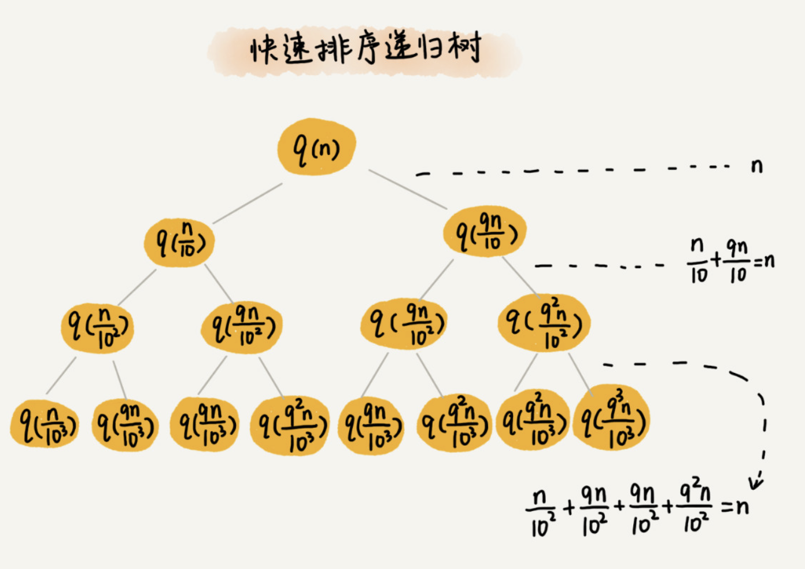

# 递归树与时间复杂度分析

递归的思想就是，将大问题分解为小问题来求解，然后再将小问题分解为小小问题。这样一层一层地分解，直到问题的数据规模被分解得足够小，不用继续递归分解为止。

如果我们把这个一层一层的分解过程画成图，它其实就是一棵树。我们给这棵树起一个名字，叫作**递归树**。

归并排序算法你还记得吧？它的递归实现代码非常简洁。现在我们就借助归并排序来看看，如何用递归树，来分析递归代码的时间复杂度。



因为每次分解都是一分为二，所以代价很低，我们把时间上的消耗记作常量 1。归并算法中比较耗时的是归并操作，也就是把两个子数组合并为大数组。从图中我们可以看出，每一层归并操作消耗的时间总和是一样的，跟要排序的数据规模有关。我们把每一层归并操作消耗的时间记作 n。

现在，我们只需要知道这棵树的高度 h，用高度 h 乘以每一层的时间消耗 n，就可以得到总的时间复杂度 O(n∗h)。

从归并排序的原理和递归树，可以看出来，归并排序递归树是一棵满二叉树。我们前两节中讲到，满二叉树的高度大约是 log2n，所以，归并排序递归实现的时间复杂度就是 O(nlogn)。我这里的时间复杂度都是估算的，对树的高度的计算也没有那么精确，但是这并不影响复杂度的计算结果。


# 实战一：分析快速排序的时间复杂度

快速排序在最好情况下，每次分区都能一分为二，这个时候用递推公式 T(n)=2T(n/2)+n，很容易就能推导出时间复杂度是 O(nlogn)。但是，我们并不可能每次分区都这么幸运，正好一分为二。

我们假设平均情况下，每次分区之后，两个分区的大小比例为 1:k。当 k=9 时，如果用递推公式的方法来求解时间复杂度的话，递推公式就写成 T(n)=T(n/10)+T(9n/10)+n。

这个公式可以推导出时间复杂度，但是推导过程非常复杂。那我们来看看，**用递归树来分析快速排序的平均情况时间复杂度，是不是比较简单呢？**

我们还是取 k 等于 9，也就是说，每次分区都很不平均，一个分区是另一个分区的 9 倍。如果我们把递归分解的过程画成递归树，就是下面这个样子：



快速排序的过程中，每次分区都要遍历待分区区间的所有数据，所以，每一层分区操作所遍历的数据的个数之和就是 n。我们现在只要求出递归树的高度 h，这个快排过程遍历的数据个数就是 h∗n ，也就是说，时间复杂度就是 O(h∗n)。

因为每次分区并不是均匀地一分为二，所以递归树并不是满二叉树。这样一个递归树的高度是多少呢？

我们知道，快速排序结束的条件就是待排序的小区间，大小为 1，也就是说叶子节点里的数据规模是 1。从根节点 n 到叶子节点 1，递归树中最短的一个路径每次都乘以 1/10，最长的一个路径每次都乘以 9/10。通过计算，我们可以得到，从根节点到叶子节点的最短路径是 log10n，最长的路径是 log10/9n。


所以，遍历数据的个数总和就介于 nlog10n 和 nlog10/9n 之间。根据复杂度的大 O 表示法，对数复杂度的底数不管是多少，我们统一写成 logn，所以，当分区大小比例是 1:9 时，快速排序的时间复杂度仍然是 O(nlogn)。


# 实战二：分析斐波那契数列的时间复杂度

```java
int f(int n) {
  if (n == 1) return 1;
  if (n == 2) return 2;
  return f(n-1) + f(n-2);
}
```


f(n) 分解为 f(n−1) 和 f(n−2)，每次数据规模都是 −1 或者 −2，叶子节点的数据规模是 1 或者 2。所以，从根节点走到叶子节点，每条路径是长短不一的。如果每次都是 −1，那最长路径大约就是 n；如果每次都是 −2，那最短路径大约就是 n/2。

每次分解之后的合并操作只需要一次加法运算，我们把这次加法运算的时间消耗记作 1。所以，从上往下，第一层的总时间消耗是 1，第二层的总时间消耗是 2，第三层的总时间消耗就是 2^2。依次类推，第 k 层的时间消耗就是 2^(k−1)，那整个算法的总的时间消耗就是每一层时间消耗之和。

如果路径长度都为 n，那这个总和就是 2^n−1。


如果路径长度都是 n/2 ，那整个算法的总的时间消耗就是 2^n/2−1。


所以，这个算法的时间复杂度就介于 O(2^n) 和 O(2^n/2) 之间。