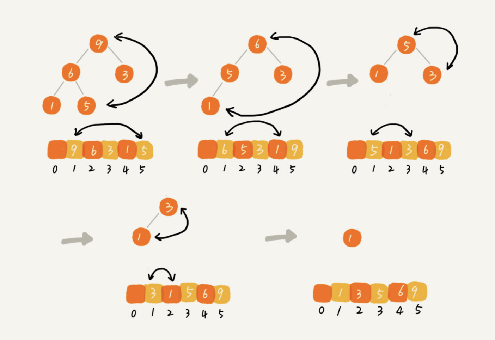

# 基于堆实现排序

我们可以把堆排序的过程大致分解成两个大的步骤，**建堆**和**排序**。


# 1. 建堆

我们首先将数组原地建成一个堆。所谓“原地”就是，不借助另一个数组，就在原数组上操作。建堆的过程，有两种思路。

第一种是借助我们前面讲的，在堆中插入一个元素的思路。尽管数组中包含 n 个数据，但是我们可以假设，起初堆中只包含一个数据，就是下标为 1 的数据。然后，我们调用前面讲的插入操作，将下标从 2 到 n 的数据依次插入到堆中。这样我们就将包含 n 个数据的数组，组织成了堆。

第二种实现思路，跟第一种截然相反，也是我这里要详细讲的。第一种建堆思路的处理过程是从前往后处理数组数据，并且每个数据插入堆中时，都是从下往上堆化。而第二种实现思路，是从后往前处理数组，并且每个数据都是从上往下堆化。

我举了一个例子，并且画了一个第二种实现思路的建堆分解步骤图，你可以看下。因为叶子节点往下堆化只能自己跟自己比较，所以我们直接从第一个非叶子节点开始，依次堆化就行了。


代码实现：

```java
private static void buildHeap(int[] a, int n) {
  for (int i = n/2; i >= 1; --i) {
    heapify(a, n, i);
  }
}
 
private static void heapify(int[] a, int n, int i) {
  while (true) {
    int maxPos = i;
    if (i*2 <= n && a[i] < a[i*2]) maxPos = i*2;
    if (i*2+1 <= n && a[maxPos] < a[i*2+1]) maxPos = i*2+1;
    if (maxPos == i) break;
    swap(a, i, maxPos);
    i = maxPos;
  }
}
```

你可能已经发现了，在这段代码中，我们对下标从 n/2 开始到 1 的数据进行堆化，下标是 n/2+1 到 n 的节点是叶子节点，我们不需要堆化。实际上，对于完全二叉树来说，下标从 n/2+1 到 n 的节点都是叶子节点。

**建堆的时间复杂度就是 O(n)。**


# 2. 排序

建堆结束之后，数组中的数据已经是按照大顶堆的特性来组织的。数组中的第一个元素就是堆顶，也就是最大的元素。我们把它跟最后一个元素交换，那最大元素就放到了下标为 n 的位置。

这个过程有点类似上面讲的“删除堆顶元素”的操作，当堆顶元素移除之后，我们把下标为 n的元素放到堆顶，然后再通过堆化的方法，将剩下的 n−1 个元素重新构建成堆。堆化完成之后，我们再取堆顶的元素，放到下标是 n−1 的位置，一直重复这个过程，直到最后堆中只剩下标为 1 的一个元素，排序工作就完成了。



堆排序代码实现：

```java
// n 表示数据的个数，数组 a 中的数据从下标 1 到 n 的位置。
public static void sort(int[] a, int n) {
  buildHeap(a, n);
  int k = n;
  while (k > 1) {
    swap(a, 1, k);
    --k;
    heapify(a, k, 1);
  }
}
```

堆排序不是稳定的排序算法，因为在排序的过程，存在将堆的最后一个节点跟堆顶节点互换的操作，所以就有可能改变值相同数据的原始相对顺序。

排序过程的时间复杂度是 O(nlogn)

所以，**堆排序整体的时间复杂度是 O(nlogn)。**