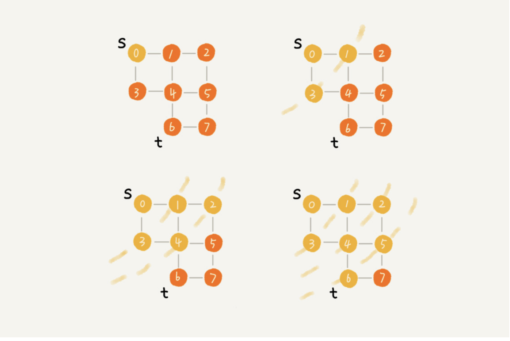

# 广度优先搜索

广度优先搜索（Breadth-First-Search），我们平常都把简称为 BFS。直观地讲，它其实就是一种“地毯式”层层推进的搜索策略，即先查找离起始顶点最近的，然后是次近的，依次往外搜索。




代码实现：

这里面，bfs() 函数就是基于之前定义的，图的广度优先搜索的代码实现。其中 s 表示起始顶点，t 表示终止顶点。我们搜索一条从 s 到 t 的路径。实际上，这样求得的路径就是从 s 到 t 的最短路径。

```java
public void bfs(int s, int t) {
  if (s == t) return;
  boolean[] visited = new boolean[v];
  visited[s]=true;
  Queue<Integer> queue = new LinkedList<>();
  queue.add(s);
  int[] prev = new int[v];
  for (int i = 0; i < v; ++i) {
    prev[i] = -1;
  }
  while (queue.size() != 0) {
    int w = queue.poll();
   for (int i = 0; i < adj[w].size(); ++i) {
      int q = adj[w].get(i);
      if (!visited[q]) {
        prev[q] = w;
        if (q == t) {
          print(prev, s, t);
          return;
        }
        visited[q] = true;
        queue.add(q);
      }
    }
  }
}
 
private void print(int[] prev, int s, int t) { // 递归打印 s->t 的路径
  if (prev[t] != -1 && t != s) {
    print(prev, s, prev[t]);
  }
  System.out.print(t + " ");
}
```

这段代码不是很好理解，里面有三个重要的辅助变量 visited、queue、prev。只要理解这三个变量，读懂这段代码估计就没什么问题了。

**visited**是用来记录已经被访问的顶点，用来避免顶点被重复访问。如果顶点 q 被访问，那相应的 visited[q] 会被设置为 true。

**queue**是一个队列，用来存储已经被访问、但相连的顶点还没有被访问的顶点。因为广度优先搜索是逐层访问的，也就是说，我们只有把第 k 层的顶点都访问完成之后，才能访问第 k+1 层的顶点。当我们访问到第 k 层的顶点的时候，我们需要把第 k 层的顶点记录下来，稍后才能通过第 k 层的顶点来找第 k+1 层的顶点。所以，我们用这个队列来实现记录的功能。

**prev**用来记录搜索路径。当我们从顶点 s 开始，广度优先搜索到顶点 t 后，prev 数组中存储的就是搜索的路径。不过，这个路径是反向存储的。prev[w] 存储的是，顶点 w 是从哪个前驱顶点遍历过来的。比如，我们通过顶点 2 的邻接表访问到顶点 3，那 prev[3] 就等于 2。为了正向打印出路径，我们需要递归地来打印，你可以看下 print() 函数的实现方式。

为了方便你理解，我画了一个广度优先搜索的分解图，你可以结合着代码以及我的讲解一块儿看。


广度优先搜索的时间复杂度也可以简写为 O(E)，E 表示边的个数。空间复杂度是 O(V)，V 表示顶点的个数。

