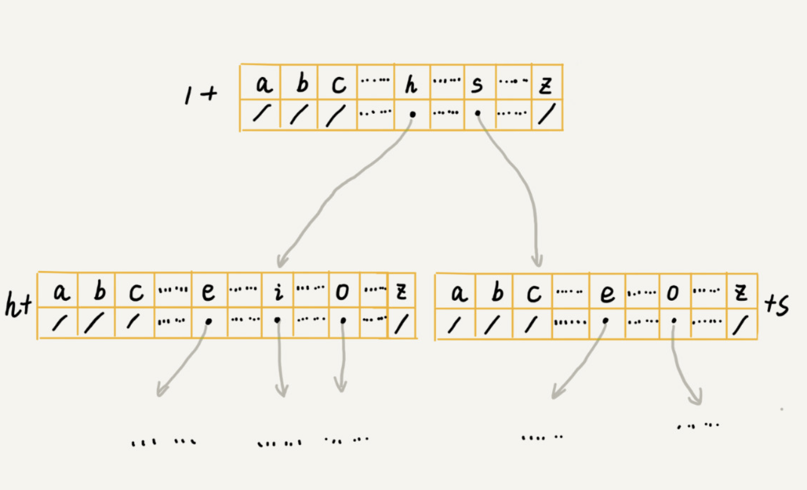

# 实现原理

Trie 树，也叫“字典树”。顾名思义，它是一个树形结构。它是一种专门处理字符串匹配的数据结构，用来解决在一组字符串集合中快速查找某个字符串的问题。

我举个简单的例子来说明一下。我们有 6 个字符串，它们分别是：how，hi，her，hello，so，see。我们希望在里面多次查找某个字符串是否存在。如果每次查找，都是拿要查找的字符串跟这 6 个字符串依次进行字符串匹配，那效率就比较低，有没有更高效的方法呢？

这个时候，我们就可以先对这 6 个字符串做一下预处理，组织成 Trie 树的结构，之后每次查找，都是在 Trie 树中进行匹配查找。**Trie 树的本质，就是利用字符串之间的公共前缀，将重复的前缀合并在一起**。最后构造出来的就是下面这个图中的样子。


其中，根节点不包含任何信息。每个节点表示一个字符串中的字符，从根节点到红色节点的一条路径表示一个字符串


Trie 树主要有两个操作，**一个是将字符串集合构造成 Trie 树**。这个过程分解开来的话，就是一个将字符串插入到 Trie 树的过程。**另一个是在 Trie 树中查询一个字符串**。

Trie 树是一个多叉树。我们知道，二叉树中，一个节点的左右子节点是通过两个指针来存储的，如下所示 Java 代码。那对于多叉树来说，我们怎么存储一个节点的所有子节点的指针呢？

```java
class BinaryTreeNode {
  char data;
  BinaryTreeNode left;
  BinaryTreeNode right;  
}
```

我先介绍其中一种存储方式，也是经典的存储方式，大部分数据结构和算法书籍中都是这么讲的。还记得我们前面讲到的散列表吗？借助散列表的思想，我们通过一个下标与字符一一映射的数组，来存储子节点的指针。



假设我们的字符串中只有从 a 到 z 这 26 个小写字母，我们在数组中下标为 0 的位置，存储指向子节点 a 的指针，下标为 1 的位置存储指向子节点 b 的指针，以此类推，下标为 25 的位置，存储的是指向的子节点 z 的指针。如果某个字符的子节点不存在，我们就在对应的下标的位置存储 null。

```java
class TrieNode {
  char data;
  TrieNode children[26];
}
```


当我们在 Trie 树中查找字符串的时候，我们就可以通过字符的 ASCII 码减去“a”的 ASCII 码，迅速找到匹配的子节点的指针。比如，d 的 ASCII 码减去 a 的 ASCII 码就是 3，那子节点 d 的指针就存储在数组中下标为 3 的位置中。

代码实现：

```java
public class Trie {
  private TrieNode root = new TrieNode('/'); // 存储无意义字符
 
  // 往 Trie 树中插入一个字符串
  public void insert(char[] text) {
    TrieNode p = root;
    for (int i = 0; i < text.length; ++i) {
      int index = text[i] - 'a';
      if (p.children[index] == null) {
        TrieNode newNode = new TrieNode(text[i]);
        p.children[index] = newNode;
      }
      p = p.children[index];
    }
    p.isEndingChar = true;
  }
 
  // 在 Trie 树中查找一个字符串
  public boolean find(char[] pattern) {
    TrieNode p = root;
    for (int i = 0; i < pattern.length; ++i) {
      int index = pattern[i] - 'a';
      if (p.children[index] == null) {
        return false; // 不存在 pattern
      }
      p = p.children[index];
    }
    if (p.isEndingChar == false) return false; // 不能完全匹配，只是前缀
    else return true; // 找到 pattern
  }
 
  public class TrieNode {
    public char data;
    public TrieNode[] children = new TrieNode[26];
    public boolean isEndingChar = false;
    public TrieNode(char data) {
      this.data = data;
    }
  }
}
```

构建 Trie 树的过程，需要扫描所有的字符串，时间复杂度是 O(n)。构建好 Trie 树后，在其中查找字符串的时间复杂度是 O(k)，k 表示要查找的字符串的长度。