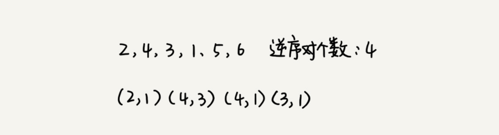

# 求逆序对数

**何编程求出一组数据的有序对个数或者逆序对个数呢**？



最笨的方法是，拿每个数字跟它后面的数字比较，看有几个比它小的。我们把比它小的数字个数记作 k，通过这样的方式，把每个数字都考察一遍之后，然后对每个数字对应的 k 值求和，最后得到的总和就是逆序对个数。不过，这样操作的时间复杂度是 O(n^2)。那有没有更加高效的处理方法呢？


我们用分治算法来试试。我们套用分治的思想来求数组 A 的逆序对个数。我们可以将数组分成前后两半 A1 和 A2，分别计算 A1 和 A2 的逆序对个数 K1 和 K2，然后再计算 A1 与 A2 之间的逆序对个数 K3。那数组 A 的逆序对个数就等于 K1+K2+K3。

我们前面讲过，使用分治算法其中一个要求是，子问题合并的代价不能太大，否则就起不了降低时间复杂度的效果了。那回到这个问题，如何快速计算出两个子问题 A1 与 A2 之间的逆序对个数呢？

这里就要借助归并排序算法了。你可以先试着想想，如何借助归并排序算法来解决呢？

归并排序中有一个非常关键的操作，就是将两个有序的小数组，合并成一个有序的数组。实际上，在这个合并的过程中，我们就可以计算这两个小数组的逆序对个数了。每次合并操作，我们都计算逆序对个数，把这些计算出来的逆序对个数求和，就是这个数组的逆序对个数了。


代码实现：

```java
private int num = 0; // 全局变量或者成员变量
 
public int count(int[] a, int n) {
  num = 0;
  mergeSortCounting(a, 0, n-1);
  return num;
}
 
private void mergeSortCounting(int[] a, int p, int r) {
  if (p >= r) return;
  int q = (p+r)/2;
  mergeSortCounting(a, p, q);
  mergeSortCounting(a, q+1, r);
  merge(a, p, q, r);
}
 
private void merge(int[] a, int p, int q, int r) {
  int i = p, j = q+1, k = 0;
  int[] tmp = new int[r-p+1];
  while (i<=q && j<=r) {
    if (a[i] <= a[j]) {
      tmp[k++] = a[i++];
    } else {
      num += (q-i+1); // 统计 p-q 之间，比 a[j] 大的元素个数
      tmp[k++] = a[j++];
    }
  }
  while (i <= q) { // 处理剩下的
    tmp[k++] = a[i++];
  }
  while (j <= r) { // 处理剩下的
    tmp[k++] = a[j++];
  }
  for (i = 0; i <= r-p; ++i) { // 从 tmp 拷贝回 a
    a[p+i] = tmp[i];
  }
}
```

