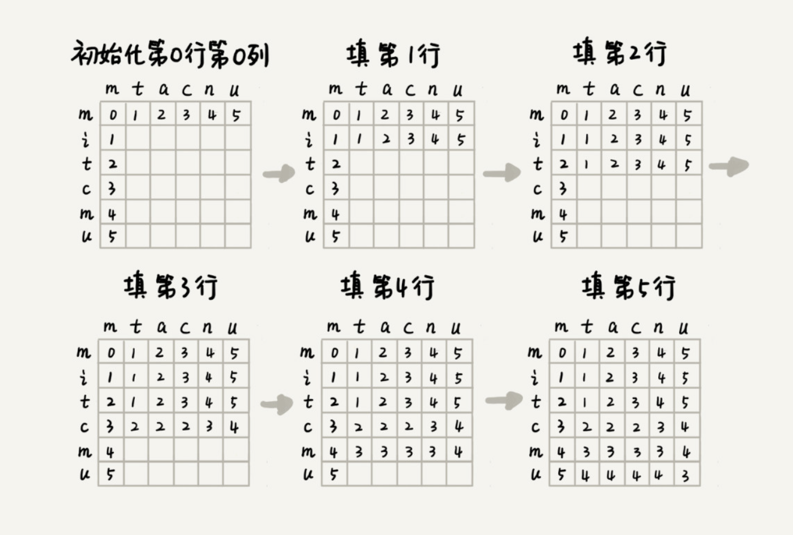

# 如何量化两个字符串的相似度？

计算机只认识数字，如何量化两个字符串之间的相似程度呢？有一个非常著名的量化方法，那就是编辑距离（Edit Distance）。

顾名思义，**编辑距离**指的就是，将一个字符串转化成另一个字符串，需要的最少编辑操作次数（比如增加一个字符、删除一个字符、替换一个字符）。编辑距离越大，说明两个字符串的相似程度越小；相反，编辑距离就越小，说明两个字符串的相似程度越大。对于两个完全相同的字符串来说，编辑距离就是 0。

根据所包含的编辑操作种类的不同，编辑距离有多种不同的计算方式，比较著名的有**莱文斯坦距离**（Levenshtein distance）和**最长公共子串长度**（Longest common substring length）。其中，莱文斯坦距离允许增加、删除、替换字符这三个编辑操作，最长公共子串长度只允许增加、删除字符这两个编辑操作。

而且，莱文斯坦距离和最长公共子串长度，从两个截然相反的角度，分析字符串的相似程度。莱文斯坦距离的大小，表示两个字符串差异的大小；而最长公共子串的大小，表示两个字符串相似程度的大小。

关于这两个计算方法，我举个例子给你说明一下。这里面，两个字符串 mitcmu 和 mtacnu 的莱文斯坦距离是 3，最长公共子串长度是 4。


# 编程计算莱文斯坦距离

这个问题是求把一个字符串变成另一个字符串，需要的最少编辑次数。整个求解过程，涉及多个决策阶段，我们需要依次考察一个字符串中的每个字符，跟另一个字符串中的字符是否匹配，匹配的话如何处理，不匹配的话又如何处理。所以，这个问题符合**多阶段决策最优解模型**。

我们前面讲了，贪心、回溯、动态规划可以解决的问题，都可以抽象成这样一个模型。要解决这个问题，我们可以先看一看，用最简单的回溯算法，该如何来解决。

回溯是一个递归处理的过程。如果 a[i] 与 b[j] 匹配，我们递归考察 a[i+1] 和 b[j+1]。如果 a[i] 与 b[j] 不匹配，那我们有多种处理方式可选：

- 可以删除 a[i]，然后递归考察 a[i+1] 和 b[j]；
- 可以删除 b[j]，然后递归考察 a[i] 和 b[j+1]；
- 可以在 a[i] 前面添加一个跟 b[j] 相同的字符，然后递归考察 a[i] 和 b[j+1];
- 可以在 b[j] 前面添加一个跟 a[i] 相同的字符，然后递归考察 a[i+1] 和 b[j]；
- 可以将 a[i] 替换成 b[j]，或者将 b[j] 替换成 a[i]，然后递归考察 a[i+1] 和 b[j+1]。

我们将上面的回溯算法的处理思路，翻译成代码，就是下面这个样子：

```java
private char[] a = "mitcmu".toCharArray();
private char[] b = "mtacnu".toCharArray();
private int n = 6;
private int m = 6;
private int minDist = Integer.MAX_VALUE; // 存储结果
// 调用方式 lwstBT(0, 0, 0);
public lwstBT(int i, int j, int edist) {
  if (i == n || j == m) {
    if (i < n) edist += (n-i);
    if (j < m) edist += (m - j);
    if (edist < minDist) minDist = edist;
    return;
  }
  if (a[i] == b[j]) { // 两个字符匹配
    lwstBT(i+1, j+1, edist);
  } else { // 两个字符不匹配
    lwstBT(i + 1, j, edist + 1); // 删除 a[i] 或者 b[j] 前添加一个字符
    lwstBT(i, j + 1, edist + 1); // 删除 b[j] 或者 a[i] 前添加一个字符
    lwstBT(i + 1, j + 1, edist + 1); // 将 a[i] 和 b[j] 替换为相同字符
  }
}
```

根据回溯算法的代码实现，我们可以画出递归树，看是否存在重复子问题。如果存在重复子问题，那我们就可以考虑能否用动态规划来解决；如果不存在重复子问题，那回溯就是最好的解决方法。


在递归树中，每个节点代表一个状态，状态包含三个变量 (i, j, edist)，其中，edist 表示处理到 a[i] 和 b[j] 时，已经执行的编辑操作的次数。

在递归树中，(i, j) 两个变量重复的节点很多，比如 (3, 2) 和 (2, 3)。对于 (i, j) 相同的节点，我们只需要保留 edist 最小的，继续递归处理就可以了，剩下的节点都可以舍弃。所以，状态就从 (i, j, edist) 变成了 (i, j, min_edist)，其中 min_edist 表示处理到 a[i] 和 b[j]，已经执行的最少编辑次数。

上一节我们讲的矩阵最短路径问题中，到达状态 (i, j) 只能通过 (i-1, j) 或 (i, j-1) 两个状态转移过来，而今天这个问题，状态 (i, j) 可能从 (i-1, j)，(i, j-1)，(i-1, j-1) 三个状态中的任意一个转移过来。


状态转移方程：

```
如果：a[i]!=b[j]，那么：min_edist(i, j) 就等于：
min(min_edist(i-1,j)+1, min_edist(i,j-1)+1, min_edist(i-1,j-1)+1)
 
如果：a[i]==b[j]，那么：min_edist(i, j) 就等于：
min(min_edist(i-1,j)+1, min_edist(i,j-1)+1，min_edist(i-1,j-1))
 
其中，min 表示求三数中的最小值。  
```

二维的状态表：




```java
public int lwstDP(char[] a, int n, char[] b, int m) {
  int[][] minDist = new int[n][m];
  for (int j = 0; j < m; ++j) { // 初始化第 0 行:a[0..0] 与 b[0..j] 的编辑距离
    if (a[0] == b[j]) minDist[0][j] = j;
    else if (j != 0) minDist[0][j] = minDist[0][j-1]+1;
    else minDist[0][j] = 1;
  }
  for (int i = 0; i < n; ++i) { // 初始化第 0 列:a[0..i] 与 b[0..0] 的编辑距离
    if (a[i] == b[0]) minDist[i][0] = i;
    else if (i != 0) minDist[i][0] = minDist[i-1][0]+1;
    else minDist[i][0] = 1;
  }
  for (int i = 1; i < n; ++i) { // 按行填表
    for (int j = 1; j < m; ++j) {
      if (a[i] == b[j]) minDist[i][j] = min(
          minDist[i-1][j]+1, minDist[i][j-1]+1, minDist[i-1][j-1]);
      else minDist[i][j] = min(
          minDist[i-1][j]+1, minDist[i][j-1]+1, minDist[i-1][j-1]+1);
    }
  }
  return minDist[n-1][m-1];
}
 
private int min(int x, int y, int z) {
  int minv = Integer.MAX_VALUE;
  if (x < minv) minv = x;
  if (y < minv) minv = y;
  if (z < minv) minv = z;
  return minv;
}
```

# 编程计算最长公共子串长度

每个状态还是包括三个变量 (i, j, max_lcs)，max_lcs 表示 a[0…i] 和 b[0…j] 的最长公共子串长度。那 (i, j) 这个状态都是由哪些状态转移过来的呢？

我们先来看回溯的处理思路。我们从 a[0] 和 b[0] 开始，依次考察两个字符串中的字符是否匹配。

- 如果 a[i] 与 b[j] 互相匹配，我们将最大公共子串长度加一，并且继续考察 a[i+1] 和 b[j+1]。
- 如果 a[i] 与 b[j] 不匹配，最长公共子串长度不变，这个时候，有两个不同的决策路线：
- 删除 a[i]，或者在 b[j] 前面加上一个字符 a[i]，然后继续考察 a[i+1] 和 b[j]；
- 删除 b[j]，或者在 a[i] 前面加上一个字符 b[j]，然后继续考察 a[i] 和 b[j+1]。

反过来也就是说，如果我们要求 a[0…i] 和 b[0…j] 的最长公共长度 max_lcs(i, j)，我们只有可能通过下面三个状态转移过来：

- (i-1, j-1, max_lcs)，其中 max_lcs 表示 a[0…i-1] 和 b[0…j-1] 的最长公共子串长度；
- (i-1, j, max_lcs)，其中 max_lcs 表示 a[0…i-1] 和 b[0…j] 的最长公共子串长度；
- (i, j-1, max_lcs)，其中 max_lcs 表示 a[0…i] 和 b[0…j-1] 的最长公共子串长度。

如果我们把这个转移过程，用状态转移方程写出来，就是下面这个样子：

```
如果：a[i]==b[j]，那么：max_lcs(i, j) 就等于：
max(max_lcs(i-1,j-1)+1, max_lcs(i-1, j), max_lcs(i, j-1))；
 
如果：a[i]!=b[j]，那么：max_lcs(i, j) 就等于：
max(max_lcs(i-1,j-1), max_lcs(i-1, j), max_lcs(i, j-1))；
 
其中 max 表示求三数中的最大值。
```

代码实现：

```java
public int lcs(char[] a, int n, char[] b, int m) {
  int[][] maxlcs = new int[n][m];
  for (int j = 0; j < m; ++j) {// 初始化第 0 行：a[0..0] 与 b[0..j] 的 maxlcs
    if (a[0] == b[j]) maxlcs[0][j] = 1;
    else if (j != 0) maxlcs[0][j] = maxlcs[0][j-1];
    else maxlcs[0][j] = 0;
  }
  for (int i = 0; i < n; ++i) {// 初始化第 0 列：a[0..i] 与 b[0..0] 的 maxlcs
    if (a[i] == b[0]) maxlcs[i][0] = 1;
    else if (i != 0) maxlcs[i][0] = maxlcs[i-1][0];
    else maxlcs[i][0] = 0;
  }
  for (int i = 1; i < n; ++i) { // 填表
    for (int j = 1; j < m; ++j) {
      if (a[i] == b[j]) maxlcs[i][j] = max(
          maxlcs[i-1][j], maxlcs[i][j-1], maxlcs[i-1][j-1]+1);
      else maxlcs[i][j] = max(
          maxlcs[i-1][j], maxlcs[i][j-1], maxlcs[i-1][j-1]);
    }
  }
  return maxlcs[n-1][m-1];
}
 
private int max(int x, int y, int z) {
  int maxv = Integer.MIN_VALUE;
  if (x > maxv) maxv = x;
  if (y > maxv) maxv = y;
  if (z > maxv) maxv = z;
  return maxv;
}
```

