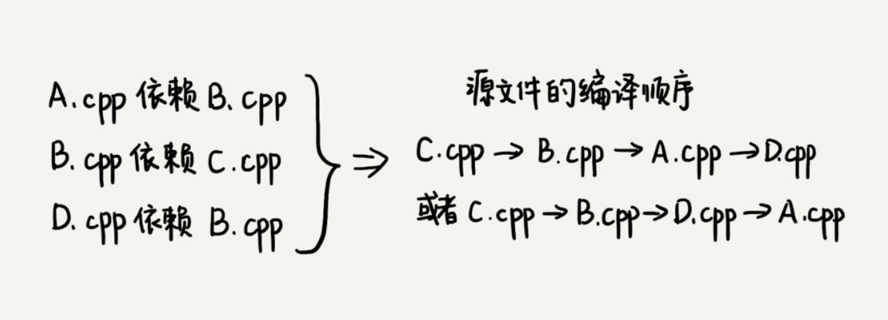

# 概述

我们知道，一个完整的项目往往会包含很多代码源文件。编译器在编译整个项目的时候，需要按照依赖关系，依次编译每个源文件。比如，A.cpp 依赖 B.cpp，那在编译的时候，编译器需要先编译 B.cpp，才能编译 A.cpp。

编译器通过分析源文件或者程序员事先写好的编译配置文件（比如 Makefile 文件），来获取这种局部的依赖关系。**那编译器又该如何通过源文件两两之间的局部依赖关系，确定一个全局的编译顺序呢？**



这个问题的解决思路与“图”这种数据结构的一个经典算法“拓扑排序算法”有关。那什么是拓扑排序呢？这个概念很好理解，我们先来看一个生活中的拓扑排序的例子。

我们在穿衣服的时候都有一定的顺序，我们可以把这种顺序想成，衣服与衣服之间有一定的依赖关系。比如说，你必须先穿袜子才能穿鞋，先穿内裤才能穿秋裤。假设我们现在有八件衣服要穿，它们之间的两两依赖关系我们已经很清楚了，那如何安排一个穿衣序列，能够满足所有的两两之间的依赖关系？

这就是个拓扑排序问题。从这个例子中，你应该能想到，在很多时候，拓扑排序的序列并不是唯一的。


算法是构建在具体的数据结构之上的。针对这个问题，我们先来看下，如何将问题背景抽象成具体的数据结构？

我们可以把源文件与源文件之间的依赖关系，抽象成一个有向图。每个源文件对应图中的一个顶点，源文件之间的依赖关系就是顶点之间的边。

如果 a 先于 b 执行，也就是说 b 依赖于 a，那么就在顶点 a 和顶点 b 之间，构建一条从 a 指向 b 的边。而且，这个图不仅要是有向图，还要是一个有向无环图，也就是不能存在像 a->b->c->a 这样的循环依赖关系。因为图中一旦出现环，拓扑排序就无法工作了。实际上，拓扑排序本身就是基于有向无环图的一个算法。

```java
public class Graph {
  private int v; // 顶点的个数
  private LinkedList<Integer> adj[]; // 邻接表
 
  public Graph(int v) {
    this.v = v;
    adj = new LinkedList[v];
    for (int i=0; i<v; ++i) {
      adj[i] = new LinkedList<>();
    }
  }
 
  public void addEdge(int s, int t) { // s 先于 t，边 s->t
    adj[s].add(t);
  }
}
```

**如何在这个有向无环图上，实现拓扑排序**？

拓扑排序有两种实现方法，它们分别是**Kahn 算法**和**DFS 深度优先搜索算法**。

