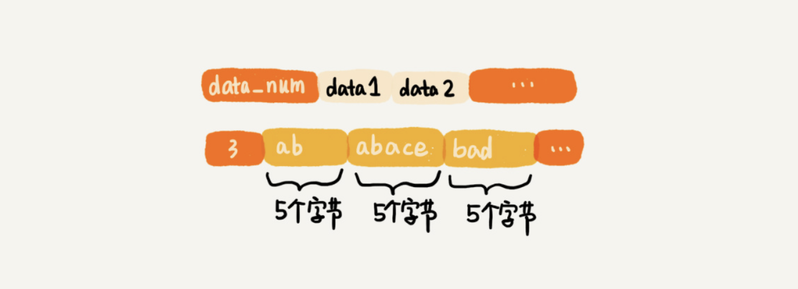

# 列表（list）

我们先来看列表。列表这种数据类型支持存储一组数据。这种数据类型对应两种实现方法，一种是**压缩列表**（ziplist），另一种是双向循环链表。

当列表中存储的数据量比较小的时候，列表就可以采用压缩列表的方式实现。具体需要同时满足下面两个条件：

- 列表中保存的单个数据（有可能是字符串类型的）小于 64 字节；
- 列表中数据个数少于 512 个。

关于压缩列表，我这里稍微解释一下。它并不是基础数据结构，而是 Redis 自己设计的一种数据存储结构。它有点儿类似数组，通过一片连续的内存空间，来存储数据。不过，它跟数组不同的一点是，它允许存储的数据大小不同。具体的存储结构也非常简单，你可以看我下面画的这幅图。


现在，我们来看看，压缩列表中的“压缩”两个字该如何理解？

听到“压缩”两个字，直观的反应就是节省内存。之所以说这种存储结构节省内存，是相较于数组的存储思路而言的。我们知道，数组要求每个元素的大小相同，如果我们要存储不同长度的字符串，那我们就需要用最大长度的字符串大小作为元素的大小（假设是 20 个字节）。那当我们存储小于 20 个字节长度的字符串的时候，便会浪费部分存储空间。听起来有点儿拗口，我画个图解释一下。



压缩列表这种存储结构，一方面比较节省内存，另一方面可以支持不同类型数据的存储。而且，因为数据存储在一片连续的内存空间，通过键来获取值为列表类型的数据，读取的效率也非常高。

当列表中存储的数据量比较大的时候，也就是不能同时满足刚刚讲的两个条件的时候，列表就要通过双向循环链表来实现了。

在链表那章里，我们已经讲过双向循环链表这种数据结构了。这里我们着重看一下 Redis 中双向链表的编码实现方式。

Redis 的这种双向链表的实现方式，非常值得借鉴。它额外定义一个 list 结构体，来组织链表的首、尾指针，还有长度等信息。这样，在使用的时候就会非常方便。

```c
// 以下是 C 语言代码，因为 Redis 是用 C 语言实现的。
typedef struct listnode {
  struct listNode *prev;
  struct listNode *next;
  void *value;
} listNode;
 
 
typedef struct list {
  listNode *head;
  listNode *tail;
  unsigned long len;
  // .... 省略其他定义
} list;
```

