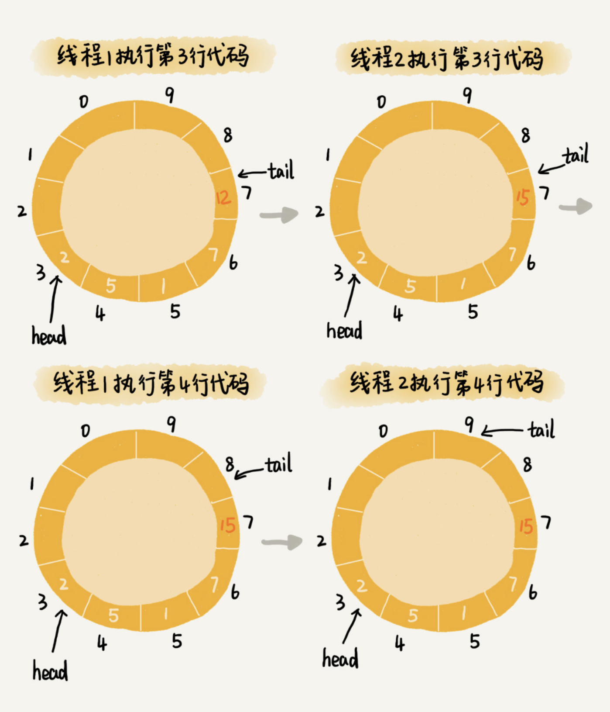

# 基于加锁的并发“生产者 - 消费者模型”

实际上，刚刚的“生产者 - 消费者模型”实现代码，是不完善的。为什么这么说呢？

如果我们只有一个生产者往队列中写数据，一个消费者从队列中读取数据，那上面的代码是没有问题的。但是，如果有多个生产者在并发地往队列中写入数据，或者多个消费者并发地从队列中消费数据，那上面的代码就不能正确工作了。我来给你讲讲为什么。

在多个生产者或者多个消费者并发操作队列的情况下，刚刚的代码主要会有下面两个问题：

- 多个生产者写入的数据可能会互相覆盖；
- 多个消费者可能会读取重复的数据。

因为第一个问题和第二个问题产生的原理是类似的。所以，我着重讲解第一个问题是如何产生的以及该如何解决。对于第二个问题，你可以类比我对第一个问题的解决思路自己来想一想。

两个线程同时往队列中添加数据，也就相当于两个线程同时执行类 Queue 中的 add() 函数。我们假设队列的大小 size 是 10，当前的 tail 指向下标 7，head 指向下标 3，也就是说，队列中还有空闲空间。这个时候，线程 1 调用 add() 函数，往队列中添加一个值为 12 的数据；线程 2 调用 add() 函数，往队列中添加一个值为 15 的数据。在极端情况下，本来是往队列中添加了两个数据（12 和 15），最终可能只有一个数据添加成功，另一个数据会被覆盖。这是为什么呢？


为了方便你查看队列 Queue 中的 add() 函数，我把它从上面的代码中摘录出来，贴在这里。

```java
public boolean add(Long element) {
  if ((tail + 1) % size == head) return false;
  data[tail] = element;
  tail = (tail + 1) % size;
  return true;
}
```

从这段代码中，我们可以看到，第 3 行给 data[tail] 赋值，然后第 4 行才给 tail 的值加一。赋值和 tail 加一两个操作，并非原子操作。这就会导致这样的情况发生：当线程 1 和线程 2 同时执行 add() 函数的时候，线程 1 先执行完了第 3 行语句，将 data[7]（tail 等于 7）的值设置为 12。在线程 1 还未执行到第 4 行语句之前，也就是还未将 tail 加一之前，线程 2 执行了第 3 行语句，又将 data[7] 的值设置为 15，也就是说，那线程 2 插入的数据覆盖了线程 1 插入的数据。原本应该插入两个数据（12 和 15）的，现在只插入了一个数据



那如何解决这种线程并发往队列中添加数据时，导致的数据覆盖、运行不正确问题呢？

最简单的处理方法就是给这段代码加锁，同一时间只允许一个线程执行 add() 函数。这就相当于将这段代码的执行，由并行改成了串行，也就不存在我们刚刚说的问题了。

不过，天下没有免费的午餐，加锁将并行改成串行，必然导致多个生产者同时生产数据的时候，执行效率的下降。当然，我们可以继续优化代码，用[CAS](https://en.wikipedia.org/wiki/Compare-and-swap)（compare and swap，比较并交换）操作等减少加锁的粒度，但是，这不是我们这节的重点。我们直接看 Disruptor 的处理方法---基于无锁的并发“生产者 - 消费者模型”。