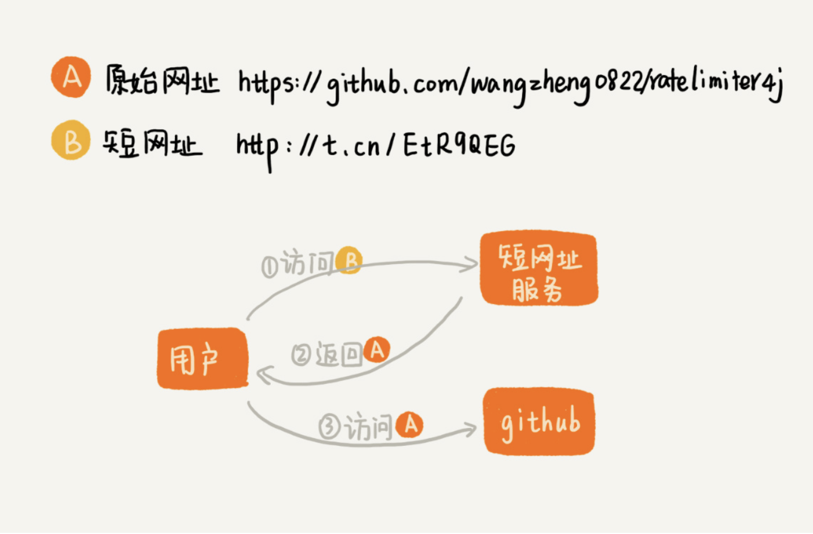

# 短网址服务整体介绍

短网址服务你用过吗？如果我们在微博里发布一条带网址的信息，微博会把里面的网址转化成一个更短的网址。我们只要访问这个短网址，就相当于访问原始的网址。比如下面这两个网址，尽管长度不同，但是都可以跳转到我的一个 GitHub 开源项目里。其中，第二个网址就是通过新浪提供的短网址服务生成的。

```
原始网址：https://github.com/wangzheng0822/ratelimiter4j
短网址：http://t.cn/EtR9QEG
```

从功能上讲，短网址服务其实非常简单，就是把一个长的网址转化成一个短的网址。


刚刚我们讲了，短网址服务的一个核心功能，就是把原始的长网址转化成短网址。除了这个功能之外，短网址服务还有另外一个必不可少的功能。那就是，当用户点击短网址的时候，短网址服务会将浏览器重定向为原始网址。这个过程是如何实现的呢？

为了方便你理解，我画了一张对比图，你可以看下。



从图中我们可以看出，浏览器会先访问短网址服务，通过短网址获取到原始网址，再通过原始网址访问到页面。不过这部分功能并不是我们今天要讲的重点。我们重点来看，如何将长网址转化成短网址？