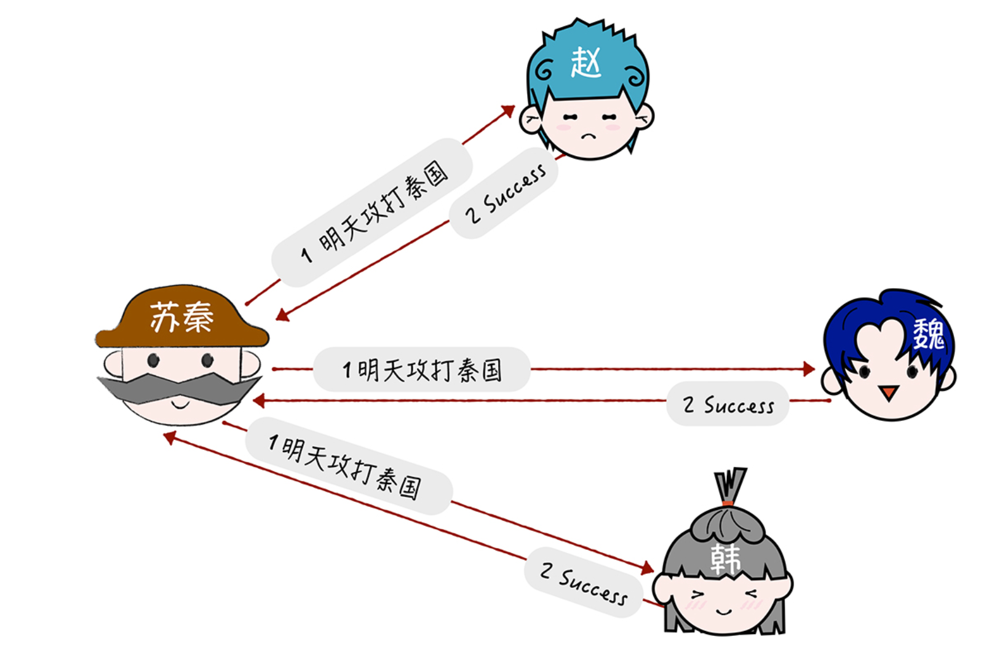

# TCC协议(Try-Confirm-Cancel)

TCC 是 Try(预留)、Confirm(确认)、Cancel(撤销) 3 个操作的简称，它包含了预留、确认或撤销这 2 个阶段。那么你如何使用 TCC 协议，解决苏秦面临的问题呢?

首先，我们先**进入到预留阶段**，大致的步骤如下:

第一步，苏秦分别发送消息通知赵、魏、韩，让他们预留明天的时间和相关资源。然后苏秦实现确认操作(明天攻打秦国)，和撤销操作(取消明天攻打秦国)。

第二步，苏秦收到赵、魏、韩的预留答复，都是 OK。

如果预留阶段的执行都没有问题，就进入**确认阶段**，大致步骤如下:

第一步，苏秦执行确认操作，通知赵、魏、韩明天攻打秦国。

第二步，收到确认操作的响应，完成分布式事务。

如果预留阶段执行出错，比如赵的一部分军队还在赶来的路上，无法出兵，那么就进入撤销 **阶段**，大致步骤如下:

第一步，苏秦执行撤销操作，通知赵、魏、韩取消明天攻打秦国的计划。

第二步，收到撤销操作的响应。

其实在我看来，TCC 本质上是补偿事务，**它的核心思想是针对每个操作都要注册一个与其 对应的确认操作和补偿操作(也就是撤销操作)。** 它是一个业务层面的协议，你也可以将 TCC 理解为编程模型，TCC 的 3 个操作是需要在业务代码中编码实现的，为了实现一致性，确认操作和补偿操作必须是等幂的，因为这 2 个操作可能会失败重试。

另外，TCC 不依赖于数据库的事务，而是在业务中实现了分布式事务，这样能减轻数据库 的压力，但对业务代码的入侵性也更强，实现的复杂度也更高。所以，我推荐在需要分布式事务能力时，优先考虑现成的事务型数据库(比如 MySQL XA)，当现有的事务型数据库 不能满足业务的需求时，再考虑基于 TCC 实现分布式事务。