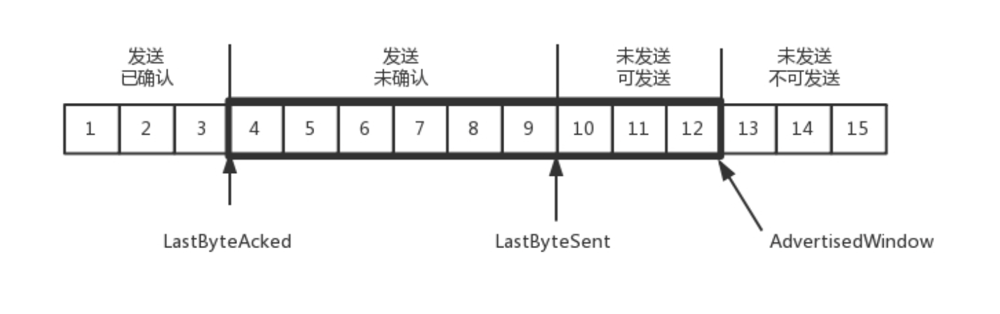
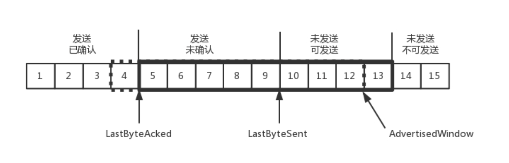
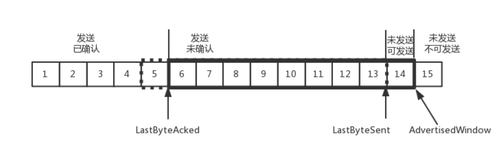
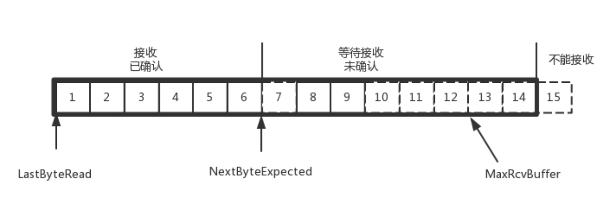
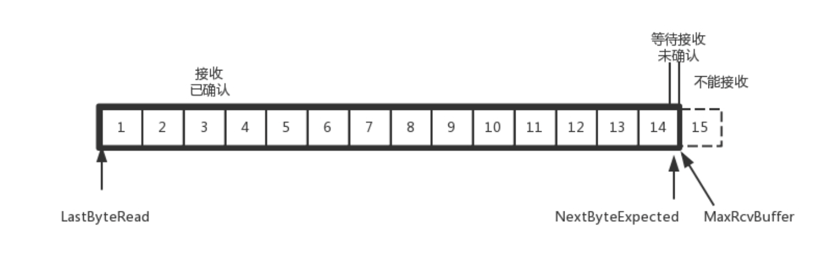
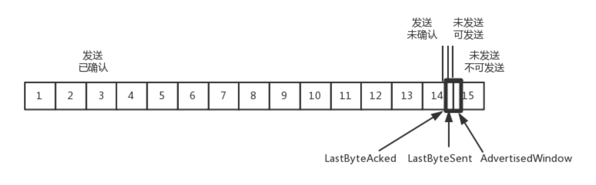

# 简述 TCP 滑动窗口

在 TCP 里，接收端会给发送端报一个窗口的大小，叫Advertised window。

假设窗口窗口始终为 9。4 的确认来的时候，会右移一个，这个时候第 13 个包也可以发送了。

这个时候，假设发送端发送过猛，会将第三部分的 10、11、12、13 全部发送完毕，之后就停止发送了，未发送可发送部分为 0。

当对于包 5 的确认到达的时候，在客户端相当于窗口再滑动了一格，这个时候，才可以有更多的包可以发送了，例如第 14 个包才可以发送。

如果接收方实在处理的太慢，导致缓存中没有空间了，可以通过确认信息修改窗口的大小，甚至可以设置为 0，则发送方将暂时停止发送。

我们假设一个极端情况，接收端的应用一直不读取缓存中的数据，当数据包 6 确认后，窗口大小就不能再是 9 了，就要缩小一个变为 8。

这个新的窗口 8 通过 6 的确认消息到达发送端的时候，你会发现窗口没有平行右移，而是仅仅左面的边右移了，窗口的大小从 9 改成了 8。

如果接收端还是一直不处理数据，则随着确认的包越来越多，窗口越来越小，直到为 0。

当这个窗口通过包 14 的确认到达发送端的时候，发送端的窗口也调整为 0，停止发送。

如果这样的话，发送方会定时发送窗口探测数据包，看是否有机会调整窗口的大小。当接收方比较慢的时候，要防止低能窗口综合征，别空出一个字节来就赶快告诉发送方，然后马上又填满了，可以当窗口太小的时候，不更新窗口，直到达到一定大小，或者缓冲区一半为空，才更新窗口。

这就是我们常说的流量控制。
