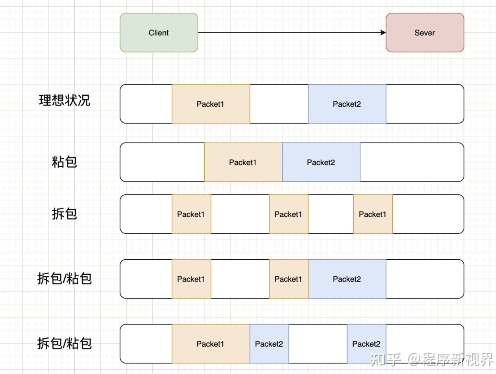

# 什么是 TCP 粘包和拆包？

因为TCP是面向流，没有边界（UDP有消息保护边界，所以不会发生粘包拆包问题），而操作系统在发送TCP数据时，会通过缓冲区来进行优化，例如缓冲区为1024个字节大小。

如果一次请求发送的数据量比较小，没达到缓冲区大小，TCP则会将多个请求合并为同一个请求进行发送，这就形成了粘包问题。

如果一次请求发送的数据量比较大，超过了缓冲区大小，TCP就会将其拆分为多次发送，这就是拆包。

上图演示了几种情况：

- 正常的理想情况，两个包恰好满足TCP缓冲区的大小或达到TCP等待时长，分别发送两个包；

- 粘包：两个包较小，间隔时间短，发生粘包，合并成一个包发送；

- 拆包：一个包过大，超过缓存区大小，拆分成两个或多个包发送；

- 拆包和粘包：Packet1过大，进行了拆包处理，而拆出去的一部分又与Packet2进行粘包处理。

对于粘包和拆包问题，常见的解决方案有四种：

- 发送端将每个包都封装成固定的长度，比如100字节大小。如果不足100字节可通过补0或空等进行填充到指定长度；

- 发送端在每个包的末尾使用固定的分隔符，例如\r\n。如果发生拆包需等待多个包发送过来之后再找到其中的\r\n进行合并；例如，FTP协议；

- 将消息分为头部和消息体，头部中保存整个消息的长度，只有读取到足够长度的消息之后才算是读到了一个完整的消息；

- 通过自定义协议进行粘包和拆包的处理。