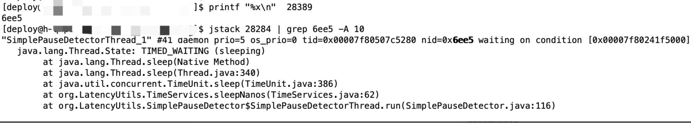

# cpu飙高怎么排查？

cpu最小执行单元是线程，导致cpu飙高的原因有几个方面：

- cpu上下文切换过多，上下文切换主要两个方面，第一需要保存线程的运行状态，第二，让处于等待中的线程恢复执行。这两个过程需要cpu执行内核指令实现状态的保存和恢复，如果较多的上下文切换会占据大量cpu资源。像文件io，网络io，锁等待这些都会造成线程阻塞，而线程阻塞就会导致cpu上下文切换

- cpu资源过度消耗，也就是在程序员创建了大量的线程，或者有线程一直占用cpu资源（比如死循环）

我们可以根据top命令找到cpu利用率过高的进程，再通过`shift+H`找到进程中cpu消耗过高的线程，这里有两种情况：

- 第一种情况：cpu利用率过高的线程一直都是同一个，也就是线程id没有变化，说明，程序中存在长期占用cpu没有释放的情况，可以通过jstack工具或者线程的dump日志，定位到线程日志后找到问题代码

- 第二种情况：cpu利用率过高的线程id一直在变化，说明线程创建过多，需要挑选几个线程id通过jstack去线程dump中进行排查，有可能定位结果是程序正常，只是cpu飙高的那一刻用户访问量大，那我们应该采取增加系统资源的手段。

****

1、查询哪个进程占用CPU

2、进程哪个线程占用CPU

3、查询线程的堆栈信息

<font size=5>**1、查询哪个进程占用CPU**</font>

可以使用 Top 或者 `top | grep 用户名`，比如这里我们可以使用 top | grep deploy 查询当前用户deploy下面有哪些进程比较占用CPU，如下图，可以发现进程28284比较占用CPU


<font size=5>**2、进程哪个线程占用CPU**</font>

接着我们查看上述进程内是哪些线程在捣乱，使用命令top -H -p PID

在这里我们使用top -H -p 28284，结果如下图，我们发现是有几个线程相对占用比较高，比如28389、28390等（这里我们只是展示效果，不要在乎是否真的占用比较大）


<font size=5>**3、查询线程的堆栈信息**</font>

在这里我们要分两步

1、将tid转换为16进制的数字：printf “%x\n” tid

2、 查询线程信息：jstack 28284 | grep 6ee5 -A 10 （jstack好像是分析java线程的工具，go好像不能用）

执行结果如下图，我们可以看到具体是我们的应用里的哪个线程占用CPU较高，比如这里就是一个叫SimplePauseDetectorThread_1的线程，下面就是根据具体线程业务分析了



****

下面是使用go的dlv分析cpu过高问题。

```go
package main

import (
	"fmt"
	"os"
	"os/signal"
)

func main() {
	fmt.Println("main start")

	msgList := make(chan int, 100)
	go func() {
		for {
			select {
			case <-msgList:
			default:

			}
		}
	}()
	
	c := make(chan os.Signal, 1)
	signal.Notify(c, os.Interrupt, os.Kill)
	s := <-c
	
	fmt.Println("main exit.get signal:", s)
}
```

go build -o cpudetect main.go编译生成cpudetect并放到服务器运行。接下来是具体的分析步骤：

<font size=5>**1.top命令查看哪个进程：**</font>

```
Tasks: 168 total,   1 running, 166 sleeping,   1 stopped,   0 zombie
%Cpu(s): 94.4 us,  5.6 sy,  0.0 ni,  0.0 id,  0.0 wa,  0.0 hi,  0.0 si,  0.0 st
KiB Mem :   995684 total,    73064 free,   613904 used,   308716 buff/cache
KiB Swap:  2097148 total,  2093300 free,     3848 used.   200060 avail Mem 

   PID USER      PR  NI    VIRT    RES    SHR S %CPU %MEM     TIME+ COMMAND                                                                                                                   
  7819 root      20   0  703020   1000    632 S 94.1  0.1   3:07.05 cpudetect                                                                                                                 
     1 root      20   0  128296   6704   3912 S  0.0  0.7   0:04.22 systemd                                                                                                                   
     2 root      20   0       0      0      0 S  0.0  0.0   0:00.01 kthreadd                                                                                                                  
     4 root       0 -20       0      0      0 S  0.0  0.0   0:00.00 kworker/0:0H 
```

可以看到cpudetect进程的cpu占用了94.1。

<font size=5>**2.top -H -p 7819 命令查看进程cpudetect具体线程信息：**</font>

```
top - 01:36:29 up  3:18,  2 users,  load average: 0.68, 0.18, 0.18
Threads:   5 total,   1 running,   4 sleeping,   0 stopped,   0 zombie
%Cpu(s):100.0 us,  0.0 sy,  0.0 ni,  0.0 id,  0.0 wa,  0.0 hi,  0.0 si,  0.0 st
KiB Mem :   995684 total,    73188 free,   613780 used,   308716 buff/cache
KiB Swap:  2097148 total,  2093300 free,     3848 used.   200184 avail Mem 

   PID USER      PR  NI    VIRT    RES    SHR S %CPU %MEM     TIME+ COMMAND                                                                                                                   
  7823 root      20   0  703020   1000    632 R 99.3  0.1   0:50.62 cpudetect                                                                                                                 
  7819 root      20   0  703020   1000    632 S  0.0  0.1   0:00.00 cpudetect                                                                                                                 
  7820 root      20   0  703020   1000    632 S  0.0  0.1   0:00.06 cpudetect                                                                                                                 
  7821 root      20   0  703020   1000    632 S  0.0  0.1   0:00.01 cpudetect                                                                                                                 
  7822 root      20   0  703020   1000    632 S  0.0  0.1   0:00.00 cpudetect
```

可以看到主要由于线程7823占用cpu过高导致。

<font size=5>**3.通过 ./dlv attach 7819 命令开启调试：**</font>

```
#使用goroutines命令查看所有的协程信息：
(dlv) goroutines
Goroutine 1 - User: E:/golang/cpuDetect/src/cpudetect/main.go:26 main.main (0x494212)
Goroutine 2 - User: c:/go/src/runtime/proc.go:305 runtime.gopark (0x431ae0)
Goroutine 3 - User: c:/go/src/runtime/proc.go:305 runtime.gopark (0x431ae0)
Goroutine 4 - User: c:/go/src/runtime/proc.go:305 runtime.gopark (0x431ae0)
Goroutine 5 - User: c:/go/src/runtime/proc.go:305 runtime.gopark (0x431ae0)
Goroutine 6 - User: E:/golang/cpuDetect/src/cpudetect/main.go:16 main.main.func1 (0x4942e4) (thread 7823)
Goroutine 7 - User: c:/go/src/runtime/sigqueue.go:147 os/signal.signal_recv (0x44559c)
Goroutine 8 - User: c:/go/src/runtime/proc.go:305 runtime.gopark (0x431ae0)
```

可以看到协程6挂在7823的线程下（7823是刚才cpu占用高的线程）。

```
 #切换到协程6并查看具体堆栈信息：
 (dlv) goroutine 6
 Switched from 6 to 6 (thread 7823)
 (dlv) bt
 0  0x0000000000405a89 in runtime.chanrecv
   at c:/go/src/runtime/chan.go:451
 1  0x0000000000405dca in runtime.selectnbrecv
   at c:/go/src/runtime/chan.go:646
 2  0x00000000004942e4 in main.main.func1
   at E:/golang/cpuDetect/src/cpudetect/main.go:16
 3  0x000000000045dad1 in runtime.goexit
   at c:/go/src/runtime/asm_amd64.s:1373
```

从上面的堆栈信息，可以定位到main.go 16行，再分析对应的代码，就可以确定是select中加了defualt但没有任何处理导致cpu空转，从而导致cpu过高。

上面第二步除了使用top -H命令查看线程以外，还可以使用下面步骤：

1.top获取程序的进程id（pid）
2.～/go/bin/dlv attavh pid即attach 到该进程
3.输入grp查看当前进程所有协程
4.输入gr 协程id 切换协程

参考视频：

- [深度探索Go语言：抢占式调度](https://www.bilibili.com/video/BV1kL411p7mW?spm_id_from=333.999.0.0)

- [Go dlv调试工具](https://www.bilibili.com/video/BV1AT4y1d7ne?spm_id_from=333.337.search-card.all.click)