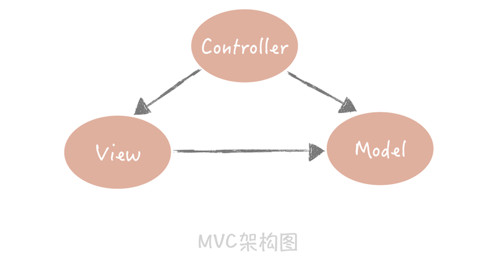

# 分层架构

## 常见分层架构

架构分层：

MVC架构，它将整体的系统分成了 Model（模型），View（视图）和 Controller（控制器）三个层次，也就是将用户视图和业务处理隔离开，并且通过控制器连接起来，很好地实现了 **表现和逻辑的解耦**，是一种标准的软件分层架构。

另外一种常见的分层方式是将整体架构分为表现层、逻辑层和数据访问层：

- 表现层，顾名思义嘛，就是展示数据结果和接受用户指令的，是最靠近用户的一层；
- 逻辑层里面有复杂业务的具体实现；
- 数据访问层则是主要处理和存储之间的交互。

这是在架构上最简单的一种分层方式。比如在构建项目的时候，我们通常会建立三个目录：Web、Service 和 Dao，它们分别对应了表现层、逻辑层还有数据访问层。

参照阿里发布的[《阿里巴巴 Java 开发手册 v1.4.0（详尽版）》 (opens new window)](https://yq.aliyun.com/articles/69327)，我们可以将原先的三层架构细化成下面的样子：

解释如下：

- 终端显示层：

  各端模板渲染并执行显示的层。当前主要是 Velocity 渲染，JS 渲染， JSP 渲染，移动端展示等。

- 开放接口层：

  将 Service 层方法封装成开放接口，同时进行网关安全控制和流量控制等。

- Web 层：

  主要是对访问控制进行转发，各类基本参数校验，或者不复用的业务简单处理等。

- Service 层：业务逻辑层。

- Manager 层：

  通用业务处理层。这一层主要有两个作用：

    - 其一，你可以将原先 Service 层的一些通用能力下沉到这一层，比如 **与缓存和存储交互策略**，中间件的接入；
    - 其二，你也可以在这一层 **封装对第三方接口的调用，比如调用支付服务，调用审核服务等**。

- DAO 层：

  数据访问层，与底层 MySQL、Oracle、Hbase 等进行数据交互。

- 外部接口或第三方平台：

  包括其它部门 RPC 开放接口，基础平台，其它公司的 HTTP 接口。

在这个分层架构中 **主要增加了 Manager 层**，它与 Service 层的关系是：**Manager 层提供原子的服务接口，Service 层负责依据业务逻辑来编排原子接口**。举例来说，Manager 层提供 **创建用户** 和 **获取用户信息** 的接口，而 Service 层负责将这两个接口组装起来。这样就把原先散布在表现层的业务逻辑都统一到了 Service 层，每一层的边界就非常清晰了。

**层次之间一定是相邻层互相依赖**，**数据的流转也只能在相邻的两层之间流转**。

## 分层优缺点

分层的好处：

- 分层的设计可以简化系统设计，让不同的人专注做某一层次的事情
- 分层之后可以做到很高的复用
- 分层架构可以让我们更容易做横向扩展

分层的缺点：

- 增加了代码的复杂度
- 多层的架构在性能上会有损耗，多一跳