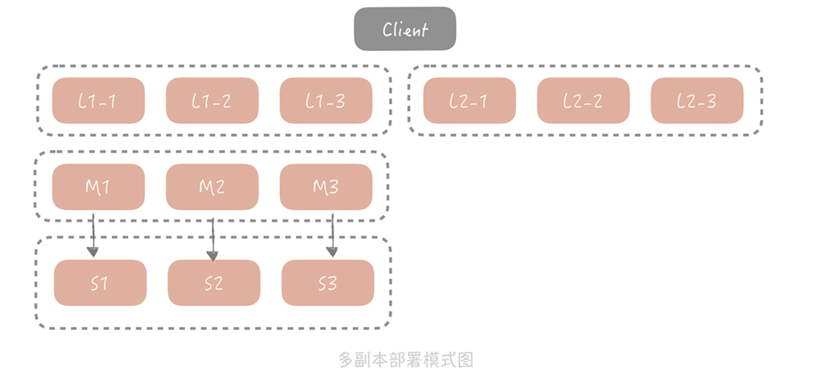

# 多副本

其实，主从方式已经能够解决大部分场景的问题，但是对于极端流量的场景下，一组 Slave 通常来说并不能完全承担所有流量，Slave 网卡带宽可能成为瓶颈。

为了解决这个问题，我们考虑在 Master/Slave 之前增加一层副本层，整体架构是这样的：

在这个方案中，当客户端发起查询请求时，请求首先会先从多个副本组中选取一个副本组发起查询，如果查询失败，就继续查询 Master/Slave，并且将查询的结果回种到所有副本组中，避免副本组中脏数据的存在。

基于成本的考虑，每一个副本组容量比 Master 和 Slave 要小，因此它只存储了更加热的数据。在这套架构中，Master 和 Slave 的请求量会大大减少，为了保证它们存储数据的热度，在实践中我们会把 Master 和 Slave 作为一组副本组使用。